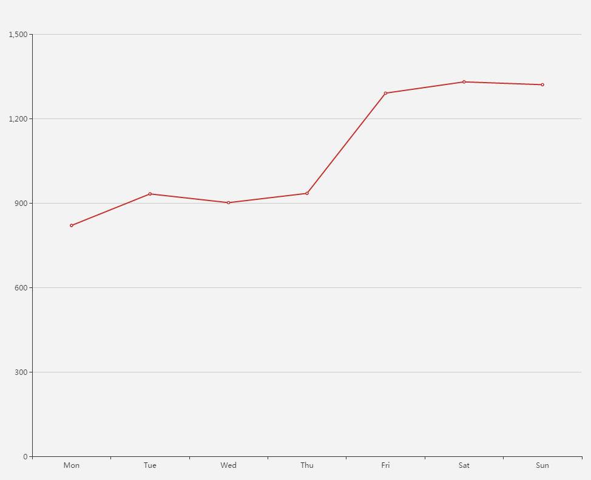
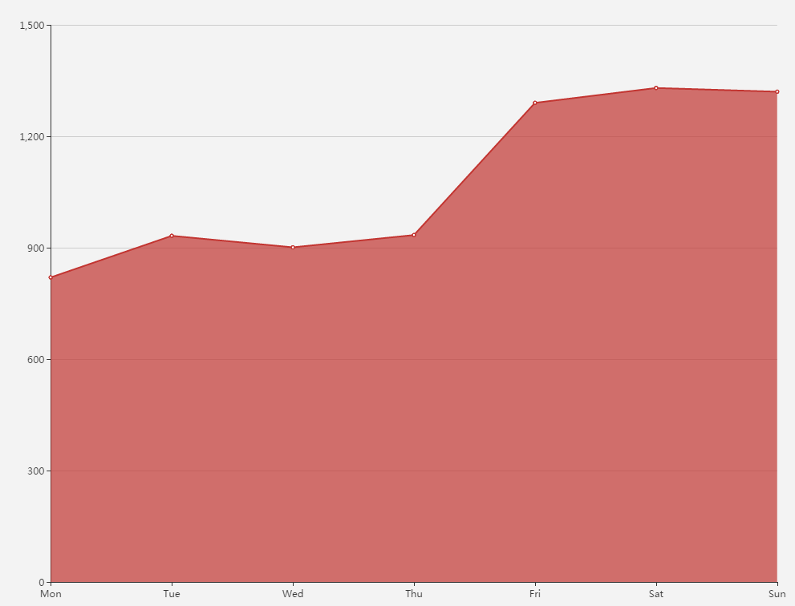
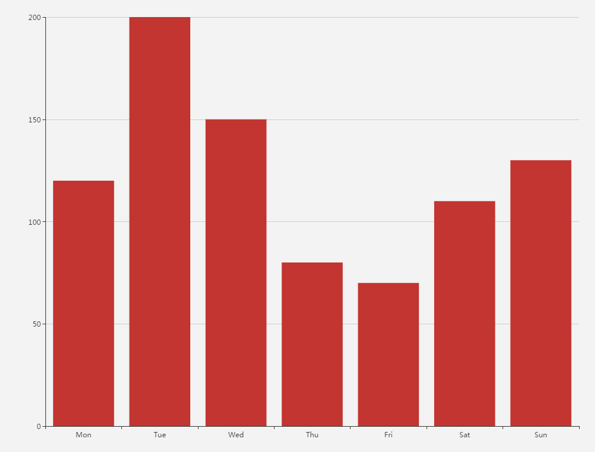
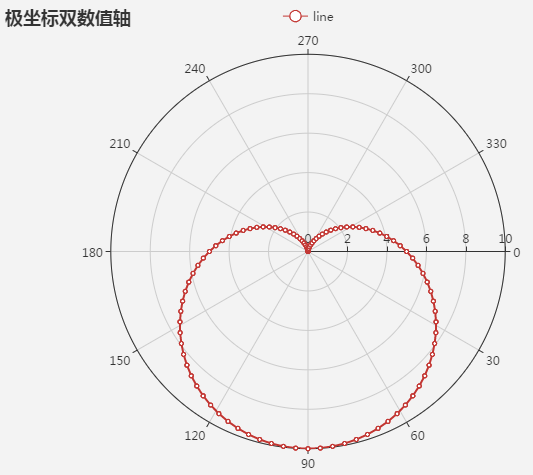
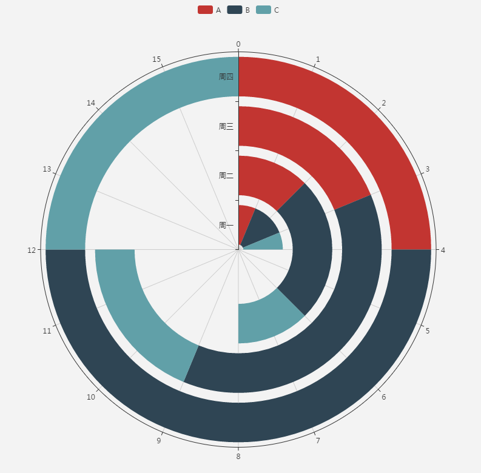
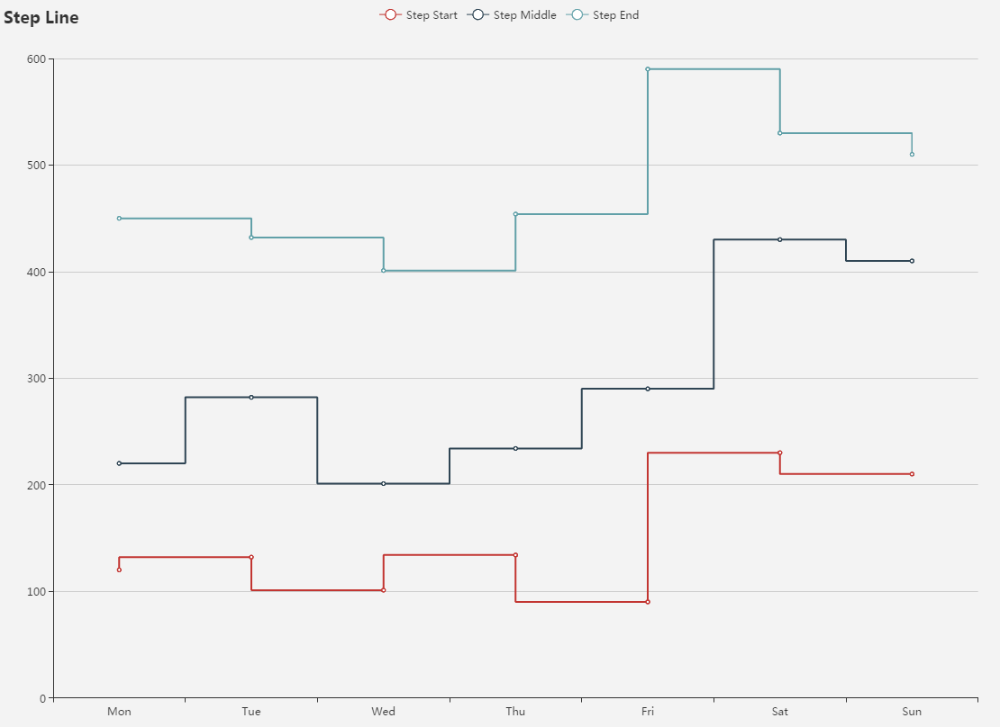
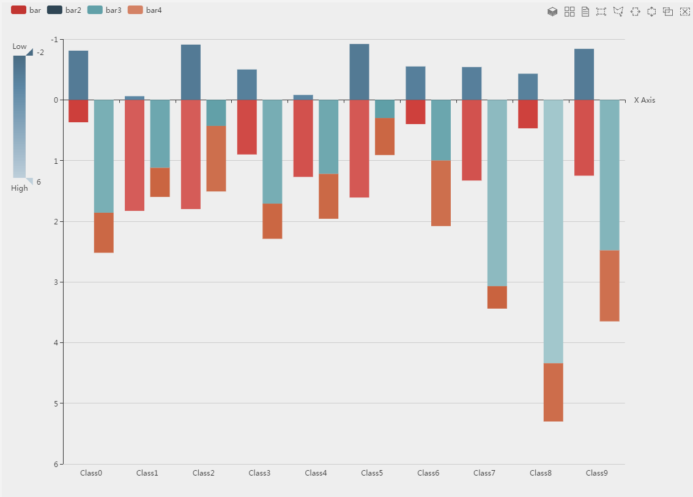
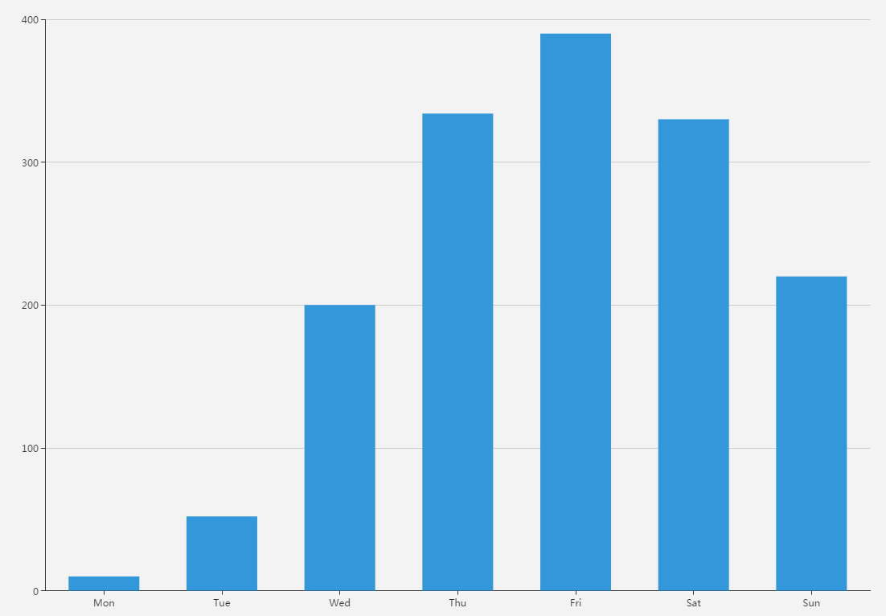
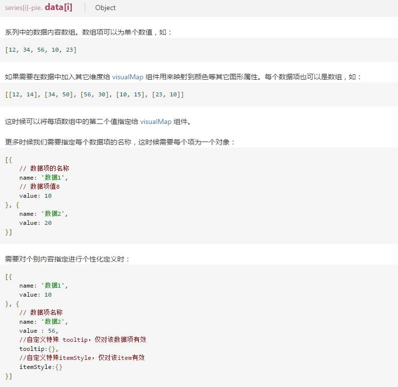
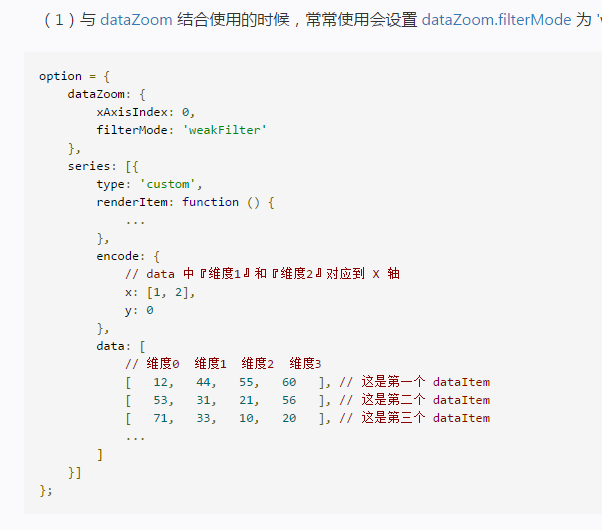

图形扩展示例
=========================
 

   
代码::
	xAxis.type = 'category'
	xAxis.data = ["Mon","Tue","Wed","Thu","Fri","Sat","Sun"]
	yAxis.type = 'value'
	series[0].data = [820,932,901,934,1290,1330,1320]
	series[0].type = 'line'

代码::
	xAxis.type = 'category'
	xAxis.boundaryGap = False
	xAxis.data = ["Mon","Tue","Wed","Thu","Fri","Sat","Sun"]
	yAxis.type = 'value'
	series[0].data = [820,932,901,934,1290,1330,1320]
	series[0].type = 'line'
	series[0].areaStyle = {}

代码::
	xAxis.type = 'category'
	xAxis.data = ["Mon","Tue","Wed","Thu","Fri","Sat","Sun"]
	yAxis.type = 'value'
	series[0].data = [120,200,150,80,70,110,130]
	series[0].type = 'bar'

代码::   
	title.text = '极坐标双数值轴'
	legend.data = ["line"]
	polar = {}
	tooltip.trigger = 'axis'
	tooltip.axisPointer.type = 'cross'
	angleAxis.type = 'value'
	angleAxis.startAngle = 0
	radiusAxis = {}
	series[0].coordinateSystem = 'polar'
	series[0].name = 'line'
	series[0].type = 'line'
	series[0].data = var ('data')

 
代码::
	angleAxis = {}
	radiusAxis.type = 'category'
	radiusAxis.data = ["周一","周二","周三","周四"]
	radiusAxis.z = 10
	polar = {}
	series[0].type = 'bar'
	series[0].data = [1,2,3,4]
	series[0].coordinateSystem = 'polar'
	series[0].name = 'A'
	series[0].stack = 'a'
	series[1].type = 'bar'
	series[1].data = [2,4,6,8]
	series[1].coordinateSystem = 'polar'
	series[1].name = 'B'
	series[1].stack = 'a'
	series[2].type = 'bar'
	series[2].data = [1,2,3,4]
	series[2].coordinateSystem = 'polar'
	series[2].name = 'C'
	series[2].stack = 'a'
	legend.show = True
	legend.data = ["A","B","C"]

代码::   
	title.text = 'Step Line'
	tooltip.trigger = 'axis'
	legend.data = ["Step Start","Step Middle","Step End"]
	grid.left = '3%'
	grid.right = '4%'
	grid.bottom = '3%'
	grid.containLabel = True
	toolbox.feature.saveAsImage = {}
	xAxis.type = 'category'
	xAxis.data = ["Mon","Tue","Wed","Thu","Fri","Sat","Sun"]
	yAxis.type = 'value'
	series[0].name = 'Step Start'
	series[0].type = 'line'
	series[0].step = 'start'
	series[0].data = [120,132,101,134,90,230,210]
	series[1].name = 'Step Middle'
	series[1].type = 'line'
	series[1].step = 'middle'
	series[1].data = [220,282,201,234,290,430,410]
	series[2].name = 'Step End'
	series[2].type = 'line'
	series[2].step = 'end'
	series[2].data = [450,432,401,454,590,530,510]

代码::
	backgroundColor = '#eee'
	legend.data = ["bar","bar2","bar3","bar4"]
	legend.align = 'left'
	legend.left = 10
	brush.toolbox = ['rect', 'polygon', 'lineX', 'lineY', 'keep', 'clear']
	brush.xAxisIndex = 0
	toolbox.feature.magicType.type = ['stack', 'tiled']
	toolbox.feature.dataView = {}
	tooltip = {}
	xAxis.data = var( 'xAxisData')
	xAxis.name = 'X Axis'
	xAxis.silent = False
	xAxis.axisLine.onZero = True
	xAxis.splitLine.show = False
	xAxis.splitArea.show = False
	yAxis.inverse = True
	yAxis.splitArea.show = False
	grid.left = 100
	visualMap.type = 'continuous'
	visualMap.dimension = 1
	visualMap.text = ['High', 'Low']
	visualMap.inverse = True
	visualMap.itemHeight = 200
	visualMap.calculable = True
	visualMap.min = -2
	visualMap.max = 6
	visualMap.top = 60
	visualMap.left = 10
	visualMap.inRange.colorLightness = [0.4, 0.8]
	visualMap.outOfRange.color = '#bbb'
	visualMap.controller.inRange.color = '#2f4554'
	series[0].name = 'bar'
	series[0].type = 'bar'
	series[0].stack = 'one'
	series[0].itemStyle =var( 'itemStyle')
	series[0].data = var('data1')
	series[1].name = 'bar2'
	series[1].type = 'bar'
	series[1].stack = 'one'
	series[1].itemStyle =var( 'itemStyle')
	series[1].data = var('data2')
	series[2].name = 'bar3'
	series[2].type = 'bar'
	series[2].stack = 'two'
	series[2].itemStyle = var('itemStyle')
	series[2].data =var( 'data3')
	series[3].name = 'bar4'
	series[3].type = 'bar'
	series[3].stack = 'two'
	series[3].itemStyle = var('itemStyle')
	series[3].data = var('data4')

代码::
	color = ['#3398DB']
	tooltip.trigger = 'axis'
	tooltip.axisPointer.type = 'shadow'
	grid.left = '3%'
	grid.right = '4%'
	grid.bottom = '3%'
	grid.containLabel = True
	xAxis[0].type = 'category'
	xAxis[0].data = ["Mon","Tue","Wed","Thu","Fri","Sat","Sun"]
	xAxis[0].axisTick.alignWithLabel = True
	yAxis[0].type = 'value'
	series[0].name = '直接访问'
	series[0].type = 'bar'
	series[0].barWidth = '60%'
	series[0].data = [10,52,200,334,390,330,220]

 

 
     