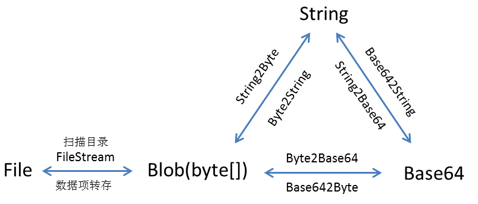
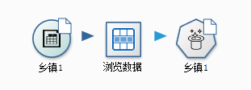
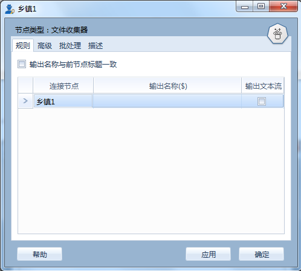
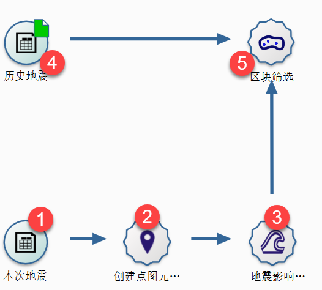
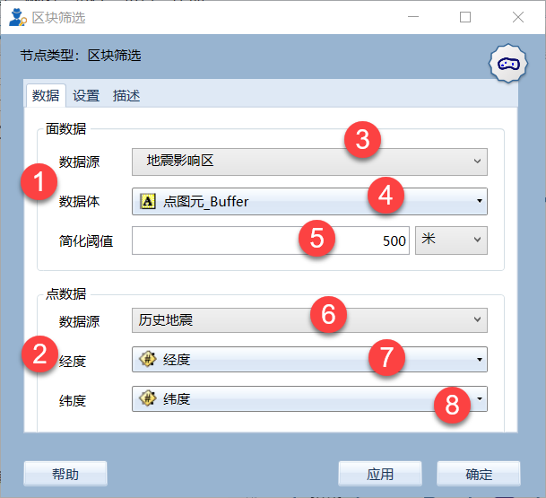
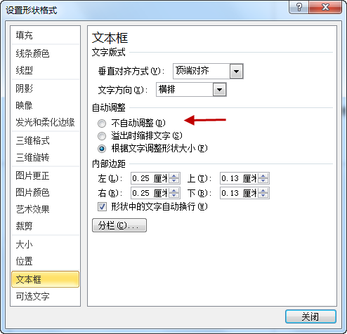

.. _FA:

节点与函数FA
======================
照片中能够提取出经纬度吗？
-----------------
智能手机具有定位功能，其拍摄照片带有空间位置信息。数据专家提供GetImageExif函数，帮助您提取照片中的相关信息，如经纬度、高程等；再使用系统中空间分析功能，将图片投到地图上，参见流程商店中“从照片中提取经纬度信息并显示在地图上”。

过滤节点中数据模型化是用来干啥的？
-----------------
数据化模型是过滤节点相对不常用的功能，它是过滤过程的逆向操作。
过滤是将字段名修改为新的名称，字段名不可修改，新列名称可修改。而数据模型化过程，新名称不可修改，只能指定字段名与新名称之间的对应关系。
数据模型化功能多用于数据入库过程中，数据库中所需入库字段是一定的，需要将前节点的字段与它们相对应。

过滤节点中同样替换新字段名R与R2有什么区别呢？
-----------------
R是一种基于文本的替换，用新的字符串替换新字段名中的字符串。
R2是一种对应关系的替换，其格式为：“原字段，新字段名称”，系统根据字段映射，自动替换原字段名相应的新字段名。通常可以把数据字典粘贴至此，从而实现字段名的批量重命名。
H是将新名称一键恢复到前节点的字段名。
U是将字段新类型一键恢复到前节点的字段类型。

怎么合并sian和sina这两个数据项？ 
-----------------
数据处理过程中常见因拼写错误或同音字录入的错误，使得字符串的统计过程变得异常复杂，合并同义词、错别字也就成了数据处理中必不可少的环节。系统提供的替换节点、同义词变换、新列节点、打标签等系列节点进行，帮助您枚举出所有的错别字或同义词，并进行值的替换，以便于进一步的数据分析工作得以顺利进行。

合并节点中内连接、左连接与排除连接分别指什么？
-----------------
合并数据操作类似于构造一个SQL的JOIN语句，涉及这样几个关键词：
1）左表（输入项中的第一个节点）、右表（输入项中第二个以后的节点），这里的节点可理解为数据表。
2）匹配条件，对应于Join语句的Where部分。
提供两种条件匹配方式，一是表达式模式，构造逻辑表达式，进行多表的匹配；另一个是同名字段模式，依据多个表中同名字段，构造等式条件，进行匹配；若同名的有很多，则需使用过滤设置功能，给字段重命名或过滤掉一些字段。
3）匹配方式，提供内连接、左连接和排除三种方式。
内连接，只保留左右两个表中都能匹配的公共记录，左表和右表中都满足条件的记录；
左连接，保留第一个表(左表)中的所有记录，以及右表与之匹配的记录；
排连接，保留第一个表中未能进行匹配的记录。

合并节点中同名列与关键字有什么区别？
-----------------
同名列枚举出了所有前节点中具有相同名称字段名称，以便于用选择作为匹配关键字。
关键字，用户可以将字段从左边同名列框中拖到右边的关键字框中。
合并节点运行时，自动在左右表之间构造等式条件，执行节点（数据表）间的合并操作。

去重节点怎么不合适？
-----------------
重复记录，即指两条记录中有部分或所有数据项相等的现象。
数据专家中去重节点的操作是依据去重关键字进行，系统依据关键字进行值比较，当所有值都相等时，将视之为重复记录，系统将剔除这部分记录，仅保留最后一条记录。
例如，有ABC三列数据，指定AB两列为关键字，进行去重操作。以下两行数据是重复的：
A1 B1 C1
A1 B1 C2
然而，以下两行数据则不重复：
A1 B1 C1
A1 B2 C2

Case函数是什么意思？
-----------------
Case函数，是一组复杂的逻辑语句，由于太复杂，仅在特殊的情况下才会用到。一般情况，用IIF就可以。
Case函数有两种形态，略有差别，基本类似于逻辑表达式：
1）条件形态：
CASE WHEN w1 THEN r1 WHEN w2 THEN r2 ELSE r3 END
其中w为条件表达式，r为取值表达式，具体运行逻辑为：
if  w1  then  r1
else if  w2  then  r2
else  r3
endif

2）值配对形态：
CASE x WHEN v1 THEN r1 WHEN v2 THEN r2 ELSE r3 END
其中x为字段名或为常数，r为取值表达式，具体运行逻辑为：
if  x=v1  then  r1
else if  x=v2  then r2
else  r3
endif

数据专家中能用正则表达式么？
-----------------
数据专家中，提供了大量正则相关函数，如IsMatch、MatchDate、ReplaceReg等，正则表达式主要有三种用途：
1）判断是否满足条件，返回布尔型，类似于字符串之间的包含关系；
2）根据规则抽取特定的值；
3）根据正则关系进行字符串的替换操作；
正则表达式功能强大，但很难驾驭。对于初学者而言，可不去深究其语法，仅需要知道其用途即可，网上有大量的相关资料。同时公式编辑器中已集成常用的正则表达式供您选择。
由于正则表达式的运行速度相对较慢，在大数据的字符串处理过程中不建议您使用，但您可以使用相关函数、节点来解决类似的问题。

更新变量节点整列模式是什么意思？
-----------------
系统中将数据赋值给流程变量的方法，有两种方式：
1）单行模式，不勾选整列模式；取二维表格第一行记录中相应字段的值对流程变量赋值，只取一个数据项的值；
2）勾选整列模式，取二维表格相应字段中所有数据项的值，合并成一个字符串对流程变量赋值（取多个数据项的值，值与值之间以分号间隔）。

如何抽取2017-08-08 21时 至2017-08-09 21时之间的数据？
-----------------
在数据专家中，日期类型是一种特殊的字符串，最常见日期格式是“yyyy-mm-dd HH:mm:ss:sss”，如2017-08-09 21:34:26:37.330。系统提供了大量日期运算功能，如日期比较、加减法等，可借助它们来实现日期型数据的抽取。
比如addDays(now(),-1)表示过去的24小时；
DateAfter(列1,"2017-08-08 21:0:0") and DateBefore(列1,"2017-08-09 21:0:0")表抽取一段时间内的记录。

如何把一列中的多个数据项合成一段文本？
-----------------
多行合并操作，可用汇总节点实现。汇总节点其基本功能是，对二维表进行分组，再对各个组内的数据进行统计计算。
不同数据类型有不同的处理方式：数值型可以用它来求均值、极值等统计量；文本型提供了合并字符串的功能。
若不指定的分组情况下，则是将所有数据看成一个组来对待。

浏览报告节点对数据有什么要求？
-----------------
浏览报告节点与浏览数据节点不同，浏览数据节点可以用于查看任意形式的数据。浏览报告节点则是针对数据体的一种数据查看方式，前面的数据中必包含Name，Data，Streamtype字段。
我们可以通过文件收集器把图片、文字、表格或是字符串加工成数据体（BLOB字段）方式向后扭转。输出数据会包括Name，Data，Streamtype，Description等字段；其中Data为数据体Blob类型，即Byte[]。您可以构造自己的数据流，也可对数据流进行操作，也可以借助扫描目录节点，把本地的文件名读入成数据流，以便于生成相应的报告。
注：字符串转换为文件体的方式，可使用String2Base64(String)函数实现。
数据体Blob与字符串并没有实质的区别，只是数据操作略有不同而已。文件、字符串、Blob以及Base64之间，可以进行相互转换，如图所示。

	 
图中箭头标注的内容为数据转换的方法，扫描目录和数据项转存为节点，其它为函数。

报告中节点描述文字内容怎么加？
-----------------
文件收集器可收集输出图片、表格等数据体，同时也可将前节点中描述信息存放于Description列中；报告浏览节点依据前节点的内容生成报告，并把Description列中的文字置于报告中（描述内容是否输出，可在浏览报告编辑器的标题页中设置）。

如何将一行数据输出成多段报告？
-----------------
生成报告时，常需将记录中的多个数据项分别输出到不同位置上，常规做法是使用过滤节点分别将每个关键字重命名，再通过文件收集器节点将它们向后扭转；当关键字数量较多时，需要使用多个过滤与文件收集器节点，流程布局不够优雅。文件收集器提供输出文本流功能，将数据表中第一行记录以文本流方式进行收集并向后扭转。

为什么文件收集器中输出文本流有时不可用？
-----------------
文件收集器中，输出文本流功能是将数据源节点、中间处理节点的数据以文本流方式进行收集，而这一功能对于终端节点则是不支持的。示例中，浏览数据节点为终端节点，在文件收集器的编辑窗口会看不到输出文本流功能。
对于终端节点，文件收集器将它视作为一个整体，收集它的输出成果向后扭转。

	 

	 
如何设置报告的层次？
-----------------
报告是数据专家的最常见的输出物之一，一般认为报告的组织结构包含递进与包罗两种关系。递进关系，即段落与段落之间的先后并列关系；而包罗关系则是指各级标题之间的层级关系，一级标题下的二级标题。
数据专家中递进关系由二维表中的记录顺序来确定；包罗关系由节点的先后关系来确定，由报告组件完成；报告节点中可将输出流格式设置成Html-Tag，意为报告组件，即将输出物视为报告的一部分，如三级标题中的一段内容。您需设置输出标题的级别，以便于系统对报告组件进行层级编号，与其他的报告组件或内容共同组件一份完整的报告。

如何设置报告层级的样式？
-----------------
层级样式即报告标题的编号样式，可以在【流程属性】窗口的【标题样式】栏中选取系统预设的样式，或自定义自己的样式。

如何自定义报告格式？
-----------------
一般情况下，出报告时使用自动生成方式就可满足应用的需求。您也可以自定义自己的报告格式，自定义报告采用MarkDown标记语言，一种快捷地构造文档的标记语言，具体的语法可以参考维基百科。
您可以使用“创建默认自定义标记”功能，创建系统默认的MarkDown语句，再以此为基础创造您的报告样式。具体操作，单击【标记】选项卡下【自动创建报告】栏中【创建默认自定义标记】按钮。

为什么数值字段不能正常排序呢？
-----------------
数据专家中严格区分数据类型，数值与数值字符串是两种不同的类型。若数值以字符串方式存储，排序节点默认以字符串方式进行排序；您可指定采用什么样的类型对字段进行排序；也可以在排序之前重新定义数据的类型。

写入数据库节点编辑器显示不完整怎么办？
-----------------
数据专家中为保护数据的运行安全，对数据库的写入操作做了限制。对于企业用户而言，用户角色由数据管理给定，授权包括：只读、读写等多重类型。您若要获取更多的数据库操作授权，请与系统管理员联系，更新授权文件即可。

访问不了MDB数据库怎么办？
-----------------
访问Access（mdb）数据库受Windows的底层限制，原因在于ODBC(微软数据访问接口)是32位的，而数据专家是64位，这两位之间不兼容。

图元在地图上定位不出来怎么办？
-----------------
坐标不一致，经纬度、横纵坐标整反了是空间分析中很常见错误，当把图元投影到地图上时，会出现黑屏、白屏或位置不对的现象。
在使用坐标时要特别注意经度与纬度的区分；中国范围内（经度：73~135，纬度3~53）可见经度为3位，纬度为2位。
在统一坐标时，使用投影变换节点，将高斯投影坐标向转换到WGS84变换，此时系统不严格区分横纵坐标，系统将自动区分中国范围内的高斯坐标（横坐标为8位，纵坐标为7位）。

为什么空间距离求不出来？
-----------------
数据专家中提供多个距离计算数，如CentroidDistance、DistanceByDegree、DistanceByMeter等，这些空间分析方法都基于WGS84坐标系统。因此，在空间分析时，需先将图元坐标进行投影变换，将其统一到经纬度（WGS84）上。

如何创建自定义空间数据源？
-----------------
空间数据源是一类特殊的数据格式，除了使用空间数据源节点加载数据之外，您还可以在地图上绘制图形（点、线、面），选择相关图元，使用【创建数据源节点】工具创建成空间数据源节点。具体参考流程商店中“入门11 自定义多边形数据源”流程。

什么叫获取地名对应的经纬度？
-----------------
这一应用在地理信息系统中，称之为正/逆地理编码（Geocoding）。
正向地理编码，将结构化地址数据（如：北京市海淀区上地十街十号）转换为对应坐标点（经纬度）；系统中对应于GetCoordinate函数；
逆向地理编码，将坐标点（经纬度）转换为对应位置信息（如所在行政区划，周边地标点分布）；系统中对应于GetAddress函数。
注GetCoordinate与GetAddress为在线函数，需要访问公网数据。

3DGIS节点运行结束后看不到结果怎么办？
-----------------
3DGIS数据展示是一种基于文件交换的数据展呈方法，系统将数据输出为KML文件，再把操作权交给Windows，由Windows调用本机软件打开KML文件进行浏览展示。KML是一种通用的标记语言，相关技术可是可以请教百度或Google。
您可以安装GoogleEarth软件在线查看KML文件；此外也可以安装Skline等专业软件作为KML的浏览器。

如何提升空间图元的展示效率？
-----------------
图元绘制需要耗费大量的系统资源，在输出报告过程中，受图幅限制，通常出现大量图元重置的现象。
数据专家中提供简化图元、平滑图元节点对线状、面装图元进行简化，减少曲线多边形构成点的个数。针对点图元提供密度聚类节点，通过空间聚类方式对点图元进行分组，再求取中心点减少点图元的个数。此外，也可以通过降低点图元经纬度精度，再进行汇总，减少点图元个数。

如何自动更新地理图的视域范围？
-----------------
地理图节点在出图时，输出视域范围支持自适应模式、中心点模式和边框范围模式三种。其中边框范围模式，用户可以根据需要自定义输出图幅范围，同时支持流程变量引用方式。用户可以通过流程变量进行桥接，自动更新地理图的视域范围。

如何分析地震周围历史地震发生情况？
-----------------
可以通过图元缓冲区结合空间筛选功能，解决类似的问题。

	 
1)本次地震经纬度信息；2)本次地震点图元（中心点图元）；3)以中心点图元创建的缓冲区；4)导入待筛选的经纬度数据（不需要创建点图元，经纬度各自成列即可）；5）创建区块筛选。

	 
其中：①为面数据源（即缓冲区）；②为点数据源（待删选的点数据）；③选取面数据源节点；④选取缓冲区字段；⑤设置点数据简化阈值；⑥选取点数据源节点；⑦选取经度字段；⑧选取纬度字段。

如何将点、线、面同时投到地图上？
-----------------
将区块筛选的经纬度数据转换成点图元，过滤节点把缓冲区的字段名修改的与新建的点图元字段名一致，再将两个数据表追加在一起，在进行输出至地图节点上。

PPT模板报告图片为什么被压偏了？
-----------------
系统中报告生成功能是基于“模板+数据”的思路，如PPT模板+Datist数据。PPT模板生成报告功能，以文本框中的标记为基础进行数据、图片等内容的替换，数据替换过程受文本框原有设置、样式的约束。
报告生成过程中，出现图片被压偏的现象，可在PPT的设置形状格式窗口，将文本框设置为不自动调整，即可。

