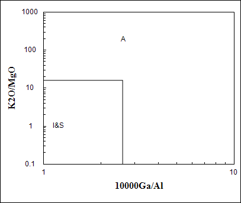
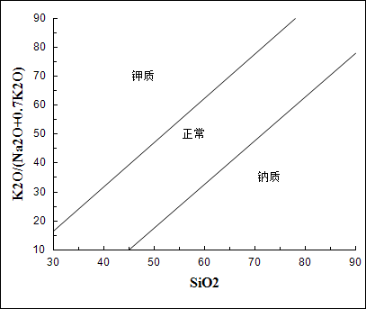

图版速查
====================================   

曾允孚砂岩分类
----------------------

   
         

信荃麟砂岩分类
----------------------

   
         

朱筱敏砂岩分类
----------------------

   
         

三角图版
----------------------

   
         

碳酸盐岩结构分类
----------------------

   
         

碳酸盐岩成分分类
----------------------

   
         

牵引流C-M图
----------------------

.. figure:: images/牵引流CM.png
   :scale: 80 %
   
         

重力流C-M图
----------------------

   
         

初始孔隙度和渗透率恢复图解
----------------------

   
         

压汞曲线
----------------------

   
         

孔隙度、渗透度交汇图
----------------------

   
         

施氏网
----------------------

   
         

吴氏网
----------------------

   
         

童宪章图版
----------------------

   
         

Adakite (La/Yb)n－(Yb)n 判别图解
----------------------

   
   Defant M J and Drummond M S. 1990. Derivation of some morden arc magmas by of young subducted lithosphere. Nature, 347:662～665      

Whalen etal, A型花岗岩的(K2O+Na2O)/CaO vs Zr+Nb+Ce+Y图解
----------------------

   
   J B Whalen,K L Currie, B W Chappell. 1987. A-type granites: geochemical characteristics,discriminatuon and petrogenesis. Contributions to Mineralogy and Petrology, 95:407-419      

Adakite Sr/Y－Y 判别图解
----------------------

   
   Defant M J and Drummond M S. 1990. Derivation of some morden arc magmas by of young subducted lithosphere. Nature, 347:662～665      

Al2O3－SiO2 岩石热水成因模式图
----------------------

   
   此图相关信息暂缺      

Whalen etal,A型花岗岩 (K2O+Na2O)/CaO vs 10000Ga/Al
----------------------

   
   J B Whalen,K L Currie, B W Chappell. 1987. A-type granites: geochemical characteristics,discriminatuon and petrogenesis. Contributions to Mineralogy and Petrology, 95:407-419      

Batchelor R2－R1 花岗岩成因分类图解
----------------------

.. figure:: images/B006.png
   :scale: 80 %
   
   ①地幔斜长花岗岩；②破坏性活动板块边缘(板块碰撞前)花岗岩；③板块碰撞后隆起期花岗岩；④晚造期花岗岩；⑤非造山区A型花岗岩；⑥同碰撞(S型)花岗岩；⑦造山期后A型花岗岩 Batchelor R A and Bowden P. Petrogenetic interpretation of granitoid rock series using multicationic parameters. Chem. Geol., 1985(48):43－55      

Whalen etal,A型花岗岩 Ce vs 10000Ga/Al
----------------------

   
   J B Whalen,K L Currie, B W Chappell. 1987. A-type granites: geochemical characteristics,discriminatuon and petrogenesis. Contributions to Mineralogy and Petrology, 95:407-419      

Eby 不同构造环境中A型花岗岩的Ce/Nb vs Y/Nb图解
----------------------

.. figure:: images/B008.png
   :scale: 80 %
   
   G N Eby,1992. Chemical subdivision of the A-type granitoids: Petrogenetic and tectonic implications. Geology,20:641-644      

A-型与I-型花岗岩Ce－SiO2判别图(Collis等,1982)
----------------------

   
   据Collis等,1982      

玄武岩 构造环境 Pearce F2-F1 判别图
----------------------

   
   WPB－板内玄武岩；LKT－低钾拉斑玄武岩(岛弧拉斑玄武岩)；CAB－钙碱性（高铝）玄武岩；SHO－钾玄岩；OFB－洋底（洋中脊）玄武岩 Pearce J A．Statistical analysis of major element patterns in basalts．J. Petro. 1976(17):15－43      

玄武岩 构造环境 Pearce F3-F2 判别图
----------------------

   
   WPB－板内玄武岩；LKT－低钾拉斑玄武岩(岛弧拉斑玄武岩)；CAB－钙碱性（高铝）玄武岩；SHO－钾玄岩；OFB－洋底（洋中脊）玄武岩 Pearce J A．Statistical analysis of major element patterns in basalts．J. Petro. 1976(17):15－43      

Whalen etal,A型花岗岩 FeO/MgO vs 10000Ga/Al
----------------------

   
   J B Whalen,K L Currie, B W Chappell. 1987. A-type granites: geochemical characteristics,discriminatuon and petrogenesis. Contributions to Mineralogy and Petrology, 95:407-419      

Whalen etal, A型花岗岩的FeOt/MgO vs Zr+Nb+Ce+Y图解
----------------------

   
   J B Whalen,K L Currie, B W Chappell. 1987. A-type granites: geochemical characteristics,discriminatuon and petrogenesis. Contributions to Mineralogy and Petrology, 95:407-419      

岩石系列K2O vs SiO2图解
----------------------

   
   实线据 Peccerillo R, Taylor S R. 1976. Geochemistry of eocene calc-alkaline volcanic rocks from the Kastamonu area, Northern Turkey. Contrib. Mineral Petrol., 58:63~81 虚线据 Middlemost E A K. 1985. Magmas and Magmatic Rocks. London: Longman, 1~266      

Whalen etal,A型花岗岩 碱性指数 vs 10000Ga/Al
----------------------

   
   J B Whalen,K L Currie, B W Chappell. 1987. A-type granites: geochemical characteristics,discriminatuon and petrogenesis. Contributions to Mineralogy and Petrology, 95:407-419      

Whalen etal,A型花岗岩 K2O/MgO vs 10000Ga/Al
----------------------

   
   J B Whalen,K L Currie, B W Chappell. 1987. A-type granites: geochemical characteristics,discriminatuon and petrogenesis. Contributions to Mineralogy and Petrology, 95:407-419      

Whalen etal,A型花岗岩 K2O+Na2O vs 10000Ga/Al
----------------------

   
   J B Whalen,K L Currie, B W Chappell. 1987. A-type granites: geochemical characteristics,discriminatuon and petrogenesis. Contributions to Mineralogy and Petrology, 95:407-419      

安山岩构造环境La/Yb vs Sc/Ni判别图(Condie,1986)
----------------------

   
   据Collis等,1982      

安山岩构造环境La/Yb vs Th判别图(Condie,1986)
----------------------

   
   据Collis等,1982      

里特曼-弋蒂里指数(logτ-logδ)图解
----------------------

   
   (里特曼,1973) A区-非造山带地区火山岩， B区-造山带地区火山岩， C区-A区、B区派生的碱性、富碱岩;J-日本火山岩      

花岗岩成因系列Na2O-K2O图解(Collis等,1982)
----------------------

   
   Collins W J et al.,1982. Nature and origin of A type granites with paticular reference to Southeastern Australia. Contrib. Miner. Petro., 80, 189-200      

Whalen etal,A型花岗岩 Nb vs 10000Ga/Al
----------------------

   
   J B Whalen,K L Currie, B W Chappell. 1987. A-type granites: geochemical characteristics,discriminatuon and petrogenesis. Contributions to Mineralogy and Petrology, 95:407-419      

A型与I型花岗岩Nb－SiO2判别图(Collis等,1982)
----------------------

   
   据Collis等,1982      

花岗岩 构造环境 Nb－Y 判别图
----------------------

   
   Pearce J A, Harris N B W and Tindle A G. Trace element discrimination diagrams for the tectonic interpretation of granitic rocks. Journal of Petrology, 1984, 25:956－983      

玄武岩 P2O5－TiO2 成因图解
----------------------

   
   此图相关信息暂缺      

洪大卫等 碱性花岗岩构造环境判别R1 vs 10000Ga/Al图解
----------------------

   
   洪大卫，王式洸，韩宝福，靳满元，1995，碱性花岗岩的构造环境分类及其鉴别标志，中国科学(B辑) ，25(4)：418-426      

火山岩全碱－硅（TAS）分类图
----------------------

   
   Pc－苦橄玄武岩；B－玄武岩；O1－玄武安山岩；O2－安山岩；O3－英安岩；R－流纹岩；S1－粗面玄武岩；S2－玄武质粗面安山岩；S3－粗面安山岩；T－粗面岩、粗面英安岩；F－副长石岩；U1－碱玄岩、碧玄岩；U2－响岩质碱玄岩；U3－碱玄质响岩；Ph－响岩；Ir－Irvine 分界线，上方为碱性，下方为亚碱性。 （Le Maitre R W (ed). A Classification of Igneous Rocks and Glossary of Terms. Blackwell, Oxford, 1989, 193 pp）      

岩浆/火成岩系统全碱-硅(TAS)分类(Eric A.K.Middlmost)
----------------------

   
   资料来源：Earth-Science Reviews, vol.37,(1994):215-224 Ir－Irvine 分界线，上方为碱性，下方为亚碱性。 【深成岩】：1-橄榄辉长岩；2a-碱性辉长岩；2b-亚碱性辉长岩；3-辉长闪长岩；4-闪长岩；5-花岗闪长岩；6-花岗岩；7-硅英岩；8-二长辉长岩；9-二长闪长岩；10-二长岩；11-石英二长岩；12-正长岩；13-副长石辉长岩；14-副长石二长闪长岩；15-副长石二长正长岩；16-副长正长岩；17-副长深成岩；18-霓方钠岩/磷霞岩/粗白榴岩 【火山岩】：1-苦橄玄武岩；2-玄武岩；3-玄武安山岩；4-安山岩；5-英安岩；6-流纹岩；7-英石岩；8-粗面玄武岩；9-玄武岩质粗面安山岩；10-粗面安山岩；11-粗面英安岩；12-粗面岩；13-碱玄岩；14-响质碱玄岩；15-碱玄质响岩；16-响岩；17-副长火山岩；18-方钠岩/霞石岩/纯白榴岩      

花岗岩 构造环境 Ta－Yb 判别图
----------------------

   
   Pearce J A, Harris N B W and Tindle A G. Trace element discrimination diagrams for the tectonic interpretation of granitic rocks. Journal of Petrology, 1984, 25:956－983      

玄武岩 TFeO/MgO －TiO2 成因图解
----------------------

   
   此图相关信息暂缺      

花岗岩 岩石系列 TiO2-Zr 判别图
----------------------

   
   此图相关信息暂缺      

玄武岩 构造环境 Ti－Zr 判别图
----------------------

   
   Pearce J A and Cann J R. Tectonic setting of basic volcanic rocks determined using trace element analyses. Earth and Planetary Science Letters,1973,19: 290－300      

火山岩 SiO2－Zr/TiO2 分类图(Winchester & Floyd,1977)
----------------------

   
   J.A.Winchester and P.A.Floyd, 1977. Geochemical discrimination of different magma series and theirdifferentiation products using immobile elements, Chemical Geology, vol.20 , pp.325-343.      

火山岩 Zr/TiO2－Nb/Y 分类图(Winchester and Floyd,1977)
----------------------

.. figure:: images/B034.png
   :scale: 80 %
   
   J.A.Winchester and P.A.Floyd, 1977. Geochemical discrimination of different magma series and theirdifferentiation products using immobile elements, Chemical Geology, vol.20 , pp.325-343.      

Whalen etal,A型花岗岩 Y vs 10000Ga/Al
----------------------

   
   J B Whalen,K L Currie, B W Chappell. 1987. A-type granites: geochemical characteristics,discriminatuon and petrogenesis. Contributions to Mineralogy and Petrology, 95:407-419      

Eby 不同构造环境中A型花岗岩的Yb/Ta vs Y/Nb图解
----------------------

   
   G N Eby,1992. Chemical subdivision of the A-type granitoids: Petrogenetic and tectonic implications. Geology,20:641-644      

A型与I型花岗岩Y－SiO2判别图(Collis等,1982)
----------------------

   
   据Collis等,1982      

Whalen etal,A型花岗岩 Zn vs 10000Ga/Al
----------------------

   
   J B Whalen, K L Currie, B W Chappell. 1987. A-type granites: geochemical characteristics,discriminatuon and petrogenesis. Contributions to Mineralogy and Petrology, 95:407-419      

Whalen etal,A型花岗岩 Zr vs 10000Ga/Al
----------------------

   
   J B Whalen,K L Currie, B W Chappell. 1987. A-type granites: geochemical characteristics,discriminatuon and petrogenesis. Contributions to Mineralogy and Petrology, 95:407-419      

花岗岩 岩石系列 Zr-SiO2 判别图
----------------------

   
   此图相关信息暂缺      

A型与I型花岗岩Zr－SiO2判别图(Collis等,1982)
----------------------

   
   据Collis等,1982      

玄武岩 构造环境 Zr/Y－Zr 判别图
----------------------

   
   Pearce J A and Norry M J. Petrogenetic Implications of Ti, Zr, Y, and Nb Variations in Volcanic Rocks. Contributions to Mineralogy and Petrology, 1979, 69: 33－47.      

朱炳泉 矿石铅同位素的 Δγ-Δβ成因分类图解
----------------------

   
   1.地幔源铅；2.上地壳铅；3.上地壳与地幔混合的俯冲带铅（3a.岩浆作用；3b.沉积作用）；4.化学沉积型铅；5.海底热水作用铅；6.中深变质作用铅；7.深变质下地壳铅；8.造山带铅；9.古老页岩上地壳铅；10.退变质铅。 朱炳泉.地球科学中同位素体系理论与应用—兼论中国大陆壳幔演化.北京:科学出版社,1998      

朱炳泉 εNd(t)-εSr(t) 图解
----------------------

   
   ZHU BING-QUAN, ZHANG JING-LIAN, TU XIANG-LIN CHANG XIANG-YANG, FAN CAI-YUAN, LIU YING, and LIU JU-YING. Pb, Sr, and Nd isotopic features in organic matter from China and their implications for petroleum generation and migration.Geochimica et Cosmochimica Acta,2001,65(15):2555-2570      

SiO2－Al2O3/(K2O+Na2O+CaO)(含矿性判别图)
----------------------

   
   此图相关信息暂缺      

花岗岩 构造环境 Rb－Y+Nb 判别图
----------------------

   
   Pearce J A, Harris N B W and Tindle A G. Trace element discrimination diagrams for the tectonic interpretation of granitic rocks. Journal of Petrology, 1984, 25:956－983      

花岗岩 构造环境 Rb－Yb+Ta 判别图
----------------------

   
   Pearce J A, Harris N B W and Tindle A G. Trace element discrimination diagrams for the tectonic interpretation of granitic rocks. Journal of Petrology, 1984, 25:956－983      

岛弧火山岩的SiO2-K2O分类图
----------------------

   
   Ewart A. The mineralogy and petrology of Tertiary-Recent orogenic volcanic rocks: with special reference to the andesite-basaltic compositional range. In: Thorpe R S, ed. Andesites. New York: John Wiley and sons, 1982, 25-95      

铅同位素V1-V2图解
----------------------

   
   A-华南；B-扬子；C-华北；D-北疆；DA-北美科迪勒拉；DP-北太平洋群岛 朱炳泉，地球化学省与地球化学急变带.北京：科学出版社，2001，P12      

Alther et al, 花岗岩A/MF-C/MF成因图解
----------------------

   
   A-变质泥岩部分熔融；B-变质砂岩部分熔融；C-基性岩的部分熔融 Alther R,Holl A, Hegner E, Langer C and Kreuzer H. High-potassium,calc-alkaline I-type plutonism in the European Variscides: Northern Vosges (France) and northern Schwarzwald (Germany).Lithos, 2000,50:51~73      

火山岩Румянцева分类法
----------------------

   
   Румянцева(1977)      

玄武岩K2O-Na2O
----------------------

   
   E A K Middlemost (1972)      

玄武岩构造环境Th-Ta判别图解
----------------------

   
   Pearce 等 1980      

岩石系列SiO2-AR(碱度率)图解
----------------------

   
   J B Wright, 1969      

铅同位素207Pb/204Pb-206Pb/204Pb构造环境判别图解
----------------------

   
   LC-下地壳；UC-上地壳；OIV-洋岛火山岩；OR-造山带；A，B，C，D分别为各区域中样品相对集中区。 R E Zartman and B R Doe. 1981. Plumbotectonics - the model. Tectonophysics, 75:135~162      

铅同位素208Pb/204Pb-206Pb/204Pb构造环境判别图解
----------------------

.. figure:: images/B056.png
   :scale: 80 %
   
   LC-下地壳；UC-上地壳；OIV-洋岛火山岩；OR-造山带；A，B，C，D分别为各区域中样品相对集中区。 R E Zartman and B R Doe. 1981. Plumbotectonics - the model. Tectonophysics, 75:135~162      

火山岩SiO2-Nb/Y分类图解
----------------------

   
   J.A.Winchester and P.A.Floyd, 1977. Geochemical discrimination of different magma series and theirdifferentiation products using immobile elements, Chemical Geology, vol.20 , pp.325-343. SubAlkalBas-亚碱性玄武岩；Andesite-安山岩；RhyDac/Dac-流纹英安岩/英安岩；Rhyolite-流纹岩；AlkBas-碱性玄武岩；TrachyAnd-粗面安山岩；Ban/Nph=Basanite(碧玄岩)/nephelinite(霞石岩)；Phonolite-响岩；Trachyte-粗面岩；Com/Pant- 钠闪碱流岩(comendite)/碱流岩(pantellerite)      

单斜辉石 F2-F1 构造环境判别图解(Nisbet and Pearce, 1977)
----------------------

   
         

单斜辉石SiO2-Al2O3岩石系列判别图解(邱家骧等, 1996)
----------------------

   
   邱家骧，廖群安.1996.浙闽新生低玄武岩岩石成因学与Cpx矿物学[J].火山地质与矿物，(1~2)16~25。      

钙质角闪石的Ti-Si变异图及成因类型划分
----------------------

   
   Ⅰ.基性超基性侵入岩中的角闪石;Ⅱ. 中酸性火山岩中的角闪石; Ⅲ. 各种变质岩中的角闪石; Ⅳ. 中酸性侵入岩中的角闪石;Ⅴ. 蚀变和交代角闪石 马昌前, 杨坤光, 唐仲华,等. 花岗岩类岩浆动力学理论方法及鄂东花岗岩类例析. 武汉:中国地质大学出版社,1994.      

δD-δ18O图解
----------------------

   
   雨水线：δD=8δ18O+10 高岭石风化线：：δD=7.6δ18O-220      

拉斑玄武岩构造环境Ti/Zr-Ni图解
----------------------

   
   IAT-岛弧拉斑玄武岩；MORB-洋中脊玄武岩 据Beccaluva,1980      

铝质-准铝花岗岩A/NK-A/KNC判别图
----------------------

   
         

铅同位素207/204-206/204增长曲线
----------------------

.. figure:: images/B064.png
   :scale: 80 %
   
   A-地幔(Mantle)；B-造山带(Orogene)；C-上地壳(Upper Crust)；D-下地壳(Lower Crust) R E Zartman and B R Doe. 1981. Plumbotectonics - the model. Tectonophysics, 75:135~162      

铅同位素208/204-206/204增长曲线
----------------------

   
   A-地幔(Mantle)；B-造山带(Orogene)；C-上地壳(Upper Crust)；D-下地壳(Lower Crust) R E Zartman and B R Doe. 1981. Plumbotectonics - the model. Tectonophysics, 75:135~162      

砂岩形成构造环境的TiO2-Fe2O3T+MgO判别图解
----------------------

   
   A-克拉通盆地；B-大陆壳内裂谷或弧后盆地；C-大陆边缘弧；D-大洋弧      

Simonen的(al+fm)-(c+alk)～Si图解
----------------------

.. figure:: images/B067.png
   :scale: 80 %
   
   据 A Simonen，1953      

变质岩原岩恢复TiO2-SiO2图解
----------------------

   
   据 Tarrey，1976      

变质岩原岩恢复Zr/TiO2-Ni图解
----------------------

   
   据J A Winchester,1980      

花岗岩 构造环境Al2O3-SiO2判别图解
----------------------

   
   IAG-岛弧花岗岩类；CAG-大陆弧花岗岩类；CCG-大陆碰撞花岗岩类；POG-后造山花岗岩类；RRG-与裂谷有关的花岗岩类；CEUG-与大陆的造陆抬升有关的花岗岩类      

花岗岩 构造环境TFeO/[w(TFeO)+w(MgO)] vs SiO2判别图解
----------------------

.. figure:: images/B071.png
   :scale: 80 %
   
   IAG-岛弧花岗岩类；CAG-大陆弧花岗岩类；CCG-大陆碰撞花岗岩类；POG-后造山花岗岩类；RRG-与裂谷有关的花岗岩类；CEUG-与大陆的造陆抬升有关的花岗岩类      

花岗岩 构造环境w(FeO)-w(MgO)判别图解
----------------------

   
   IAG-岛弧花岗岩类；CAG-大陆弧花岗岩类；CCG-大陆碰撞花岗岩类；POG-后造山花岗岩类；RRG-与裂谷有关的花岗岩类；CEUG-与大陆的造陆抬升有关的花岗岩类      

花岗岩 构造环境[w(TFeO)+w(MgO)]-w(CaO)判别图解
----------------------

   
   IAG-岛弧花岗岩类；CAG-大陆弧花岗岩类；CCG-大陆碰撞花岗岩类；POG-后造山花岗岩类；RRG-与裂谷有关的花岗岩类；CEUG-与大陆的造陆抬升有关的花岗岩类      

花岗岩 Q’-F’-Anor分类图
----------------------

   
   2-;3a-;3b;4-;5-;6*-;7*-;      

黄铁矿Ni-Co成因图解
----------------------

   
   赵振华等，1987 Ⅰ、Ⅱ区为沉积和沉积改造区；Ⅲ、Ⅳ为岩浆和热液区      

玄武岩 10·TiO2-Al2O3-10·K2O 图解（赵崇贺）
----------------------

   
   Ⅰ－大洋玄武岩； Ⅱ－大陆玄武岩、安山岩； Ⅲ－岛弧、造山带玄武岩、安山岩 资料来源：赵崇贺.1989.中基性火山岩成分的ATK图解与构造环境.地质科技情报，8(4)：1-5 [Zhao Chonghe.1989.The ATK Diagram of Basic-Intermediate volcanic rocks and Tectonic Environment.Geological science and Technology information, 8(4)：1-5]      

玄武岩 岩石系列 FeO*-Na2O+K2O-MgO (FAM) 图
----------------------

   
   Irvine T N and Barager W R A. A guide to the chemical classification of the common volcanic rocks. Canadian Journal of Earth Sciences, 1971, 8: 523－548      

玄武岩 构造环境 Hf/3-Th-Nb/16 判别图
----------------------

.. figure:: images/T003.png
   :scale: 80 %
   
   Wood D A. 1980. The application of a Th-Hf-Nb diagram to problems of tectomagmatic classification and to establishing the nature of crustal contamination of the British Tertiary volcanic provinic. Earth Plant Sci Lett,(50):11-30      

玄武岩 构造环境 Hf/3-Th-Ta 判别图
----------------------

   
   Wood D A. 1979. Avariably veined suboceanic uppermantle-genetic significance for mid-ocean ridge basalts from geochemical evidence. Geology, 7:499-503      

Eby： A型花岗岩分类 Nb-Y-3Ga图解
----------------------

   
   G N Eby,1992. Chemical subdivision of the A-type granitoids: Petrogenetic and tectonic implications. Geology,20:641-644      

Eby： A型花岗岩分类 Nb-Y-Ce 图解
----------------------

   
   G N Eby,1992. Chemical subdivision of the A-type granitoids: Petrogenetic and tectonic implications. Geology,20:641-644      

玄武岩 构造环境 2Nb-Zr/4-Y 判别图
----------------------

   
   A1+A2－板内碱性玄武岩；A2+C－板内拉斑玄武岩；B－P型 MORB；D－ N型 MORB；C+D－火山弧玄武岩 Meschede M. 1986 ,A method of discriminating between different types of mid－ocean ridge basalts and continental tholeiites with the Nb－Zr－Y diagram. Chemical Geology, 1986(56) pp.207－218      

花岗岩 Q-A-P 分类图
----------------------

   
   [火山岩]: 1－富石英流纹岩；2－碱长流纹岩；3a、b－流纹岩；4、5－英安岩；6*－碱长石英粗面岩；7*－石英粗面岩；8*－石英安粗岩；9*－石英粗安岩；10*－石英安山岩；6－碱长粗面岩；7－粗面岩；8－安粗岩；9－粗安岩；10－安山岩、玄武岩 [侵入岩]: 1－富石英花岗岩；2－碱长花岗岩；3a－花岗岩；3b－花岗岩(二长花岗岩)；4－花岗闪长岩；5－英云闪长岩、斜长花岗岩；6*－碱长石英正长岩；7*－石英正长岩；8*－石英二长岩；9*－石英二长闪长岩；10*-石英闪长岩、石英辉长岩、石英斜长岩;6－碱长正长岩；7-正长岩;8-二长岩;9-二长闪长岩、二长辉岩;10-闪长岩、辉长岩、斜长岩      

花岗岩 Q-A-P S-I-A型判别
----------------------

   
   P Bowden等，1982      

花岗岩 构造环境Rb/30-Hf-3Ta判别图
----------------------

   
   此图相关信息暂缺      

Pearce 玄武岩FeO*-MgO-Al2O3 判别图(FMA）
----------------------

   
   Ⅰ－洋中脊或洋底；Ⅱ－洋岛； Ⅲ－大陆； Ⅳ－扩张性中央岛； Ⅴ－造山带 （Pearce T H et al． The relationship betwee major element chemistry and tectonic environment of basic and intermediate vocanic rocks．Earth Planet. Sci. Lett.,1977(36),121－132）      

Pearce 玄武岩构造环境 TiO2-K2O-P2O5 判别图解
----------------------

   
   T H Pearce, B E Gorman T C Birkett,1975. The TiO2-K2O-P2O5 diagram: a method of discriminating between oceanic and non-oceanic basalts. Earth Planet. Sci. Lett., 24:419-426      

玄武岩 构造环境 TiO2-10×MnO-10×P2O5 图
----------------------

   
   OIT－洋岛拉斑玄武岩；OIA－洋岛碱性玄武岩；MORB－洋中脊玄武岩；IAT－岛弧拉斑玄武岩；CAB－钙碱性玄武岩（Mullen E D. MnO/TiO2/P2O5: a minor element discriminate for basaltic rocks of oceanic environments and its implications for petrogenesis. Earth and Planetary Science Letters, 1983(62), pp.53－62）      

玄武岩 构造环境 Ti/100-Zr-Sr/2 判别图
----------------------

.. figure:: images/T014.png
   :scale: 80 %
   
   Pearce J A and Cann J R. Tectonic setting of basic volcanic rocks determined using trace element analyses. Earth and Planetary Science Letters,1973,19: 290－300      

玄武岩 构造环境 Ti/100-Zr-Y×3 判别图
----------------------

   
   Pearce J A and Cann J R. Tectonic setting of basic volcanic rocks determined using trace element analyses. Earth and Planetary Science Letters,1973,19: 290－300      

FeO*-K2O+Na2O-MgO(多条演化线)
----------------------

   
   此图相关信息暂缺      

花岗岩Rb-Ba-Sr图解
----------------------

   
   AGG-钠长石化和云英岩化花岗岩；DG-分异的花岗岩；NG-正常花岗岩；AG-异常花岗岩；GD-花岗闪长岩；QD-石英闪长岩；D-闪长岩；GAD-与W、Mo、Sn有关矿化花岗岩 (El Blouseily A M, El Sokkary A A. The relation between Rb, Ba and Sr in granitic rocks[J].Chemical Geology, 1975 16: 207-219)      

花岗岩成因类型ACF图解
----------------------

   
         

玄武岩岩石系列Cpx-Ol-Opx图解
----------------------

.. figure:: images/T019.png
   :scale: 80 %
   
   据 F Chayes,1965,1966      

玄武岩岩石系列Ol-Ne-Q图解
----------------------

   
   据T N Irvine等,1971      

亚碱性系列火山岩An-Ab-Or图解
----------------------

   
   据T N Irvine等,1971      

碱性系列火山岩An-Ab-Or图解
----------------------

   
   据T N Irvine等,1971      

侵入岩F-M-C图解(常用于基性-超基性岩的含矿性评价)
----------------------

   
   常用于基性-超基性岩的含矿性评价      

基性超基性火山岩TFe+Ti-Al-Mg分类图解
----------------------

   
   UMK-超基性科马提岩；BK-玄武质科马提岩；HMT-高镁拉斑玄武岩；HFT-高铁拉斑玄武岩；HAT-高铝拉班玄武岩      

TTG岩套 CIPW标准矿物 An-Ab-Or分类图解
----------------------

   
   Tr-奥长花岗岩; Tn-英云闪长岩; Gd-花岗闪长岩; MG-二长花岗岩; Gr-花岗岩      

碱性岩Ne(霞石)-M(暗色矿物)-A(碱性长石)分类图解
----------------------

   
   a-钛铁霞辉岩；b-碱性辉长岩；c-暗色含霞正长岩；d-中色含霞正长岩；e-浅色含霞正长岩；f-暗霓霞岩；g-含长暗霓霞岩；h-暗色暗霞正长岩；i-霞石正长岩；j-浅色-霞石正长岩；k-霓霞岩；l-含长霓霞岩；m-暗霞正长岩；n-磷霞岩；o-含长磷霞岩；p-正霞正长岩      

单斜辉石分类图解
----------------------

.. figure:: images/T027.png
   :scale: 80 %
   
   Di-透辉石(diopside), He-钙铁辉石(hedenbergite), Au-普通辉石(Augite), Pi-易变辉石(Pigeonite), ClEn-斜顽辉石(clinoenstatite), ClFs-斜铁辉石(clinoferrosilite) (据Morimoto等，1988)      

岩浆岩成因类型的角闪石Ca-Fe-Mg判别图解
----------------------

   
         

沉积岩 构造环境Th-Hf-Co判别图解
----------------------

   
   A-长英质火山岩；B-页岩(克拉通盆地)；C-石英岩(克拉通盆地)；D-长石砂岩；E-杂砂岩(弧)      

沉积岩 构造环境Th-Sc-Zr/10判别图解
----------------------

   
   A-大洋岛弧；B-大陆岛弧；C-活动大陆边缘；D-被动大陆边缘 Mukul R. Bhatia and Keith A.W. Crook. Trace element characteristics of graywackes and tectonic setting discrimination of sedimentary basins.Contrib Mineral Petrol(1986),92:181-193      

沉积岩 构造环境La-Th-Sc判别图解
----------------------

   
   A-大洋岛弧；B-大陆岛弧；C-活动大陆边缘；D-被动大陆边缘 Mukul R. Bhatia and Keith A.W. Crook. Trace element characteristics of graywackes and tectonic setting discrimination of sedimentary basins.Contrib Mineral Petrol(1986),92:181-193      

花岗岩 构造环境Rb/10-Hf-Ta×3判别图解
----------------------

   
         

拉斑玄武岩和钙碱性玄武岩系列FeOt/MgO-SiO2图解
----------------------

   
   Miyashiro, A., 1974, Volcanic rock series in island arc and active continental margins. Am J Sci, 274: 321-355.      

SiO2-(Na2O+K2O) discrimination diagram for basalt series
----------------------

   
   A-Alkaline basalt series; T-Tholeiite series (1) MacDonald, G. A., Katsura, T., 1964, Chemical compositions of Hawaiian lavas, J. Petro., 5: 82-133. (2) Hyndman, D. W., 1985, Petrology of igneous and metamorphic rocks, McGraw-Hill, New York.      

玄武岩构造环境判别Th/Hf vs. Ta/Hf图解
----------------------

   
   Ⅰ.板块发散边缘N-MORB区;Ⅱ.板块汇聚边缘(Ⅱ1.大洋岛弧玄武岩区;Ⅱ2.陆缘岛弧及陆缘火山弧玄武岩区);Ⅲ.大洋板内洋岛、海山玄武岩区及T-MORB、E-MORB区;Ⅳ.大陆板内(Ⅳ1.陆内裂谷及陆缘裂谷拉斑玄武岩区;Ⅳ2.陆内裂谷碱性玄武岩区;Ⅳ3.大陆拉张带(或初始裂谷)玄武岩区);Ⅴ.地幔热柱玄武岩区      

Middlemost(1994)花岗岩岩类TAS分类图
----------------------

.. figure:: images/B077.png
   :scale: 80 %
   
   Middlemost (1994)      

流体包裹体Th-S-p图解
----------------------

   
         

Pearce(1982)玄武岩构造环境判别图解(Th/Yb-Ta/Yb)
----------------------

   
   IAB-岛弧玄武岩；IAT-岛弧拉斑系列；ICA-岛弧钙碱系列；SHO-岛弧橄榄玄粗岩系列；WPB-板内玄武岩；MORB-洋中脊玄武岩；TH-拉斑玄武岩；TR-过渡玄武岩；ALK-碱性玄武岩 （据Pearce,1982)      

玄武岩构造环境判别图解(TiO2-Zr)
----------------------

   
         

玄武岩岩浆系列Th/Yb-Ta/Yb图解
----------------------

   
         

玄武岩岩浆系列Ce/Yb-Ta/Yb图解
----------------------

   
         

燧石沉积环境Fe2O3/SiO2 Vs Al2O3/SiO2图解
----------------------

   
   资料来源：Richard W. Murray. Chemical criteria to identify the depositional environment of chert: general principles and applications. Sedimentary Geology, 90(1994): 213-232      

燧石沉积环境Fe2O3/(100-SiO2) Vs Al2O3/(100-SiO2)图解
----------------------

   
   资料来源：Richard W. Murray. Chemical criteria to identify the depositional environment of chert: general principles and applications. Sedimentary Geology, 90(1994): 213-232      

燧石沉积环境Fe2O3/TiO2 Vs Al2O3/(Al2O3+Fe2O3)图解
----------------------

   
   资料来源：Richard W. Murray. Chemical criteria to identify the depositional environment of chert: general principles and applications. Sedimentary Geology, 90(1994): 213-232      

燧石沉积环境LaN/CeN Vs Al2O3/(Al2O3+Fe2O3)图解
----------------------

   
   资料来源：Richard W. Murray. Chemical criteria to identify the depositional environment of chert: general principles and applications. Sedimentary Geology, 90(1994): 213-232      

花岗岩形成构造背景QAP图解
----------------------

   
         

花岗岩类Q-Ab-An等温等压力线图
----------------------

   
         

玄武岩构造环境V-Ti图解
----------------------

.. figure:: images/B087.png
   :scale: 80 %
   
   Shervais, J. W., Ti-V plots and the petrogenesis of modern and ophiolitic lavas. Earth Planet Sci Lett, 1982, 59: 101—118      

杂砂岩构造环境Ti/Zr vs La/Sc 判别图解
----------------------

.. figure:: images/B091.png
   :scale: 80 %
   
   A-大洋岛弧；B-大陆岛弧；C-活动大陆边缘；D-被动大陆边缘 Mukul R. Bhatia and Keith A.W. Crook. Trace element characteristics of graywackes and tectonic setting discrimination of sedimentary basins.Contrib Mineral Petrol(1986),92:181-193      

杂砂岩构造环境La/Y vs Sc/Cr 判别图解
----------------------

   
   A-大洋岛弧；B-大陆岛弧；C-活动大陆边缘；D-被动大陆边缘 Mukul R. Bhatia and Keith A.W. Crook. Trace element characteristics of graywackes and tectonic setting discrimination of sedimentary basins.Contrib Mineral Petrol(1986),92:181-193      

杂砂岩构造环境La vs Th 判别图解
----------------------

   
   A-大洋岛弧；B-大陆岛弧；C-活动大陆边缘；D-被动大陆边缘 Mukul R. Bhatia and Keith A.W. Crook. Trace element characteristics of graywackes and tectonic setting discrimination of sedimentary basins.Contrib Mineral Petrol(1986),92:181-193      

