.. ChartLanguage
 
统计图语言
====================================
Datist提供一套统计图绘制语言。 

设置坐标系
-----------------------------------

**XYChart**
^^^^^^^^^^^^^^^^^^^^^^^^^^^^^^^^^^^

创建二维统计图。

语法::

    XYChart([Name],[ShowGrid = True],[TitleX],[TitleY],[Side = default])
    其中Side，可设置为default|left|right指定X坐标轴的位置。

**PieChart**
^^^^^^^^^^^^^^^^^^^^^^^^^^^^^^^^^^^

创建饼状统计图。

语法::

    PieChart([Name])

**PolarChart**
^^^^^^^^^^^^^^^^^^^^^^^^^^^^^^^^^^^

创建极坐标统计图(角度vs数值)。

语法::

    PolarChart([Name])
	

极坐标系示例::
	
    //极坐标系
    PolarChart(chart1)
    Area(联盟广告,搜索引擎)
    PolarChart(chart1)
    Histogram(邮件营销,联盟广告)
    ChartStyle(Dark)
      
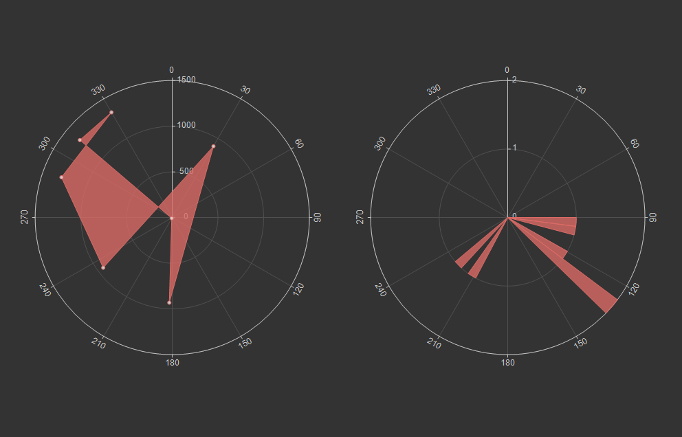

**RadarChart**
^^^^^^^^^^^^^^^^^^^^^^^^^^^^^^^^^^^

创建雷达图（多个坐标轴)。

语法::

    RadarChart([Name])

雷达图示例::	
	
    //雷达图
    RadarChart(chart1)
    Area(Name,搜索引擎)
    RadarChart(chart1)
    line(Name,搜索引擎)
    ChartStyle(Dark)
      
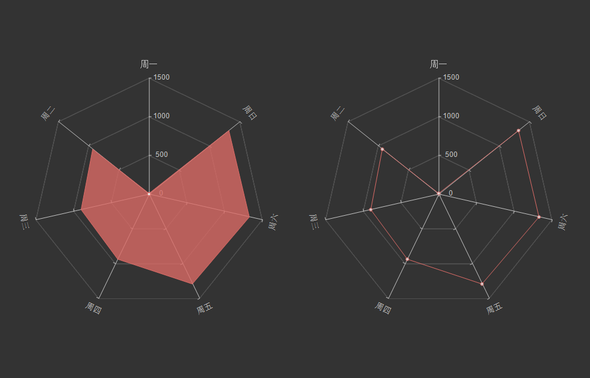

	
**TriChart**
^^^^^^^^^^^^^^^^^^^^^^^^^^^^^^^^^^^

创建三角坐标系统计图。

语法::

    TriChart([Name],[ShowGrid = True],[TitleA = A],[TitleB = B],[TitleC = C],[Desc])
    其中Desc用于指定统计图底部显示的文字信息。
	
三角坐标系示例::
	  
    //三角坐标系
    trichart(test,true,Q,f,R)
    setdata(4)
    point(Q,F,R)
    
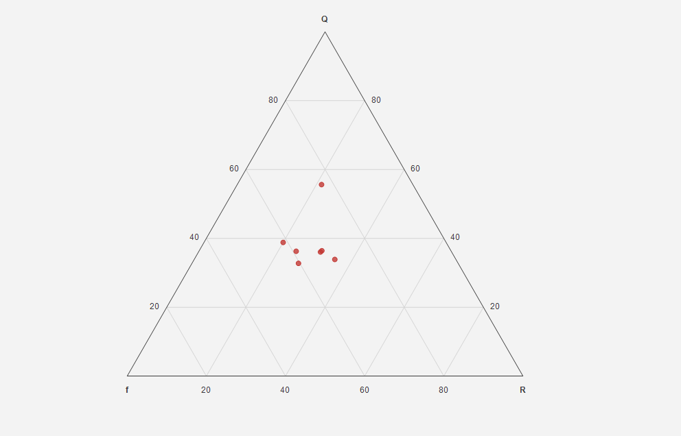

**WulffChart**
^^^^^^^^^^^^^^^^^^^^^^^^^^^^^^^^^^^

创建吴氏网(乌尔夫网图)。

语法::

    WulffChart([Name],[ShowGrid = True])
	
**SchmidtChart**
^^^^^^^^^^^^^^^^^^^^^^^^^^^^^^^^^^^

创建施氏网(施密特网)。

语法::

    SchmidtChart([Name],[ShowGrid = True]) 
	
吴氏网与施氏网示例::
  
    //吴氏网与施氏网
    setdata(4)
    SchmidtChart(test2,true)
    point(Q,F)
    WulffChart(test3,true)
    point(Q,F)
    
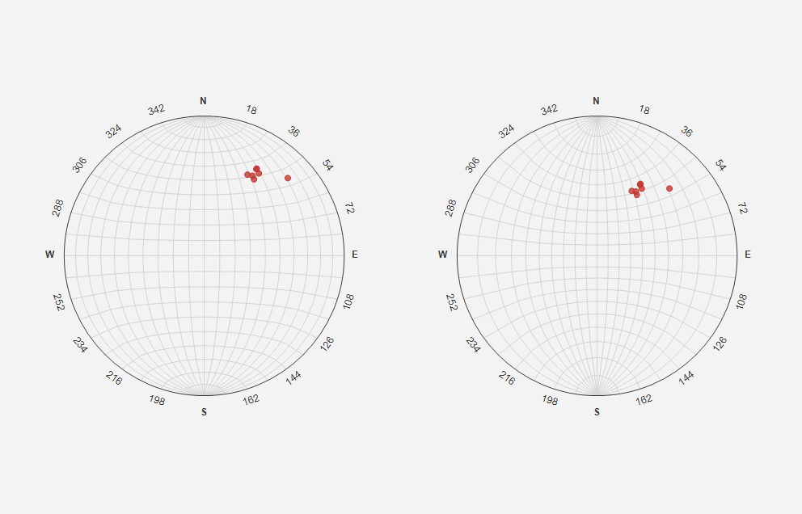
    
**PiperChart**
^^^^^^^^^^^^^^^^^^^^^^^^^^^^^^^^^^^

创建piper三线图，适用于水化学数据分析。

语法::

    PiperChart([Name],[ShowGrid = True]) 

Piper三线图示例::
	
    //Piper三线图
    title(Piper三线图测试用例,font=微软雅黑,size=16)
    setdata(tri) 
    PiperChart(test,true)
    Piper(q,f,r,q,f,r,Name) 
    SetLegend( 3 ,false,cols=1 )
    ChartStyle(dark) 
    Circle(0 78.5 21.5 0 39.8 60.2,0 63.1 36.9 0 35.7 64.3)
    Circle(Null 38.7 38.3 23.1,Null 28.7 32.7 38.6)
    Circle(37.8 42.2 20.0 Null,28.7 36.6 34.7 Null)
    
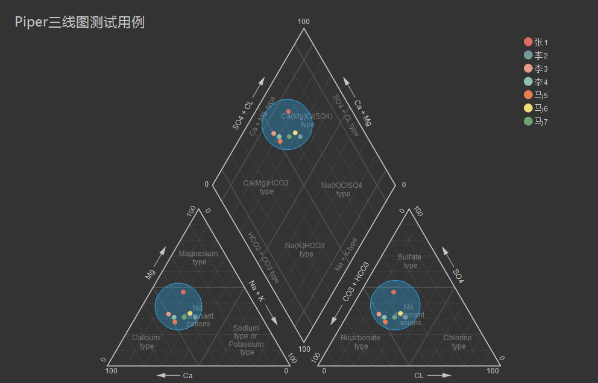
	
	
设置坐标轴
-----------------------------------
 
**AxisTitle**
^^^^^^^^^^^^^^^^^^^^^^^^^^^^^^^^^^^

设置坐标轴的标题。

语法::

    AxisTitle(AxisType = X,Title)
    其中AxisType可为X|Y|Polar|PolarAngle

**OrdinalScale**
^^^^^^^^^^^^^^^^^^^^^^^^^^^^^^^^^^^

将当前统计图指定的坐标轴，设置为序数型。

语法::

    OrdinalScale(AxisType = X)
	

**LinearScale**
^^^^^^^^^^^^^^^^^^^^^^^^^^^^^^^^^^^

将当前统计图指定的坐标轴，设置为数值型。

语法::

    LinearScale(AxisType = X,[min = 数字],[max = 数字])

**LogScale**
^^^^^^^^^^^^^^^^^^^^^^^^^^^^^^^^^^^

将当前统计图指定的坐标轴，设置为对数坐标。

语法::

    LogScale(AxisType = X,[min = 数字],[max = 数字])

对数坐标系示例:: 	
	
    //对数坐标系
    XYChart(chart5)
    StepLine(Name,直接访问)
    logscale(Y)
    
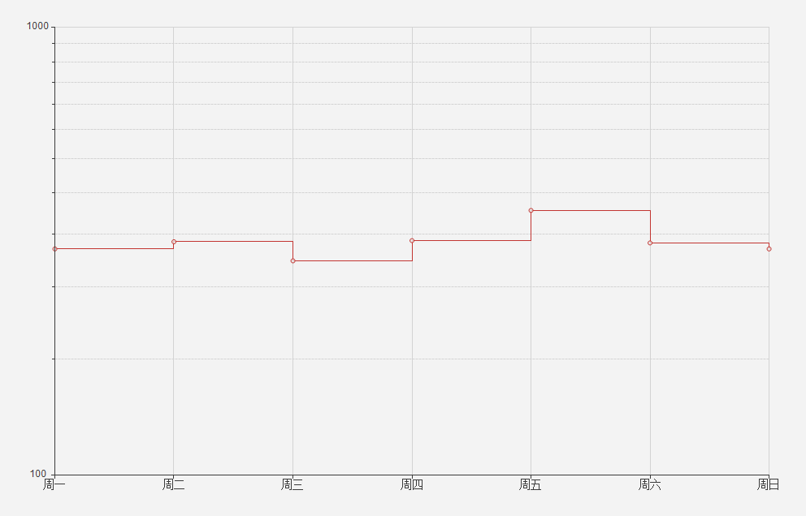

	
**AngularScale**
^^^^^^^^^^^^^^^^^^^^^^^^^^^^^^^^^^^

将当前统计图指定的坐标轴，设置为角度坐标。

语法::

    AngularScale(AxisType = PolarAngle)
 

**TimelineScale**
^^^^^^^^^^^^^^^^^^^^^^^^^^^^^^^^^^^

将当前统计图指定的坐标轴，设置为时间型。

语法::

    TimelineScale(AxisType = X)
	
时间轴示例::
	
    //时间轴
    setdata(2)
    XYChart(chart5)
    StepLine(Birthday,Age)     
	
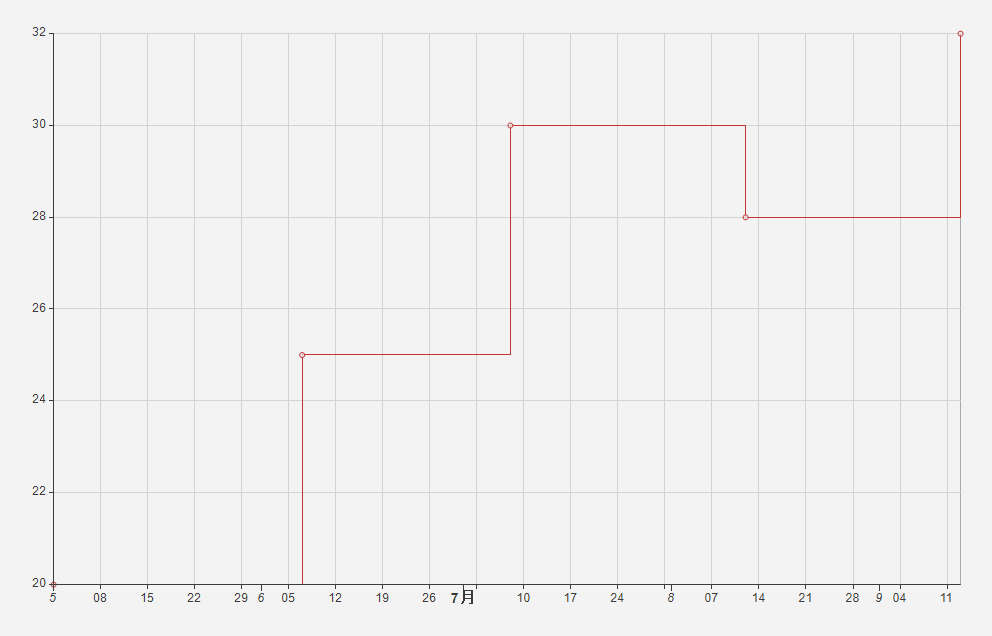
	
设置数据系列
-----------------------------------

**Area**
^^^^^^^^^^^^^^^^^^^^^^^^^^^^^^^^^^^

Area系列支持：XYChart,PolarChart,RadarChart

语法::

    XYChart: Area(xColumn,yColumn,[LabelColumn],[Name])
    PolarChart: Area(AColumn,PColumn,[LabelColumn],[Name])
    RadarChart: Area(AxisColumn,ValueColumn,[LabelColumn],[Name])
 
Area示例::	

    //SmoothArea
    XYChart(chart5)
    Area(Name,直接访问)
    XYChart(chart5)
    SmoothArea(Name,直接访问)
    AlignV()
    ChartStyle(Dark)

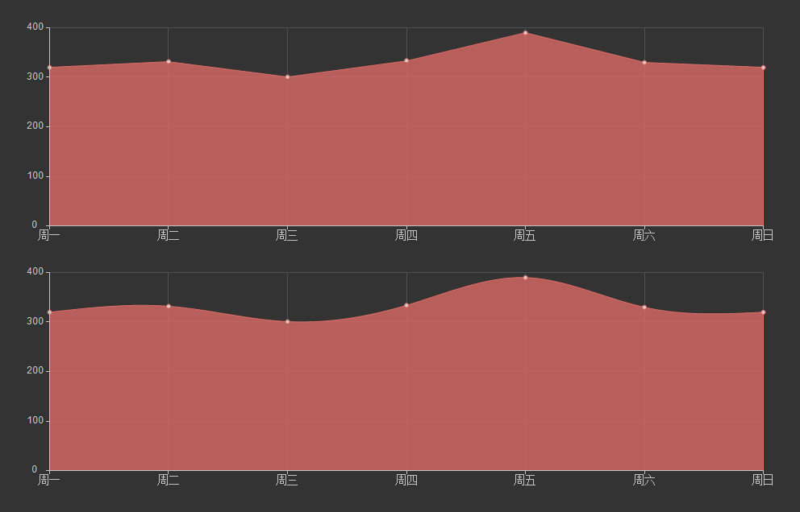

**Line**
^^^^^^^^^^^^^^^^^^^^^^^^^^^^^^^^^^^

Line系列支持：XYChart,PolarChart,RadarChart

语法::

    XYChart: Line(xColumn,yColumn,[LabelColumn],[Name])
    PolarChart: Line(AColumn,PColumn,[LabelColumn],[Name])
    RadarChart: Line(AxisColumn,ValueColumn,[LabelColumn],[Name])

**Point**
^^^^^^^^^^^^^^^^^^^^^^^^^^^^^^^^^^^

Point系列支持：XYChart,PolarChart,TriChart,SchmidtChart,WulffChart

语法::

    XYChart: Point(xColumn,yColumn,[LabelColumn],[Name])
    PolarChart: Point(AColumn,PColumn,[LabelColumn],[Name])
    TriChart: Point(AColumn,BColumn,CColumn,[LabelColumn],[Name])
    SchmidtChart: Point(rColumn,aColumn,[LabelColumn],[Name])
    WulffChart: Point(rColumn,aColumn,[LabelColumn],[Name])
	
点系列示例::

    //点系列
    Title(散点图测试)
    XYChart(chart2) 
    point(邮件营销,搜索引擎,name="搜索引擎")
    point(搜索引擎,邮件营销,name="邮件营销")

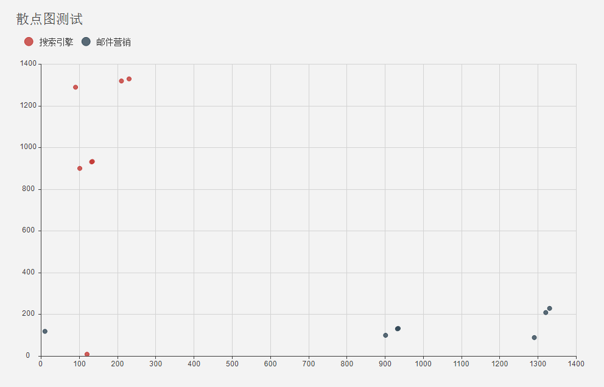
	
**Bar**
^^^^^^^^^^^^^^^^^^^^^^^^^^^^^^^^^^^

Bar系列支持：XYChart

语法::

    Bar(xColumn,yColumn,[LabelColumn],[Name])
  	
多个系列示例::
	
    //多个系列
    Setdata(1)
    XYChart(chart2)
    AxisTitle(x,一周的广告收入)
    AxisTitle(y,访问率)
    Bar(Name,联盟广告)
    Bar(Name,视频广告)
    Bar(Name,直接访问)

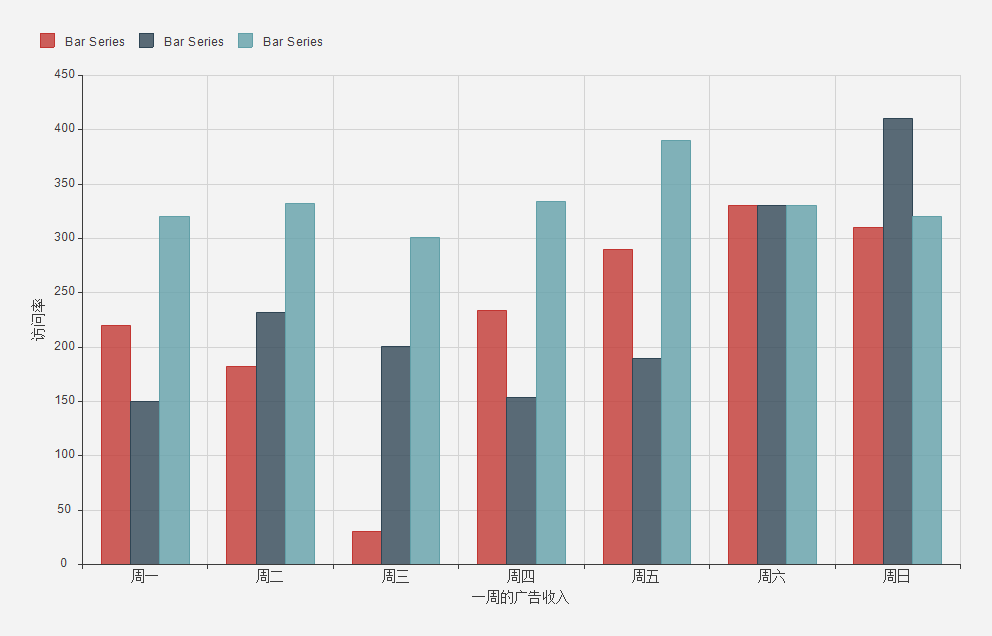

**CountBar**
^^^^^^^^^^^^^^^^^^^^^^^^^^^^^^^^^^^

CountBar系列,对散列数据分组计数，给制条形图支持：XYChart

语法::

    CountBar(LabelColumn,[Name])

**Box**
^^^^^^^^^^^^^^^^^^^^^^^^^^^^^^^^^^^

误差统计图，支持：XYChart

语法::

    Box(ValueColumn,[groupColumn],[Name])
	
误差统计图示例::		
	
    //误差统计图
    XYChart(chart1)
    Box(搜索引擎,Name)
    XYChart(chart2)
    Box(搜索引擎) 

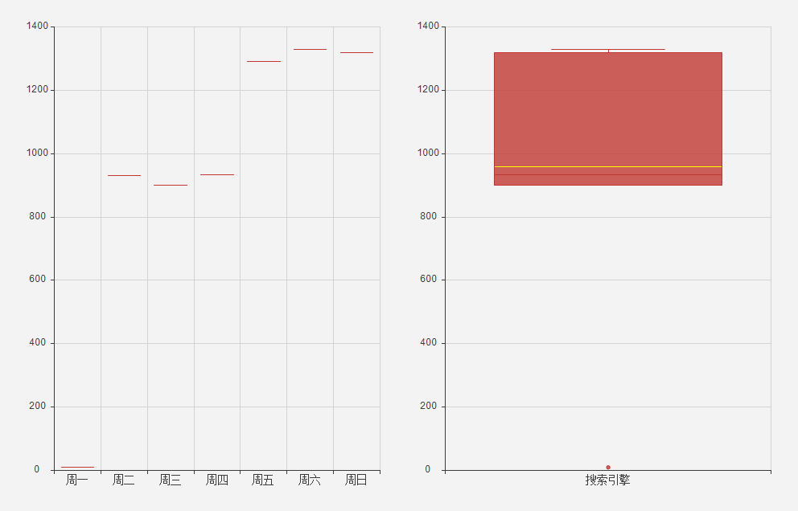

**Histogram**
^^^^^^^^^^^^^^^^^^^^^^^^^^^^^^^^^^^

Histogram系列支持：XYChart,PolarChart

语法::

    Histogram(ValueColumn,[Name])
	
Histogram与玫瑰花图示例::	
    
    //Histogram与玫瑰花图
    XYChart(chart2)
    Histogram(邮件营销,联盟广告)
    PolarChart(chart1)
    Histogram(邮件营销,联盟广告)
    ChartStyle(Dark) 
	
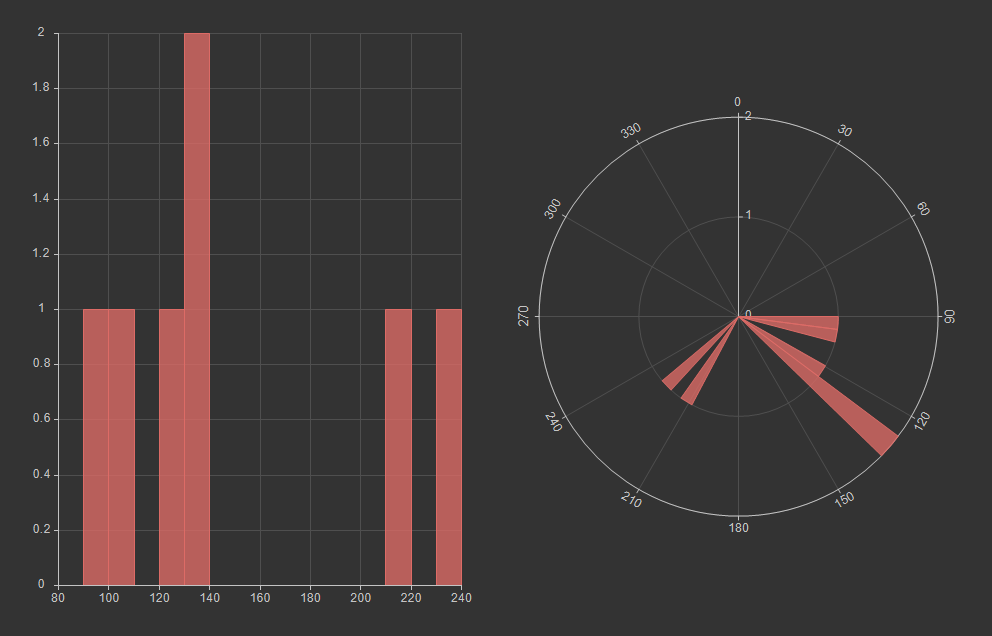

**Pie**
^^^^^^^^^^^^^^^^^^^^^^^^^^^^^^^^^^^

饼图系列支持：PieChart

语法::

    Pie(LabelColumn,ValueColumn,[Name])

**Ring**
^^^^^^^^^^^^^^^^^^^^^^^^^^^^^^^^^^^

Ring系列支持：PieChart

语法::

    Ring(LabelColumn,ValueColumn,[Name])
	
饼图示例::	
   
    //饼图
    PieChart(pie1)
    Pie(Name,直接访问)
    PieChart(pie2)
    Ring(Name,直接访问) 
  
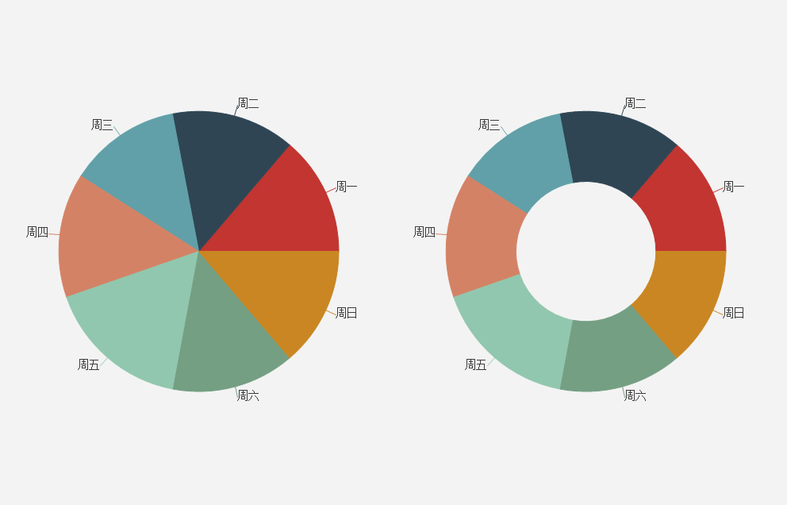

**SmoothArea**
^^^^^^^^^^^^^^^^^^^^^^^^^^^^^^^^^^^

SmoothArea系列支持：XYChart

语法::

    SmoothArea(xColumn,yColumn,[LabelColumn],[Name])

**SmoothLine**
^^^^^^^^^^^^^^^^^^^^^^^^^^^^^^^^^^^

SmoothLine系列支持：XYChart

语法::

    SmoothLine(xColumn,yColumn,[LabelColumn],[Name])

**StepLine**
^^^^^^^^^^^^^^^^^^^^^^^^^^^^^^^^^^^

StepLine系列支持：XYChart

语法::

    StepLine(xColumn,yColumn,[LabelColumn],[Name])
 
StepLine示例::		
	
    //StepLine
    XYChart(chart5)
    Linearscale(y,0,400)
    StepLine(Name,直接访问)

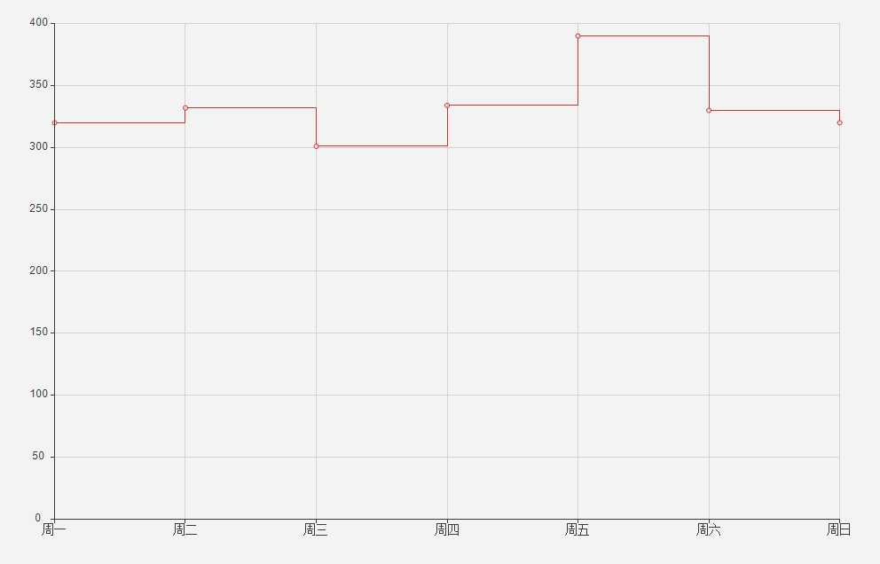

**Piper**
^^^^^^^^^^^^^^^^^^^^^^^^^^^^^^^^^^^

Piper系列支持：PiperChart

语法::

    Piper(MgColumn,CaColumn,NaColumn,SO4Column,CO3Column,ClColumn,[LabelColumn],[Name])

绘图命令
-----------------------------------

绘图命令，可以通过鼠标交互式绘图来自动创建。注意，不同的坐标系下点的坐标编码方式不同。

**Rect**
^^^^^^^^^^^^^^^^^^^^^^^^^^^^^^^^^^^

绘制矩形

语法::

    Rect(pointA,pointB)
	
**Circle**
^^^^^^^^^^^^^^^^^^^^^^^^^^^^^^^^^^^

绘制椭圆

语法::

    Circle(CenterPoint,SidePoint)

**Ellipse**
^^^^^^^^^^^^^^^^^^^^^^^^^^^^^^^^^^^

绘制椭圆

语法::

    Ellipse(pointA,pointB)
	
	
**Polyline**
^^^^^^^^^^^^^^^^^^^^^^^^^^^^^^^^^^^

绘制折线

语法::

    Polyline(pointA,pointB,pointC...)

**Curve**
^^^^^^^^^^^^^^^^^^^^^^^^^^^^^^^^^^^

绘制曲线

语法::

    Curve(pointA,pointB,pointC...)

**Label**
^^^^^^^^^^^^^^^^^^^^^^^^^^^^^^^^^^^

添加标记 

语法::

    Label(Text,point[,Pos])
    其中Pos为Center(默认),LeftTop,LeftMiddle,LeftBottom,CenterTop,CenterBottom,RightTop,RightMiddle,RightBottom
    Pos也可以通过相应的序号来设置。

**Image**
^^^^^^^^^^^^^^^^^^^^^^^^^^^^^^^^^^^

加载背景图片

语法::

    Image(File)

页面布局
-----------------------------------

**AlignGrid**
^^^^^^^^^^^^^^^^^^^^^^^^^^^^^^^^^^^

网格布局所有统计图。

语法::

    AlignGrid([margin = 1],[gap = 5])
    其中margin指定页边距，gap指定图与图之间的间隔
	
网格局器示例:: 
	
    //网格局器
    XYChart(chart1)
    AxisTitle(y,联盟广告)
    Bar(Name,联盟广告)
    XYChart(chart2)
    AxisTitle(y,直接访问)
    area(Name,直接访问)
    XYChart(chart3)
    AxisTitle(y,直接访问)
    StepLine(Name,直接访问)
    XYChart(chart4)
    AxisTitle(y,搜索引擎)
    smoothline(Name,搜索引擎)
    ChartStyle(Dark)
    AlignGrid()
    	
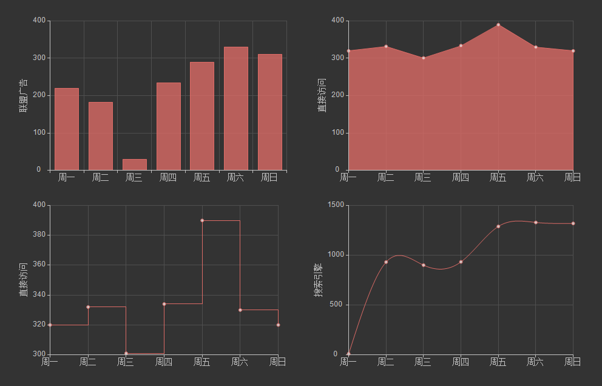
 
**AlignH**
^^^^^^^^^^^^^^^^^^^^^^^^^^^^^^^^^^^

左右布局所有统计图。

语法::

    AlignH([margin = 1],[gap = 5])
	
水平布局器示例::
	
    //水平布局器
    setdata(1)
    XYChart(chart2,side=right)
    AxisTitle(y,联盟广告)
    Bar(Name,联盟广告)
    XYChart(chart2,side=left)
    AxisTitle(y,直接访问)
    Bar(Name,直接访问)
    ChartStyle(Dark)
    AlignH()
	
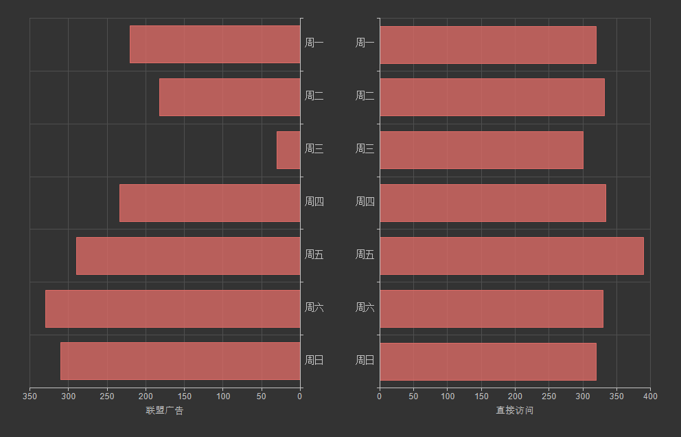
	
**AlignV**
^^^^^^^^^^^^^^^^^^^^^^^^^^^^^^^^^^^

上下布局所有统计图。

语法::

    AlignV([margin = 1],[gap = 5])
	
垂直局器示例::   

    //垂直局器
    XYChart(chart1)
    AxisTitle(y,联盟广告)
    Bar(Name,联盟广告)
    XYChart(chart2)
    AxisTitle(y,直接访问)
    area(Name,直接访问)
    XYChart(chart3)
    AxisTitle(y,直接访问)
    StepLine(Name,直接访问)
    XYChart(chart4)
    AxisTitle(y,搜索引擎)
    smoothline(Name,搜索引擎)
    ChartStyle(Dark)
    AlignV()
		
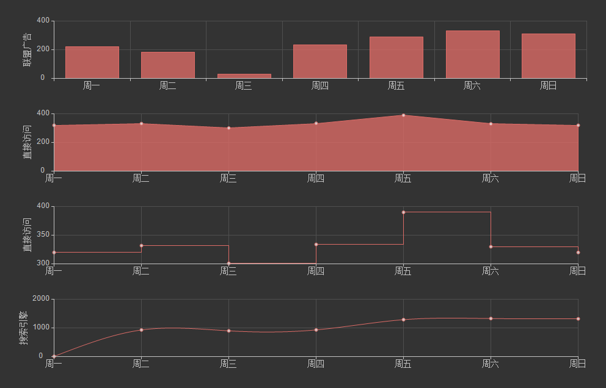
	
**AlignLeft**
^^^^^^^^^^^^^^^^^^^^^^^^^^^^^^^^^^^

┠型布局所有统计图。

语法::

    AlignLeft([margin = 1],[gap = 5])
	
左布局器示例::    
   
    //左布局器
    XYChart(chart1,left)
    AxisTitle(y,访问率)
    Bar(Name,联盟广告)
    XYChart(chart2)
    area(Name,直接访问)
    XYChart(chart3)
    StepLine(Name,直接访问)
    XYChart(chart4)
    smoothline(Name,搜索引擎)
    ChartStyle(Dark)
    Alignleft()
 
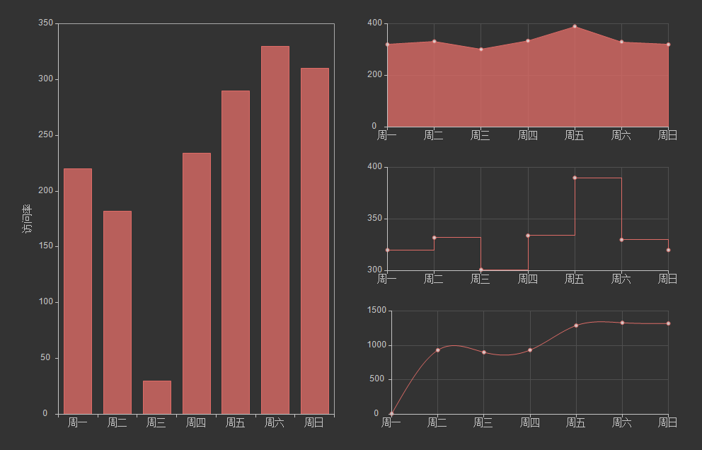

	
**AlignRight**
^^^^^^^^^^^^^^^^^^^^^^^^^^^^^^^^^^^

┫型布局所有统计图。

语法::

    AlignRight([margin = 1],[gap = 5])

右布局器示例:: 
 
    //右布局器
    XYChart(chart1)
    AxisTitle(y,访问率)
    Bar(Name,联盟广告)
    XYChart(chart2)
    area(Name,直接访问)
    XYChart(chart2)
    StepLine(Name,直接访问)
    PolarChart(chart1)
    Area(邮件营销,搜索引擎)
    ChartStyle(Dark)
    AlignRight()
    
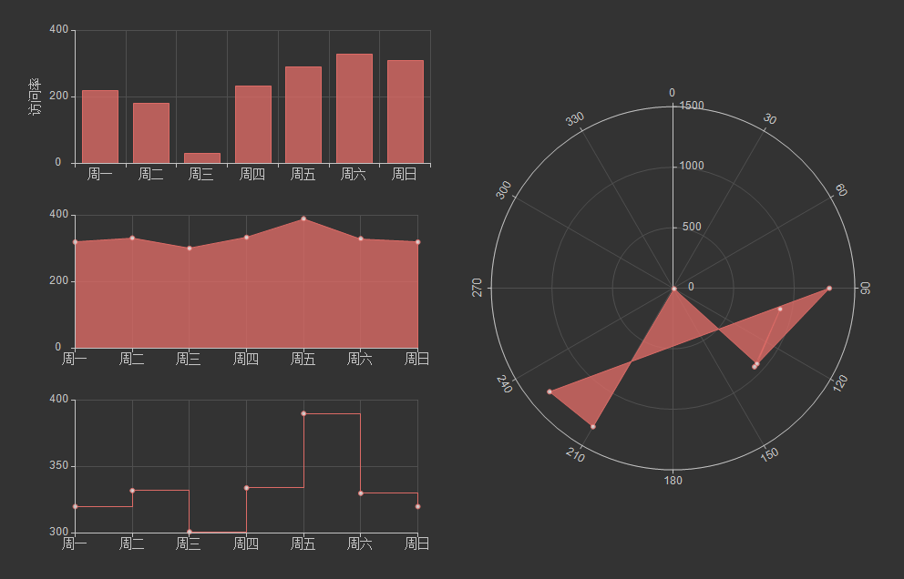
	
其它设置
-----------------------------------

**Title**
^^^^^^^^^^^^^^^^^^^^^^^^^^^^^^^^^^^

设置统计图的标题。

语法::

    Title(Text,[Pos = Left],[Font = 宋体],[Size = 16])
	其中Pos，可设置为Left、Center、Right

**SetChart**
^^^^^^^^^^^^^^^^^^^^^^^^^^^^^^^^^^^

将指定名称的统计图设置为当前统计图。

语法::

    SetChart(Name)

**SetData**
^^^^^^^^^^^^^^^^^^^^^^^^^^^^^^^^^^^

当有多个数据源时，切换当前用于绘图的数据表；tableId从1开始计数。

语法::

    SetData(Name|tableId)
	
多个数据源示例:: 
	
    //多个数据源
    XYChart(chart2,left)
    AxisTitle(x,一周的广告收入)
    AxisTitle(y,访问率)
    Bar(Name,联盟广告,Name=联盟广告)
    Bar(Name,视频广告,Name=视频广告)
    Bar(Name,直接访问,Name=直接访问)
    setdata(2)
    PieChart(饼图)
    Pie(Name,age)
    setdata(广告访问)
    XYChart(chart5)
    StepLine(Name,邮件营销)
    PolarChart(chart1)
    Area(联盟广告,搜索引擎)
    ChartStyle(dark)
    AlignRight()
    
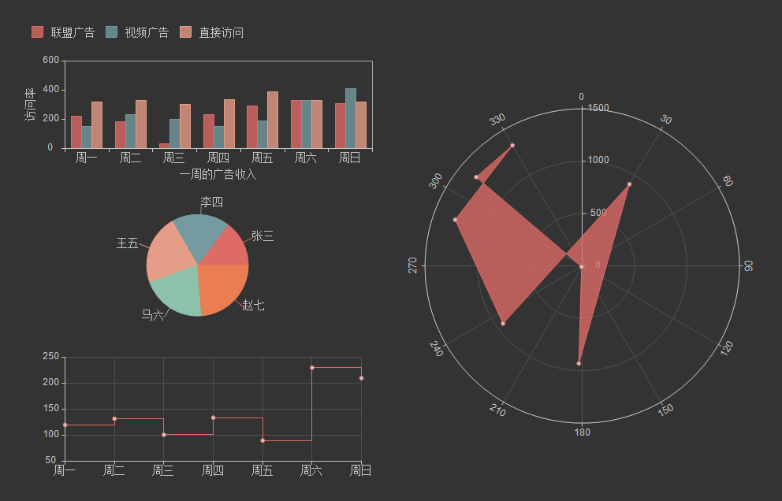

**ChartStyle**
^^^^^^^^^^^^^^^^^^^^^^^^^^^^^^^^^^^

设置统计图的界面样式。

语法::

    ChartStyle([style = Default],[margin = 15])
    其中style，支持default、Paper、Light、Dark。
    在数据专家系统的ChartEx目录下，用户可以编制（.json）文件对统计图的界面式进行扩展，可参考test.json文件。

**SetLegend**
^^^^^^^^^^^^^^^^^^^^^^^^^^^^^^^^^^^

设置图例样式。

语法::

    SetLegend([Pos = LeftTop],[dock = True],[Rows = -1],[Cols = -1])
    其中Pos为Center(默认),LeftTop,LeftMiddle,LeftBottom,CenterTop,CenterBottom,RightTop,RightMiddle,RightBottom
    Pos也可以通过相应的序号来设置。
	
**Export**
^^^^^^^^^^^^^^^^^^^^^^^^^^^^^^^^^^^

导出图像

语法::

    Export(File)

	
扩展统计图
-----------------------------------

用户可以使用统计图语言定制统计图，对系统进行扩展。扩展统计图以.cht为后缀，位于数据专家系统的ChartEx目录下，可参考Clasolite.cht。
也可以将其添加到Chart.cfg文件中，将扩展统计图添加到【统计图节点】的列表中。

**Clasolite**
^^^^^^^^^^^^^^^^^^^^^^^^^^^^^^^^^^^

碎屑岩三角分类图解，一个扩展统计图的示例。

语法::

    Clasolite()

扩展图形示例::
	
    //扩展图形
    Clasolite()
    setdata(4)
    point(Q,F,R)

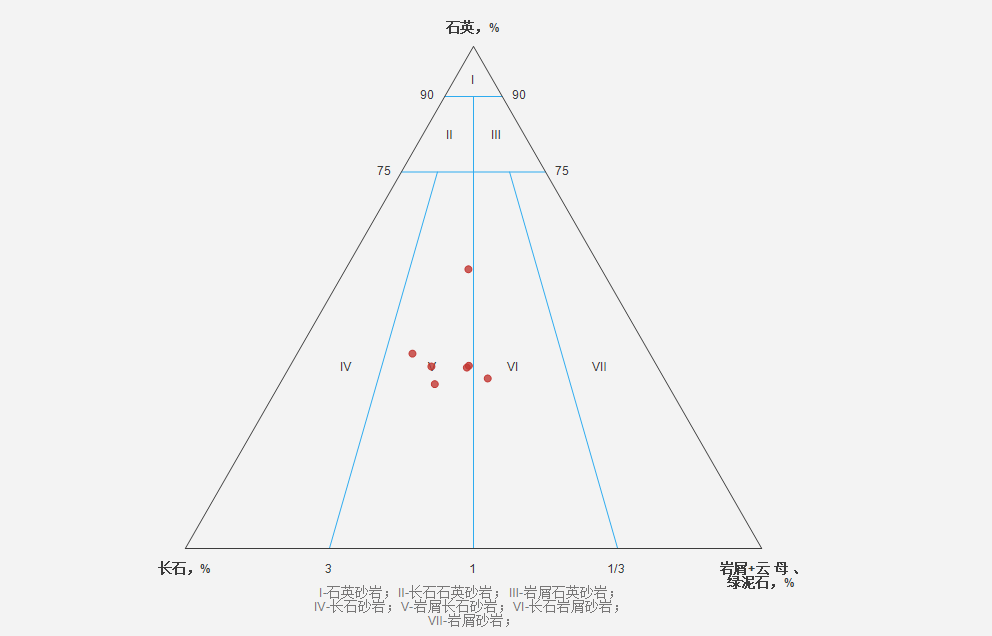

