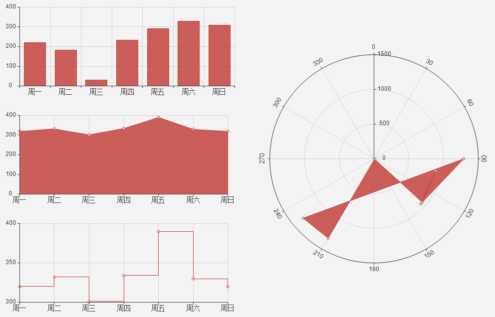

.. ChartLanguage
 
图表语言
====================================
Datist提供一套统计图绘制语言。

    
**案例：**

点系列示例::

    //点系列
    Title(散点图测试)
    XYChart(chart2) 
    point(邮件营销,搜索引擎,name="搜索引擎")
    point(搜索引擎,邮件营销,name="邮件营销")

.. figure:: ChartImages/Chart1.png
    :align: center
    :figwidth: 90% 
    :name: plate
    	
	
多个系列示例::
	
    //多个系列
    Setdata(1)
    XYChart(chart2)
    AxisTitle(x,一周的广告收入)
    AxisTitle(y,访问率)
    Bar(Name,联盟广告)
    Bar(Name,视频广告)
    Bar(Name,直接访问)

	
	
SmoothArea示例::	

    //SmoothArea
    XYChart(chart5)
    Area(Name,直接访问)
    XYChart(chart5)
    SmoothArea(Name,直接访问)
    AlignV()
    ChartStyle(Dark)

		

StepLine示例::		
	
    //StepLine
    XYChart(chart5)
    Linearscale(y,0,400)
    StepLine(Name,直接访问)

.. figure:: ChartImages/Chart4.png
    :align: center
    :figwidth: 90% 
    :name: plate	
	
误差统计图示例::		
	
    //误差统计图
    XYChart(chart1)
    Box(搜索引擎,Name)
    XYChart(chart2)
    Box(搜索引擎) 

.. figure:: ChartImages/Chart5.png
    :align: center
    :figwidth: 90% 
    :name: plate	
		
	
Histogram与玫瑰花图示例::	
    
    //Histogram与玫瑰花图
    XYChart(chart2)
    Histogram(邮件营销,联盟广告)
    PolarChart(chart1)
    Histogram(邮件营销,联盟广告)
    ChartStyle(Dark) 
	
.. figure:: ChartImages/Chart6.png
    :align: center
    :figwidth: 90% 
    :name: plate		
	
饼图示例::	
   
    //饼图
    PieChart(pie1)
    Pie(Name,直接访问)
    PieChart(pie2)
    Ring(Name,直接访问) 
  
.. figure:: ChartImages/Chart7.png
    :align: center
    :figwidth: 90% 
    :name: plate	

雷达图示例::	
	
    //雷达图
    RadarChart(chart1)
    Area(Name,搜索引擎)
    RadarChart(chart1)
    line(Name,搜索引擎)
    ChartStyle(Dark)
      
.. figure:: ChartImages/Chart8.png
    :align: center
    :figwidth: 90% 
    :name: plate		  

极坐标系示例::
	
    //极坐标系
    PolarChart(chart1)
    Area(联盟广告,搜索引擎)
    PolarChart(chart1)
    Histogram(邮件营销,联盟广告)
    ChartStyle(Dark)
      

	  
三角坐标系示例::
	  
    //三角坐标系
    trichart(test,true,Q,f,R)
    setdata(4)
    point(Q,F,R)
    

	
吴氏网与施氏网示例::
  
    //吴氏网与施氏网
    setdata(4)
    SchmidtChart(test2,true)
    point(Q,F)
    WulffChart(test3,true)
    point(Q,F)
    
.. figure:: ChartImages/Chart11.png
    :align: center
    :figwidth: 90% 
    :name: plate		
	
Piper三线图示例::
	
    //Piper三线图
    title(Piper三线图测试用例,font=微软雅黑,size=16)
    setdata(tri) 
    PiperChart(test,true)
    Piper(q,f,r,q,f,r,Name) 
    SetLegend( 3 ,false,cols=1 )
    ChartStyle(dark) 
    Circle(0 78.5 21.5 0 39.8 60.2,0 63.1 36.9 0 35.7 64.3)
    Circle(Null 38.7 38.3 23.1,Null 28.7 32.7 38.6)
    Circle(37.8 42.2 20.0 Null,28.7 36.6 34.7 Null)
    

	
水平布局器示例::
	
    //水平布局器
    setdata(1)
    XYChart(chart2,side=right)
    AxisTitle(y,联盟广告)
    Bar(Name,联盟广告)
    XYChart(chart2,side=left)
    AxisTitle(y,直接访问)
    Bar(Name,直接访问)
    ChartStyle(Dark)
    AlignH()
	

	
	
垂直局器示例::   

    //垂直局器
    XYChart(chart1)
    AxisTitle(y,联盟广告)
    Bar(Name,联盟广告)
    XYChart(chart2)
    AxisTitle(y,直接访问)
    area(Name,直接访问)
    XYChart(chart3)
    AxisTitle(y,直接访问)
    StepLine(Name,直接访问)
    XYChart(chart4)
    AxisTitle(y,搜索引擎)
    smoothline(Name,搜索引擎)
    ChartStyle(Dark)
    AlignV()
		
.. figure:: ChartImages/Chart14.png
    :align: center
    :figwidth: 90% 
    :name: plate		
	
左布局器示例::    
   
    //左布局器
    XYChart(chart1,left)
    AxisTitle(y,访问率)
    Bar(Name,联盟广告)
    XYChart(chart2)
    area(Name,直接访问)
    XYChart(chart3)
    StepLine(Name,直接访问)
    XYChart(chart4)
    smoothline(Name,搜索引擎)
    ChartStyle(Dark)
    Alignleft()
 
.. figure:: ChartImages/Chart15.png
    :align: center
    :figwidth: 90% 
    :name: plate	

右布局器示例:: 
 
    //右布局器
    XYChart(chart1)
    AxisTitle(y,访问率)
    Bar(Name,联盟广告)
    XYChart(chart2)
    area(Name,直接访问)
    XYChart(chart2)
    StepLine(Name,直接访问)
    PolarChart(chart1)
    Area(邮件营销,搜索引擎)
    ChartStyle(Dark)
    AlignRight()
    
.. figure:: ChartImages/Chart16.png
    :align: center
    :figwidth: 90% 
    :name: plate		
	
网格局器示例:: 
	
    //网格局器
    XYChart(chart1)
    AxisTitle(y,联盟广告)
    Bar(Name,联盟广告)
    XYChart(chart2)
    AxisTitle(y,直接访问)
    area(Name,直接访问)
    XYChart(chart3)
    AxisTitle(y,直接访问)
    StepLine(Name,直接访问)
    XYChart(chart4)
    AxisTitle(y,搜索引擎)
    smoothline(Name,搜索引擎)
    ChartStyle(Dark)
    AlignGrid()
    	

样式示例:: 
	
    //样式
    XYChart(chart1)
    Bar(Name,联盟广告)
    XYChart(chart2)
    area(Name,直接访问)
    XYChart(chart2)
    StepLine(Name,直接访问)
    PolarChart(chart1)
    Area(邮件营销,搜索引擎)
    ChartStyle(default) //default  paper  light  dark
    AlignRight()
    

		
多个数据源示例:: 
	
    //多个数据源
    XYChart(chart2,left)
    AxisTitle(x,一周的广告收入)
    AxisTitle(y,访问率)
    Bar(Name,联盟广告,Name=联盟广告)
    Bar(Name,视频广告,Name=视频广告)
    Bar(Name,直接访问,Name=直接访问)
    setdata(2)
    PieChart(饼图)
    Pie(Name,age)
    setdata(广告访问)
    XYChart(chart5)
    StepLine(Name,邮件营销)
    PolarChart(chart1)
    Area(联盟广告,搜索引擎)
    ChartStyle(dark)
    AlignRight()
    
.. figure:: ChartImages/Chart19.png
    :align: center
    :figwidth: 90% 
    :name: plate	

对数坐标系示例:: 	
	
    //对数坐标系
    XYChart(chart5)
    StepLine(Name,直接访问)
    logscale(Y)
    

	
时间轴示例::
	
    //时间轴
    setdata(2)
    XYChart(chart5)
    StepLine(Birthday,Age)     
	
.. figure:: ChartImages/Chart21.png
    :align: center
    :figwidth: 90% 
    :name: plate		
	
扩展图形示例::
	
    //扩展图形
    Clasolite()
    setdata(4)
    point(Q,F,R)

.. figure:: ChartImages/Chart22.png
    :align: center
    :figwidth: 90% 
    :name: plate	

