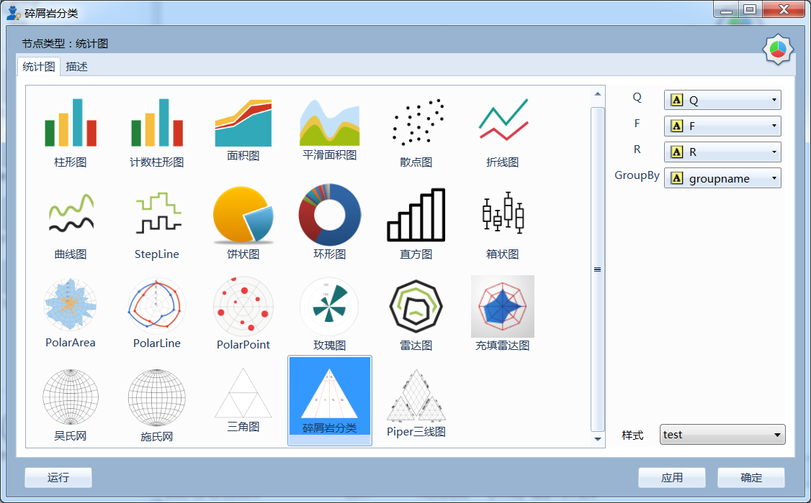

.. ChartLanguage
 
统计图语言
====================================
Datist提供一套统计图绘制语言，适用于统计图、统计图2节点。 

统计图绘制以函数方式组织绘图语法，函数由函数名和参数组成。

语法说明::
   
    XYChart([Name],[ShowGrid = True],[TitleX],[TitleY],[Side = default])
    其中：
       1、XYChart为函数名；
       2、括号里Name、ShowGrid、TitleX、TitleY、Side均为参数，多个参数之间以逗号间隔；
       3、参数的指定，以“参数名=值”的方式指定；
          当参数的顺序与函数参数的默认顺序一致里，可省略参数名；
          如以下三个命名是等效的：
            XYChart(Name="统计图",ShowGrid = True)；
            XYChart(ShowGrid = True,Name="统计图")；
            XYChart("统计图",True)；
       4、语法中，参数名以方括号标记，表示可选参数，即使用时，可不指定；	 
       5、字符串，以"或'配对使用，如Name="这是一个测试统计图"。
	

设置坐标系
-----------------------------------

XYChart
^^^^^^^^^^^^^^^^^^^^^^^^^^^^^^^^^^^

创建二维统计图。

语法::

    XYChart([Name],[ShowGrid = True],[TitleX],[TitleY],[Side = default])
    其中Side，可设置为default|left|right指定X坐标轴的位置。

PieChart
^^^^^^^^^^^^^^^^^^^^^^^^^^^^^^^^^^^

创建饼状统计图。

语法::

    PieChart([Name])

PolarChart
^^^^^^^^^^^^^^^^^^^^^^^^^^^^^^^^^^^

创建极坐标统计图(角度vs数值)。

语法::

    PolarChart([Name])
	

极坐标系示例::
	
    //极坐标系
    PolarChart(chart1)
    Area(联盟广告,搜索引擎)
    PolarChart(chart1)
    Histogram(邮件营销,联盟广告)
    ChartStyle(Dark)
      
.. figure:: ChartImages/Chart9.png
    :align: center
    :figwidth: 90% 
    :name: plate		  

RadarChart
^^^^^^^^^^^^^^^^^^^^^^^^^^^^^^^^^^^

创建雷达图（多个坐标轴)。

语法::

    RadarChart([Name])

雷达图示例::	
	
    //雷达图
    RadarChart(chart1)
    Area(Name,搜索引擎)
    RadarChart(chart1)
    line(Name,搜索引擎)
    ChartStyle(Dark)
      

	
TriChart
^^^^^^^^^^^^^^^^^^^^^^^^^^^^^^^^^^^

创建三角坐标系统计图。

语法::

    TriChart([Name],[ShowGrid = True],[TitleA = A],[TitleB = B],[TitleC = C],[Desc])
    其中Desc用于指定统计图底部显示的文字信息。
	
三角坐标系示例::
	  
    //三角坐标系
    trichart(test,true,Q,f,R)
    setdata(4)
    point(Q,F,R)
    
.. figure:: ChartImages/Chart10.png
    :align: center
    :figwidth: 90% 
    :name: plate		

WulffChart
^^^^^^^^^^^^^^^^^^^^^^^^^^^^^^^^^^^

创建吴氏网(乌尔夫网图)。

语法::

    WulffChart([Name],[ShowGrid = True])
	
SchmidtChart
^^^^^^^^^^^^^^^^^^^^^^^^^^^^^^^^^^^

创建施氏网(施密特网)。

语法::

    SchmidtChart([Name],[ShowGrid = True]) 
	
吴氏网与施氏网示例::
  
    //吴氏网与施氏网
    setdata(4)
    SchmidtChart(test2,true)
    point(Q,F)
    WulffChart(test3,true)
    point(Q,F)
    

    
PiperChart
^^^^^^^^^^^^^^^^^^^^^^^^^^^^^^^^^^^

创建piper三线图，适用于水化学数据分析。

语法::

    PiperChart([Name],[ShowGrid = True]) 

Piper三线图示例::
	
    //Piper三线图
    title(Piper三线图测试用例,font=微软雅黑,size=16)
    setdata(tri) 
    PiperChart(test,true)
    Piper(q,f,r,q,f,r,Name) 
    SetLegend( 3 ,false,cols=1 )
    ChartStyle(dark) 
    Circle(0 78.5 21.5 0 39.8 60.2,0 63.1 36.9 0 35.7 64.3)
    Circle(Null 38.7 38.3 23.1,Null 28.7 32.7 38.6)
    Circle(37.8 42.2 20.0 Null,28.7 36.6 34.7 Null)
    
.. figure:: ChartImages/Chart12.png
    :align: center
    :figwidth: 90% 
    :name: plate		
	
	
设置坐标轴
-----------------------------------
 
AxisTitle
^^^^^^^^^^^^^^^^^^^^^^^^^^^^^^^^^^^

设置坐标轴的标题。

语法::

    AxisTitle(AxisType = X,Title)
    其中AxisType可为X|Y|Polar|PolarAngle

OrdinalScale
^^^^^^^^^^^^^^^^^^^^^^^^^^^^^^^^^^^

将当前统计图指定的坐标轴，设置为序数型。

语法::

    OrdinalScale(AxisType = X)
	

LinearScale
^^^^^^^^^^^^^^^^^^^^^^^^^^^^^^^^^^^

将当前统计图指定的坐标轴，设置为数值型。

语法::

    LinearScale(AxisType = X,[min = 数字],[max = 数字])

LogScale
^^^^^^^^^^^^^^^^^^^^^^^^^^^^^^^^^^^

将当前统计图指定的坐标轴，设置为对数坐标。

语法::

    LogScale(AxisType = X,[min = 数字],[max = 数字])

对数坐标系示例:: 	
	
    //对数坐标系
    XYChart(chart5)
    StepLine(Name,直接访问)
    logscale(Y)
    
.. figure:: ChartImages/Chart20.png
    :align: center
    :figwidth: 90% 
    :name: plate		

	
AngularScale
^^^^^^^^^^^^^^^^^^^^^^^^^^^^^^^^^^^

将当前统计图指定的坐标轴，设置为角度坐标。

语法::

    AngularScale(AxisType = PolarAngle)
 

TimelineScale
^^^^^^^^^^^^^^^^^^^^^^^^^^^^^^^^^^^

将当前统计图指定的坐标轴，设置为时间型。

语法::

    TimelineScale(AxisType = X)
	
时间轴示例::
	
    //时间轴
    setdata(2)
    XYChart(chart5)
    StepLine(Birthday,Age)     
	

	
设置数据系列
-----------------------------------

标记符号Symbol支持:
Bar, Pyramid, InvertedPyramid, Ellipse, Cross, DiagonalCross, LineCross, LineDiagonalCross, Star, Diamond, Asterisk

Area
^^^^^^^^^^^^^^^^^^^^^^^^^^^^^^^^^^^

Area系列支持：XYChart,PolarChart,RadarChart

语法::
 
    XYChart: Area(xColumn,yColumn,[LabelColumn],[ShowLabel = False],[Symbol = Ellipse],[SymbolSize = 5],[Name]) 
    PolarChart: Area(AColumn,PColumn,[LabelColumn],[ShowLabel = False],[Symbol = Ellipse],[SymbolSize = 5],[Name]) 
    RadarChart: Area(AxisColumn,ValueColumn,[LabelColumn],[ShowLabel = False],[Symbol = Ellipse],[SymbolSize = 5],[Name]) 

Area示例::	

    //SmoothArea
    XYChart(chart5)
    Area(Name,直接访问)
    XYChart(chart5)
    SmoothArea(Name,直接访问)
    AlignV()
    ChartStyle(Dark)

.. figure:: ChartImages/Chart3.png
    :align: center
    :figwidth: 90% 
    :name: plate	

Line
^^^^^^^^^^^^^^^^^^^^^^^^^^^^^^^^^^^

Line系列支持：XYChart,PolarChart,RadarChart

语法::

    XYChart: Line(xColumn,yColumn,[LabelColumn],[ShowLabel = False],[Symbol = Ellipse],[SymbolSize = 5],[Name]) 
    PolarChart: Line(AColumn,PColumn,[LabelColumn],[ShowLabel = False],[Symbol = Ellipse],[SymbolSize = 5],[Name]) 
    RadarChart: Line(AxisColumn,ValueColumn,[LabelColumn],[ShowLabel = False],[Symbol = Ellipse],[SymbolSize = 5],[Name]) 

Point
^^^^^^^^^^^^^^^^^^^^^^^^^^^^^^^^^^^

Point系列支持：XYChart,PolarChart,TriChart,SchmidtChart,WulffChart

语法::
 
    XYChart: Point(xColumn,yColumn,[LabelColumn],[ShowLabel = False],[Symbol = Ellipse],[SymbolSize = 5],[Name]) 
    PolarChart:	 Point(AColumn,PColumn,[LabelColumn],[ShowLabel = False],[Symbol = Ellipse],[SymbolSize = 5],[Name]) 
    TriChart: Point(AColumn,BColumn,CColumn,[LabelColumn],[ShowLabel = False],[Symbol = Ellipse],[SymbolSize = 5],[Name]) 
    SchmidtChart: Point(rColumn,aColumn,[LabelColumn],[ShowLabel = False],[Symbol = Ellipse],[SymbolSize = 5],[Name]) 
    WulffChart: Point(rColumn,aColumn,[LabelColumn],[ShowLabel = False],[Symbol = Ellipse],[SymbolSize = 5],[Name]) 
	
点系列示例::

    //点系列
    Title(散点图测试)
    XYChart(chart2) 
    point(邮件营销,搜索引擎,name="搜索引擎")
    point(搜索引擎,邮件营销,name="邮件营销")

	
Bar
^^^^^^^^^^^^^^^^^^^^^^^^^^^^^^^^^^^

Bar系列支持：XYChart

语法::

    Bar(xColumn,yColumn,[LabelColumn],[ShowLabel = True],[Name])
  	
多个系列示例::
	
    //多个系列
    Setdata(1)
    XYChart(chart2)
    AxisTitle(x,一周的广告收入)
    AxisTitle(y,访问率)
    Bar(Name,联盟广告)
    Bar(Name,视频广告)
    Bar(Name,直接访问)

.. figure:: ChartImages/Chart2.png
    :align: center
    :figwidth: 90% 
    :name: plate	

CountBar
^^^^^^^^^^^^^^^^^^^^^^^^^^^^^^^^^^^

CountBar系列,对散列数据分组计数，给制条形图支持：XYChart

语法::

    CountBar(LabelColumn,[ShowLabel = True],[Name])

Box
^^^^^^^^^^^^^^^^^^^^^^^^^^^^^^^^^^^

误差统计图，支持：XYChart

语法::

    Box(ValueColumn,[groupColumn],[Name])
	
误差统计图示例::		
	
    //误差统计图
    XYChart(chart1)
    Box(搜索引擎,Name)
    XYChart(chart2)
    Box(搜索引擎) 

.. figure:: ChartImages/Chart5.png
    :align: center
    :figwidth: 90% 
    :name: plate	

Histogram
^^^^^^^^^^^^^^^^^^^^^^^^^^^^^^^^^^^

Histogram系列支持：XYChart,PolarChart

语法::

    Histogram(ValueColumn,[Name])
	
Histogram与玫瑰花图示例::	
    
    //Histogram与玫瑰花图
    XYChart(chart2)
    Histogram(邮件营销,联盟广告)
    PolarChart(chart1)
    Histogram(邮件营销,联盟广告)
    ChartStyle(Dark) 
	

Pie
^^^^^^^^^^^^^^^^^^^^^^^^^^^^^^^^^^^

饼图系列支持：PieChart

语法::

    Pie(LabelColumn,ValueColumn,[ShowLabel = True],[Name]) 

Ring
^^^^^^^^^^^^^^^^^^^^^^^^^^^^^^^^^^^

Ring系列支持：PieChart

语法::

    Ring(LabelColumn,ValueColumn,[ShowLabel = True],[Name]) 
	
饼图示例::	
   
    //饼图
    PieChart(pie1)
    Pie(Name,直接访问)
    PieChart(pie2)
    Ring(Name,直接访问) 
  

SmoothArea
^^^^^^^^^^^^^^^^^^^^^^^^^^^^^^^^^^^

SmoothArea系列支持：XYChart

语法::

    SmoothArea(xColumn,yColumn,[LabelColumn],[ShowLabel = False],[Symbol = Ellipse],[SymbolSize = 5],[Name]) 

SmoothLine
^^^^^^^^^^^^^^^^^^^^^^^^^^^^^^^^^^^

SmoothLine系列支持：XYChart

语法::

    SmoothLine(xColumn,yColumn,[LabelColumn],[ShowLabel = False],[Symbol = Ellipse],[SymbolSize = 5],[Name]) 

StepLine
^^^^^^^^^^^^^^^^^^^^^^^^^^^^^^^^^^^

StepLine系列支持：XYChart

语法::

    StepLine(xColumn,yColumn,[LabelColumn],[ShowLabel = False],[Symbol = Ellipse],[SymbolSize = 5],[Name]) 
 
StepLine示例::		
	
    //StepLine
    XYChart(chart5)
    Linearscale(y,0,400)
    StepLine(Name,直接访问)

Piper
^^^^^^^^^^^^^^^^^^^^^^^^^^^^^^^^^^^

Piper系列支持：PiperChart

语法::

    Piper(MgColumn,CaColumn,NaColumn,SO4Column,CO3Column,ClColumn,[LabelColumn],[ShowLabel = False],[Symbol = Ellipse],[SymbolSize = 5],[Name]) 

绘图命令
-----------------------------------

绘图命令，可以通过鼠标交互式绘图来自动创建。注意，不同的坐标系下点的坐标编码方式不同。

Rect
^^^^^^^^^^^^^^^^^^^^^^^^^^^^^^^^^^^

绘制矩形

语法::

    Rect(pointA,pointB)
	
Circle
^^^^^^^^^^^^^^^^^^^^^^^^^^^^^^^^^^^

绘制椭圆

语法::

    Circle(CenterPoint,SidePoint)

Ellipse
^^^^^^^^^^^^^^^^^^^^^^^^^^^^^^^^^^^

绘制椭圆

语法::

    Ellipse(pointA,pointB)
	
	
Polyline
^^^^^^^^^^^^^^^^^^^^^^^^^^^^^^^^^^^

绘制折线

语法::

    Polyline(pointA,pointB,pointC...)

Curve
^^^^^^^^^^^^^^^^^^^^^^^^^^^^^^^^^^^

绘制曲线

语法::

    Curve(pointA,pointB,pointC...)

Label
^^^^^^^^^^^^^^^^^^^^^^^^^^^^^^^^^^^

添加标记 

语法::

    Label(Text,point[,Pos])
    其中Pos为Center(默认),LeftTop,LeftMiddle,LeftBottom,CenterTop,CenterBottom,RightTop,RightMiddle,RightBottom
    Pos也可以通过相应的序号来设置。

Image
^^^^^^^^^^^^^^^^^^^^^^^^^^^^^^^^^^^

加载背景图片

语法::

    Image(File)

页面布局
-----------------------------------

AlignGrid
^^^^^^^^^^^^^^^^^^^^^^^^^^^^^^^^^^^

网格布局所有统计图。

语法::

    AlignGrid([margin = 1],[gap = 5])
    其中margin指定页边距，gap指定图与图之间的间隔
	
网格局器示例:: 
	
    //网格局器
    XYChart(chart1)
    AxisTitle(y,联盟广告)
    Bar(Name,联盟广告)
    XYChart(chart2)
    AxisTitle(y,直接访问)
    area(Name,直接访问)
    XYChart(chart3)
    AxisTitle(y,直接访问)
    StepLine(Name,直接访问)
    XYChart(chart4)
    AxisTitle(y,搜索引擎)
    smoothline(Name,搜索引擎)
    ChartStyle(Dark)
    AlignGrid()
    	
.. figure:: ChartImages/Chart17.png
    :align: center
    :figwidth: 90% 
    :name: plate	
 
AlignH
^^^^^^^^^^^^^^^^^^^^^^^^^^^^^^^^^^^

左右布局所有统计图。

语法::

    AlignH([margin = 1],[gap = 5])
	
水平布局器示例::
	
    //水平布局器
    setdata(1)
    XYChart(chart2,side=right)
    AxisTitle(y,联盟广告)
    Bar(Name,联盟广告)
    XYChart(chart2,side=left)
    AxisTitle(y,直接访问)
    Bar(Name,直接访问)
    ChartStyle(Dark)
    AlignH()
	
.. figure:: ChartImages/Chart13.png
    :align: center
    :figwidth: 90% 
    :name: plate	
	
AlignV
^^^^^^^^^^^^^^^^^^^^^^^^^^^^^^^^^^^

上下布局所有统计图。

语法::

    AlignV([margin = 1],[gap = 5])
	
垂直局器示例::   

    //垂直局器
    XYChart(chart1)
    AxisTitle(y,联盟广告)
    Bar(Name,联盟广告)
    XYChart(chart2)
    AxisTitle(y,直接访问)
    area(Name,直接访问)
    XYChart(chart3)
    AxisTitle(y,直接访问)
    StepLine(Name,直接访问)
    XYChart(chart4)
    AxisTitle(y,搜索引擎)
    smoothline(Name,搜索引擎)
    ChartStyle(Dark)
    AlignV()
		
.. figure:: ChartImages/Chart14.png
    :align: center
    :figwidth: 90% 
    :name: plate		
	
AlignLeft
^^^^^^^^^^^^^^^^^^^^^^^^^^^^^^^^^^^

┠型布局所有统计图。

语法::

    AlignLeft([margin = 1],[gap = 5])
	
左布局器示例::    
   
    //左布局器
    XYChart(chart1,left)
    AxisTitle(y,访问率)
    Bar(Name,联盟广告)
    XYChart(chart2)
    area(Name,直接访问)
    XYChart(chart3)
    StepLine(Name,直接访问)
    XYChart(chart4)
    smoothline(Name,搜索引擎)
    ChartStyle(Dark)
    Alignleft()
 

	
AlignRight
^^^^^^^^^^^^^^^^^^^^^^^^^^^^^^^^^^^

┫型布局所有统计图。

语法::

    AlignRight([margin = 1],[gap = 5])

右布局器示例:: 
 
    //右布局器
    XYChart(chart1)
    AxisTitle(y,访问率)
    Bar(Name,联盟广告)
    XYChart(chart2)
    area(Name,直接访问)
    XYChart(chart2)
    StepLine(Name,直接访问)
    PolarChart(chart1)
    Area(邮件营销,搜索引擎)
    ChartStyle(Dark)
    AlignRight()
    

	
其它设置
-----------------------------------

Title
^^^^^^^^^^^^^^^^^^^^^^^^^^^^^^^^^^^

设置统计图的标题。

语法::

    Title(Text,[Pos = Left],[Font = 宋体],[Size = 16])
	其中Pos，可设置为Left、Center、Right

SetChart
^^^^^^^^^^^^^^^^^^^^^^^^^^^^^^^^^^^

将指定名称的统计图设置为当前统计图。

语法::

    SetChart(Name)

SetData
^^^^^^^^^^^^^^^^^^^^^^^^^^^^^^^^^^^

当有多个数据源时，切换当前用于绘图的数据表；tableId从1开始计数。

语法::

    SetData(Name|tableId)
	
多个数据源示例:: 
	
    //多个数据源
    XYChart(chart2,left)
    AxisTitle(x,一周的广告收入)
    AxisTitle(y,访问率)
    Bar(Name,联盟广告,Name=联盟广告)
    Bar(Name,视频广告,Name=视频广告)
    Bar(Name,直接访问,Name=直接访问)
    setdata(2)
    PieChart(饼图)
    Pie(Name,age)
    setdata(广告访问)
    XYChart(chart5)
    StepLine(Name,邮件营销)
    PolarChart(chart1)
    Area(联盟广告,搜索引擎)
    ChartStyle(dark)
    AlignRight()
    

ChartStyle
^^^^^^^^^^^^^^^^^^^^^^^^^^^^^^^^^^^

设置统计图的界面样式。

语法::

    ChartStyle([style = Default],[margin = 15])
    其中style，支持default、Paper、Light、Dark或自定义样式的文件名。

SetLegend
^^^^^^^^^^^^^^^^^^^^^^^^^^^^^^^^^^^

设置图例样式。

语法::

    SetLegend([Pos = LeftTop],[dock = True],[Rows = -1],[Cols = -1])
    其中Pos为Center(默认),LeftTop,LeftMiddle,LeftBottom,CenterTop,CenterBottom,RightTop,RightMiddle,RightBottom
    Pos也可以通过相应的序号来设置。
	
Export
^^^^^^^^^^^^^^^^^^^^^^^^^^^^^^^^^^^

导出图像

语法::

    Export(File)

	
系统扩展
-----------------------------------
 
自定义统计图
^^^^^^^^^^^^^^^^^^^^^^^^^^^^^^^^^^^

用户可以使用统计图语言定制统计图，对系统进行扩展。扩展统计图以.cht为后缀，位于数据专家系统的ChartEx目录下，可参考Clasolite.cht。
 
Clasolite文件代码::

    //碎屑岩三角分类图解
    TriChart(ss,false,"石英，%","长石，%","岩屑+云母、\r\n绿泥石，%","Ⅰ-石英砂岩；Ⅱ-长石石英砂岩；Ⅲ-岩屑石英砂岩；\r\nⅣ-长石砂岩；Ⅴ-岩屑长石砂岩；Ⅵ-长石岩屑砂岩；\r\nⅦ-岩屑砂岩；")
    Polyline(90 10 0,90 0 10,,75 25 0,75 0 25,,90 5 5,0 50 50,,75 18.75 6.25,0 75 25,,75 6.25 18.75,0 25 75)
    Label(Ⅰ,93 3.5 3.5)
    Label(Ⅱ,82 13 5)
    Label(Ⅲ,82 5 13)
    Label(Ⅳ,36 54 10)
    Label(Ⅴ,36 39 25)
    Label(Ⅵ,36 25 39)
    Label(Ⅶ,36 10 54)
    Label( 90,90 10 0,4)
    Label( 90,90 0 10,6)
    Label( 75,75 25 0,4)
    Label( 75,75 0 25,6)
    Label( 3,0 75 25,8)
    Label( 1,0 50 50,8)
    Label( 1/3,0 25 75,8) 

Clasolite使用::
	
    //扩展图形
    Clasolite()
    setdata(4)
    point(Q,F,R)

	
统计图节点扩展
^^^^^^^^^^^^^^^^^^^^^^^^^^^^^^^^^^^

用户通过编辑Chart.cfg文件，对统计图节点面板进行扩展，也可以将扩展统计图添加到其中。
	
统计图节点面板扩展示例::	

    { 
        "ChartId":"Clasolite",   //唯一标识，用于区分统计图的类型；同时与Images下的图标相对应，指定面板中显示的图标。
        "Title": "碎屑岩分类",   //定义面板中显示的统计图名称。
        "ChartName": "Clasolite",//指定统计图的坐标系，也可为扩展统计图的名称。
        "SeriesName": "Point",   //定义绘图的数据系列
        "Multi": "Series",       //定义有多组数据时的绘图方式，支持Value, Series, Chart, None。其中Value支持多个Y数据;Series将分组生成多个数据系列，一般为Point数据系列使用;Chart将分组生成多个统计图，如饼图;None为不支持多组数据。
        "DataNames": "Q,F,R"     //定义数据系列，对应前节点数据需求列的名称，注其顺序必须与数据系列的顺序一致。
    },
	
统计图节点面板

	
统计图样式扩展
^^^^^^^^^^^^^^^^^^^^^^^^^^^^^^^^^^^

在数据专家系统的ChartEx目录下，用户可以编制（.json）文件对统计图的界面式进行扩展，可参考test.json文件。	

test.json文件代码::	

    {
      "SetBorder": false,
      "SeriesBorderColor": "",
      "DrawStrokeColor": "255, 79, 79",
      "DrawFillColor": "80, 255, 79, 79",
      "ControlBackgroundForeColor": "0,51, 51, 51",
      "ControlBackgroundBackColor": "0,211, 211, 211",
      "LabelForeColor": "0, 0, 0",
      "LabelBackColor": "255, 255, 255",
      "GaugeBackgroundBackColor": "251, 203, 156",
      "GaugeBackgroundForeColor": "60, 90, 108",
      "NumericLitColor": "247, 150, 56",
      "NumericDimColor": "50, 247, 150, 56",
      "NumericDecimalLitColor": "238, 217, 2",
      "NumericDecimalDimColor": "50, 238, 217, 2",
      "GaugeAxisLabelForeColor": "White",
      "GaugeAxisLabelBackColor": "White",
      "IndicatorColors": [ "247, 150, 56", "238, 217, 2", "243, 217, 124" ],
      "RulerStrokeColor": "79, 79, 79",
      "RulerFillColor": "160, 162, 173, 182",
      "TickStrokeColor": "196, 196, 196",
      "GridStrokeColor": "79, 79, 79",
      "WallForeColor": "255, 255, 255",
      "WallBackColor": "0,51, 51, 51",
      "SeriesColors": [ "221, 107, 102", "117, 154, 160", "230, 157, 135", "141, 193, 169", "234, 126, 83", "238, 221, 120", "115, 163, 115", "115, 185, 188", "114, 137, 171", "145, 202, 140", "244, 159, 66" ],
      "ScaleStripColor": "230, 234, 240"
    }
	
样式扩展文件的使用方式::	

    ChartStyle(test)//test为扩展样式的文件名
    