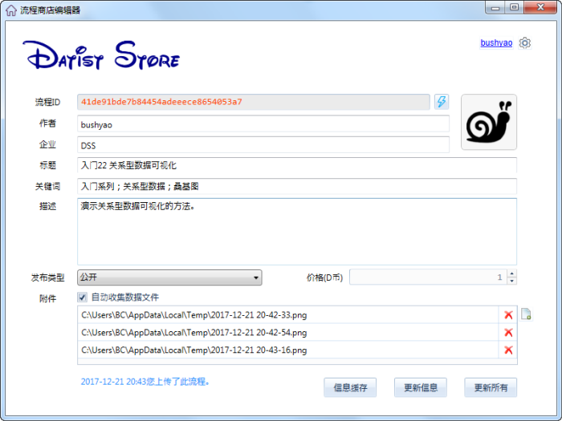

.. DatistStore
 
流程商店（DatistStore）
====================================

数据专家是一个内秀又慢热的女孩，她不像传统的业务产品那么直白，能够立即解决实际的生产问题，她的工作方式是DIY，您得把业务需求用流程表达出来交给她，让她成为您的专职秘书，给她安排的工作越多，她就越称职。

为了克服数据专家过于害羞的性格，我们设计了流程商店（DatistStore），把我们遇到问题的解决方案放在上面，同时也鼓励用户自已的解决方案也分享出来，让更多的人去了解她，使用她。

流程上传与下载极为简单，下面给您详细的讲解：

注册帐号
------------------

在帮助主菜单下的流程商店菜单，可以带您进入流程商店的世界；

如果您是第一次登录，它提示您注册一个帐号：

当然，如果您有帐号，可以直接登录:

.. figure:: images/DatistStore02.png
     :align: center
     :figwidth: 90% 
     :name: plate 	 
	 
流程查找
------------------

流程商店中提供多种查询方式：

关键字查询，您可输入一个或多个关键字，单击查询按钮，它将给您呈现查询结果。点击流程列表中的流程，右侧将会为您列举出该流程的详细描述、图像以及录像资料。

您也可以单击关键字栏中的蓝色文字，查询该关键字相关的流程；或使用流程列表的右键功能菜单，了解流程相关主题，关注某个用户的所有作品。

.. note::
   
   本站中的【共享资源】主题，发布流程商店里所有公开流程的信息，因此，您也可以在本站中进行查询、搜索感觉兴趣的流程。 
 
流程上架
------------------

若将自己的流程发布到流程商店中，请在流程编辑区的空白处，点右键，在右键菜单中点击上传流程菜单项，系统将为您打开上传流程窗口。请填写流程标题、关键词、描述等相关信息，填写结束后，将流程上传到流程商店中，或是将信息缓存以便于再次上传时使用。

如果您的流程ID呈现为红色，则说明这个ID在流程商店里已经存在。

  * 如果这是您上传过流程，您可以更新它的信息；
  * 若将作为新流程再次上传，请单击右侧闪电按扭，生成一个新的流程ID。
	 

	 
	 
当您的流程上传之后，请耐心等待管理员的审核，只有审核通过后，其它用户才能看到哦。

.. note::
   
   上传流程时，建议您将流程的关键点截图，放到附件列表中，以便其它用户查阅。
    
   您可以通过从截图工具中，直接将图片复制、粘贴到附件列表中；
   
   也可以从Windows目录中，将文件或目录拖到附件列表中；当然把文件或目录直接复制、粘贴到附件列表中也是支持的。
   
.. warning::
   
   默认情况下，上传流程过程时，系统将自动收集流程相关数据与模板文件，以保证流程的正常运行。如果您不愿意共享数据，请取消“自动收集数据文件”的勾选状态。
    
流程下架
------------------

如果想把流程从流程商店中下架，请在流程商店窗口的流程列表中，打开右键菜单，找到删除流程菜单，进行操作。
