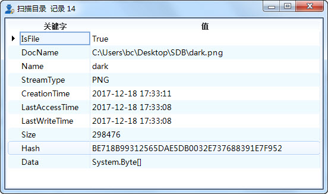
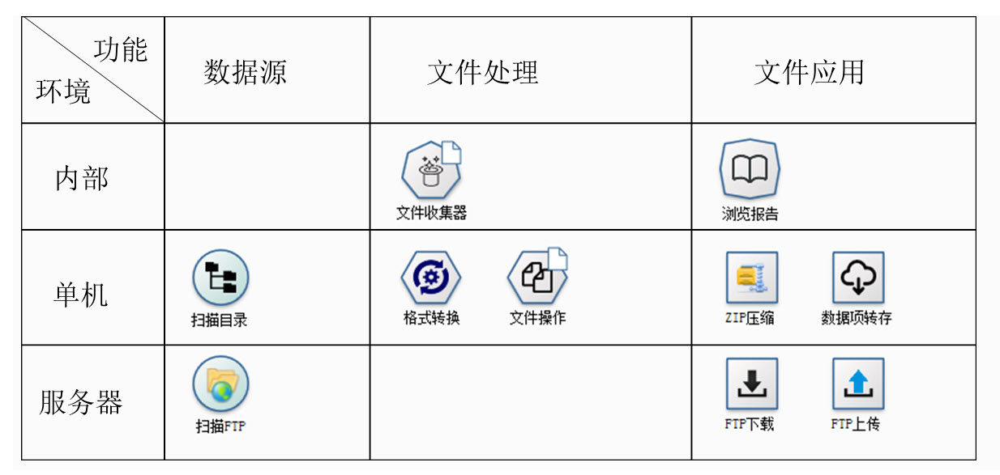
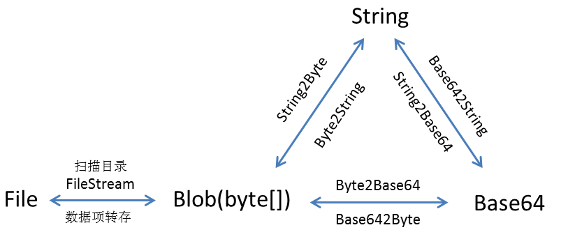
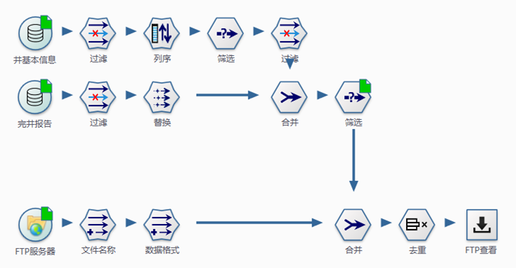
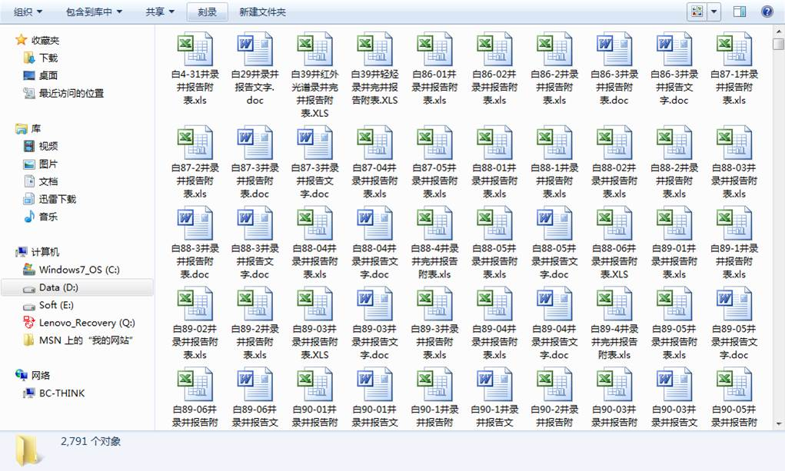

.. FileSystem

文件体系结构
===============================

工作中，常需要处理文件的目录数据，如按规则重命名、文件归类等。数据专家中支持文件处理与应用，文件信息由文件实体数据、文件目录信息两部分组成；

  * 文件实体数据，以二进制数组的方式存储（Byte[]）; 
  * 文件目录信息，又称之为元数据，包括文件名称、目录结构、扩展名、创建日期、文件大小、Hash值等。

 
**文件体系：**
 
数据专家中，提供一组针对文件操作的节点，由应用环境及节点功能两个维度构成；

文件体系结构图：
  

	 
* **节点功能：** 根据节点所处阶段划分为数据源、中间数据处理及文件应用三类；  
  
* **应用环境：** 根据数据来源环境划分为数据专家内部、单机目录 、FTP服务器三个类型；
  
   * **内部：** 通过文件收集器，将数据专家数据可视化节点的成果，收集并转换为文件数据结构；
	 
   * **单机：** 针对本地环境，以目录及子目录下的所有文件信息为基础，提供格式转换、剪切、复制、压缩、保存等操作功能；
	 
   * **服务器：** 提供针对FTP服务器的系列操作功能；
	 
除了以上这些节点外，数据专家内还提供丰富的针对二进制数组进行操作的函数，以便于您进行组合应用。

数据专家是一个开放体系，文件实体的来源不局限于扫描目录、扫描FTP两个数据源节点；数据库数据源中的Blob字段所表达的内容也是文件实体数据。
	 
数据体Blob与字符串并没有实质的区别，只是数据操作略有不同而已。文件、字符串、Blob以及Base64之间，可以进行相互转换，如图所示。

	 
图中箭头标注的内容为数据转换的方法，扫描目录和数据项转存为节点，其它为函数。

**案例：**

在油田数据整理过程中，需要从服务器上下载采油单位的相关完井报告文件，并进行数据结构化处理入库，需要从10万个FTP文件中挑选出一万个文档资料。
 
主要技术点：
 
  * 从井基本信息表中，过滤出采油厂的井名；
  * 根据井名，从完井报告表中，挑选出相应的文件名；
  * 根据文件名，从FTP服务器上，下载相关文件；
 
 

	 
其中：	 
  
  **扫描FTP** ，是抓取FTP服务器的目录信息，作为数据源引入流程中；支持通过远程路径的选取方式，指定FTP路径；使用FTP目录信息与其它信息相互关联、验证，在信息系统建设过程中威力巨大，如可对数据库中的文件索引记录进行匹配，查找文件变更后的一致性问题；
  
  **FTP查看** ，从文件服务器上下载指定的文件；可以使用存储名称对下载后的文件进行重命名，如果不指定则以服务器上原有的文件名称存储文件。

	 
流程就是一个魔法棒，流程建立之后，服务器上的文件就会按照你想要的方式，跑到你的电脑中。

.. note::	
 
  数据专家系统突破了传统观念上的限制，可以抓取文件目录信息作为数据源，而不仅仅局限于文件内容处理上。除了扫描FTP节点之外，还有扫描目录节点，用于对本地、映射网盘的目录信息的抓取。

.. note::

  系统在文件数据体处理方面，即以文件体为数据项，也提供了一系列的节点，如格式转换、文件操作、CMD接口、Excel合并、Word合并等。
