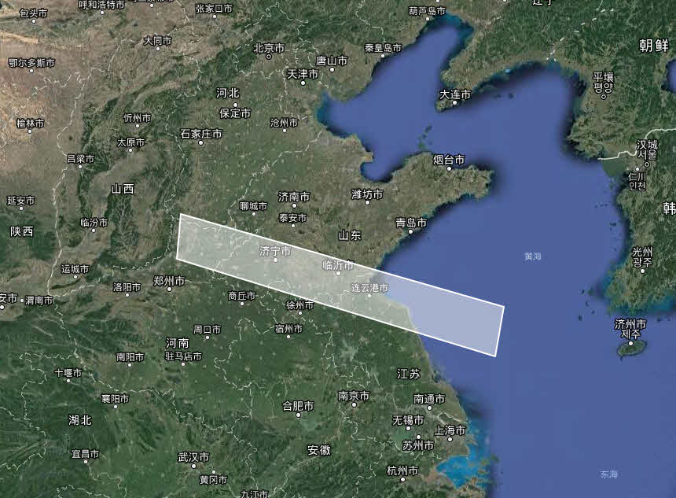

.. GIS

空间数据分析
===============================

在我们日常数据分析中，空间分析是必不可少的，比如周围有哪些美食城，一次地震发生那个构造带上？为了进行这些常规的空间分析，去驾驭ArcGIS之类的专业软件，其学习成本显然过高。 

**空间分析体系结构**

数据专家系统，具有空间数据处理能力，提供点线面图元构建、投影变换、空间叠加运算等一系列节点工具及扩展函数，实现空间查询与统计分析。
 
空间分析体系:

空间数据分析体系由空间数据源、创建图元、空间运算、空间可视化四部分构成：

  * **空间数据源：** 可以将ArcGIS、AutoCAD、MapInfo、GeoJson等常用空间数据文件读入系统中，包括空间数据、地质图件、接图表等节点；
  * **创建图元：** 将二维表数据转换成空间图元，包括创建点图元、线图元、多边形图元、外包络线图元等；
  * **空间运算：** 提供一组空间分析算法，如投影变换、简化图元、缓冲区分析、空间匹配、等值线绘制等；除了空间运算节点之外，系统还提供大量的空间分析扩展函数，如PointInPolygon、GetCoordinate等；
  * **可视化：** 是将空间分析的结果进行可视化展示，提供内置地图展示、百度地图、Google高清影像以及各类专题地图功能；除了这些内置的可视化功能之外，您还可以编写自己的R、Python、GMT脚本，使用脚本语言节点进行空间数据的展示与应用；

**空间数据构成**

空间数据两个部分构成：

  * **图元数据** 是点坐标、多边形的边界线坐标，由一对、一组XY数值的集合，如省边界线、单井坐标等；
  * **属性数据** 是一系列的属性参数，如省份的人口、GDP等；

一般GIS软件中，会将图元数据与属性数据分别存放，如ArcGIS的标准数据格式SHP与DBF文件。

在数据专家里将它们合并在一张二维表中，图元以一个特殊的字符串（ `WKT <https://en.wikipedia.org/wiki/Well-known_text>`_ ，一种通用的图元表达方式）；您可以使用创建图元节点，来创建空间图元；也可以根据WKT的格式编写自己的图元。

==================   ============
Type                 Examples
==================   ============
Point                POINT (30 10)
Polyline             LINESTRING (30 10, 10 30, 40 40)
Polygon              POLYGON ((30 10, 40 40, 20 40, 10 20, 30 10))
Polygon              POLYGON ((35 10, 45 45, 15 40, 10 20, 35 10),(20 30, 35 35, 30 20, 20 30))
==================   ============

**案例： 求单井所属勘探区带信息**

在自然地震研究过程中，需要从华东地震目录中抽取研究区内历年来发生的地震数据。

历年来发生的地震情况：

构造带空间边界数据：	 
	 

通过创建点图元、构建多边形、区块筛选等节点，实现地震目录数据自动抽取流程（流程商店中，地震目录之三研究区内地震点筛选）。
	 

研究区内地震数据抽取结果：
	 

	
	
.. note::

   数据专家中坐标系统默认是WGS84，在空间分析过程中，需先通过投影变换节点将其它坐标系的数据统一WGS84坐标系下。
   
   空间运算过程中，可使用于图元简化节点减少线面图元点的数量， 从而提高分析效率。

