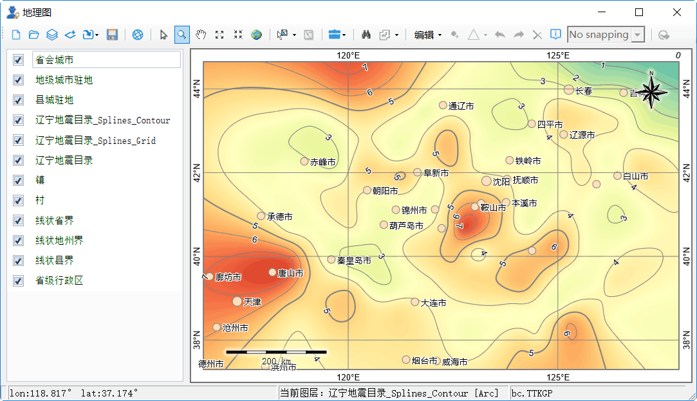
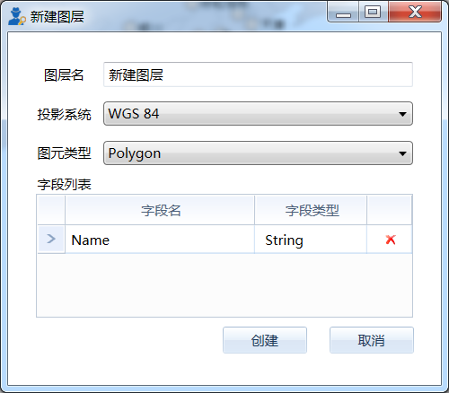
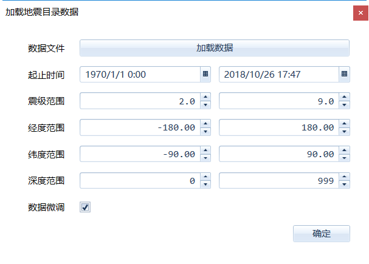

.. GIS

空间界面操作
===============================
空间分析是地学工作者常见的需求之一，本节将对空间分析的界面操作作简要的描述。

标准工具箱
-----------------------------------
空间分析标准工具组，提供一组基于图件的基本操作功能，如新建图件、打开图件、添加图层等。

**新建图件**

创建一个空白图件。

**打开图件**

从本地文件夹中，打开一个图件，支持格式包括ArcView Shape File、MapInfo WorkFile、OpenStreetMap等近百种GIS通用数据格式。

**添加图层**

以追加的方式，向当前打开的图件中添加一个或多个空间文件。在追加过程中，系统将根据追加图层类型，进行图件的加载顺序优化，并指定图层的默认样式。

**新建图层**

根据指定的投影系统、图元类型及字段列表，创建一个新的地图图层。

**导入地震目录**

将地震目录文件加载到当前地图中，支持时间、震级、深度等范围的限定。其中数据微调功能，在原始的震中坐标的基础进行了数据优化处理，从而优化震中的空间显示效果。

	
**保存**

保存当前地图文件；当图件做了修改后才可用。

**坐标系统与网格**

