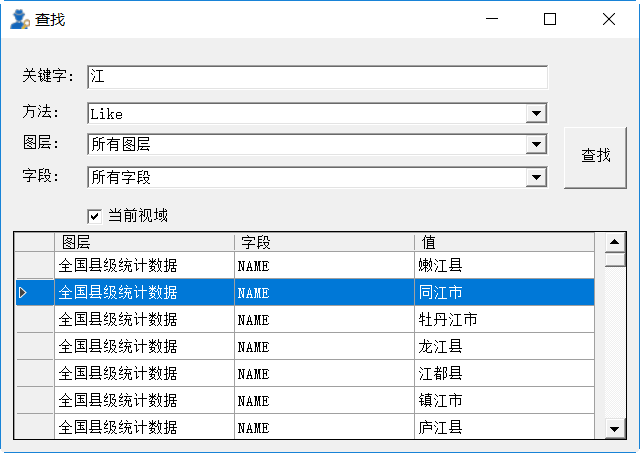

.. GIS

空间界面操作
===============================
空间分析是地学工作者常见的需求之一，本节将对空间分析的界面操作作简要的描述。空间分析模块旨在提供空间数据的选取、展示、分析等功能，以增强Datist的空间数据处理能力。该模板功能围绕主界面、属性表两大主题展开。主界面上工具栏，收纳了文件操作、图形浏览、图元选取、图元编辑、空间分析等工具；图层目录中右键菜单，收纳了图层属性编辑、图层操作、数据导出等系列操作；属性表中的系列功能，支持属性字段编辑、图元记录与图元交互、数据汇总分析等功能。

.. figure:: GISImages/GIS.png
    :align: center
    :figwidth: 90% 
    :name: plate
 
标准工具箱
-----------------------------------
空间分析标准工具组，提供一组基于图件的基本操作功能，如新建图件、打开图件、添加图层等。

**1)新建图件**
创建一个空白图件。

**2)打开图件**
从本地文件夹中，打开一个图件，支持格式包括ArcView Shape File、MapInfo WorkFile、OpenStreetMap等近百种GIS通用数据格式。

**3)添加图层**
以追加的方式，向当前打开的图件中添加一个或多个空间文件。在追加过程中，系统将根据追加图层类型，进行图件的加载顺序优化，并指定图层的默认样式。

**4)新建图层**
根据指定的投影系统、图元类型及字段列表，创建一个新的地图图层。

.. figure:: GISImages/NewLayer.png
    :align: center
    :figwidth: 90% 
    :name: plate

**5)导入地震目录**
将地震目录文件加载到当前地图中，支持时间、震级、深度等范围的限定。其中数据微调功能，在原始的震中坐标的基础进行了数据优化处理，从而优化震中的空间显示效果。

.. figure:: GISImages/ImportEarthQuake.png
    :align: center
    :figwidth: 90% 
    :name: plate
	
**6)保存**
保存当前地图文件；当图件做了修改后才可用。

**7)坐标系统与网格**
提供丰富的坐标系统，用户可在多种不同的坐标系统之间切换；坐标网格自动绘制机制使得图件显示，更具专业效果。

.. figure:: GISImages/Projection.png
    :align: center
    :figwidth: 90% 
    :name: plate
	

常用工具箱
-----------------------------------

最常用的地图操作功能，如缩放、平移、放大一倍、缩小一倍等。

**1)Default**
空操作模式，用于模式切换。

**2)缩放**
切换至缩放模式，从左向右拉框为放大地图；而从右向左拉框则为缩小地图。

**3)平移**
切换至平移模式，通过鼠标拖拽，移动地图的中心位置。

**4)放大一倍**
以当前显示的中心为原点，将地图放大倍。

**5)缩小一倍**
以当前显示的中心为原点，将地图缩小倍。	

**6)查看全图**
将地图缩放到，能否足够显示地图所有内容的比例尺。	
 
**7)查找图元**
提供根据图元的属性信息查询图元功能，用户可以指定查询关键字、查询方式等查询条件；在查询结果中双击图元记录，地图显示区的图元会高亮闪烁。

 
**8)测量长度**
切换至测量长度模式；提供一个测量尺用于测量长度。  
 
**9)量面积**
切换至测量长度模式；提供一个测量尺用于测量面积。 
 

 
选中工具箱
-----------------------------------

提供矩形选中、多边形选中、折线选中等多个选中工具，状态栏中将显示选中图元的统计结果。

**1)矩形选中**
切换至矩形选中模式；绘制矩形选中与之相交的图元。 	
	
**2)多边形选中**
切换至多边形选中模式；您可以绘制一个多边形以便选中其中的图元。 
 
**3)手绘区域选中**
切换至手绘区域选中模式；提供绘制一个自由绘制多边形的工具，以圈选其中的图元。
 
**4)圆选中**
切换至圆选中模式；通过两点确认一个圆，以便选中图元。 
 
**5)折线选中**
切换至折线选中模式；您可以绘制一个折线以便选中与之相交的所有图元。 
 
**6)缓冲区选中**
切换至缓冲区选中模式；折线选中的增强版，可以根据设定的缓冲距离，选中折线周边一定距离内容的图元。
 
.. figure:: GISImages/Selection2.png
    :align: center
    :figwidth: 90% 
    :name: plate
 
**7)选中设置**
设置选中图元的方式及缓冲选中的距离；同时为了方便选取操作，还提供了顶部图层、可见图元、可见图层等选中模式。

.. figure:: GISImages/SelectSetting.png
    :align: center
    :figwidth: 90% 
    :name: plate
 
**8)清除选中状态**
清除地图上所有的图元的选中状态。

**9)创建空间数据源节点**
在数据专家流程区创建缓冲数据节点，其数据为选中的图元的属性数据；若图元涉及多个图层，将合并多个图层的属性字段列表。

图元编辑工具箱
-----------------------------------

提供一组点、线、面图元的编辑功能，同时支持三角形、正方形等常规图形的快速绘制。图元编辑是基于当前图层的（可在图层管理栏中选中一个矢量图层，作为当前图层），不同的图层的支持编辑的内容不同。

.. figure:: GISImages/Editor.png
    :align: center
    :figwidth: 90% 
    :name: plate

**1)开始编辑**
开启图层编辑状态。
 
**2)结束编辑**
编辑结束，退出编辑状态。	
	
**3)创建图元**
切换至图层编辑模式，可以用于创建点、线、面图元，或对选中的图层进行编辑。对于环形多边形，您可以使用鼠标右键菜单功能进行创建与修改。

.. figure:: GISImages/CreateShape.png
    :align: center
    :figwidth: 90% 
    :name: plate

**4)三角形**
切换至三角形创建模式。 

**5)正方形**
切换至正方形创建模式。	

**6)五边形**
切换至五边形创建模式。	

**7)五角星**
切换至五角星创建模式。	 

**8)六边形**
切换至六边形创建模式。	 

**9)圆形**
切换至圆形创建模式。	 

**10)撤消**
图元编辑过程中，撤消当前的操作。	

**11)重做**
图元编辑过程中，重做撤消的操作。	

**12)删除选中图元**
当处理于编辑状态下，您若选中一个或多个图元，即可以把他们删除。
 
**13)属性信息**
切换至图元信息窗口，提供可见图层、可选图层等多个图层同时探查模式。

