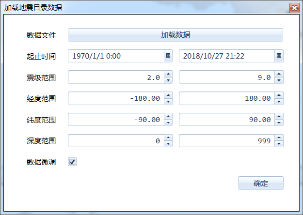

.. GIS

空间界面操作
===============================
空间分析是地学工作者常见的需求之一，本节将对空间分析的界面操作作简要的描述。

.. figure:: GISImages/GIS.png
    :align: center
    :figwidth: 90% 
    :name: plate
 
标准工具箱
-----------------------------------
空间分析标准工具组，提供一组基于图件的基本操作功能，如新建图件、打开图件、添加图层等。

**1)新建图件**
创建一个空白图件。

**2)打开图件**
从本地文件夹中，打开一个图件，支持格式包括ArcView Shape File、MapInfo WorkFile、OpenStreetMap等近百种GIS通用数据格式。

**3)添加图层**
以追加的方式，向当前打开的图件中添加一个或多个空间文件。在追加过程中，系统将根据追加图层类型，进行图件的加载顺序优化，并指定图层的默认样式。

**4)新建图层**
根据指定的投影系统、图元类型及字段列表，创建一个新的地图图层。

.. figure:: GISImages/NewLayer.png
    :align: center
    :figwidth: 90% 
    :name: plate

**5)导入地震目录**
将地震目录文件加载到当前地图中，支持时间、震级、深度等范围的限定。其中数据微调功能，在原始的震中坐标的基础进行了数据优化处理，从而优化震中的空间显示效果。

	
**6)保存**
保存当前地图文件；当图件做了修改后才可用。

**7)坐标系统与网格**
提供北京54，西安80以及2000等多个投影系统，供用户选择。同时用户还可以选择坐标网格的类型。

	
.. figure:: GISImages/Projection2.png
    :align: center
    :figwidth: 90% 
    :name: plate

常用工具箱
-----------------------------------

最常用的地图操作功能，如缩放、平移、放大一倍、缩小一倍等。

**1)Default**
空操作模式，用于模式切换。

**2)缩放**
切换至缩放模式，从左向右拉框为放大地图；而从右向左拉框则为缩小地图。

**3)平移**
切换至平移模式，通过鼠标拖拽，移动地图的中心位置。

**4)放大一倍**
以当前显示的中心为原点，将地图放大倍。

**5)缩小一倍**
以当前显示的中心为原点，将地图缩小倍。	

**6)查看全图**
将地图缩放到，能否足够显示地图所有内容的比例尺。	
 
**7)查找图元**
提供根据图元的属性信息查询图元功能，用户可以指定查询关键字、查询方式等查询条件；在查询结果中双击图元记录，地图显示区的图元会高亮闪烁。

.. figure:: GISImages/Search.png
    :align: center
    :figwidth: 90% 
    :name: plate
 
**8)测量长度**
切换至测量长度模式；提供一个测量尺用于测量长度。  
 
**9)量面积**
切换至测量长度模式；提供一个测量尺用于测量面积。 
 
.. figure:: GISImages/MeatureArea.png
    :align: center
    :figwidth: 90% 
    :name: plate
 
 
