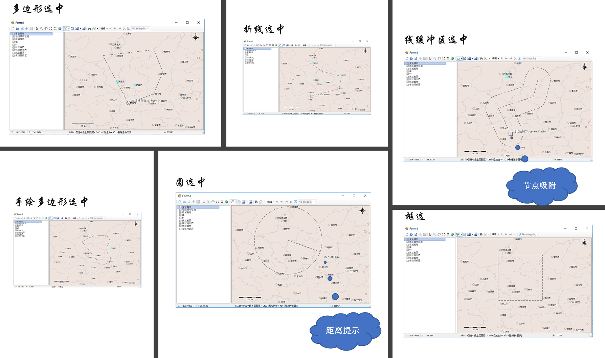
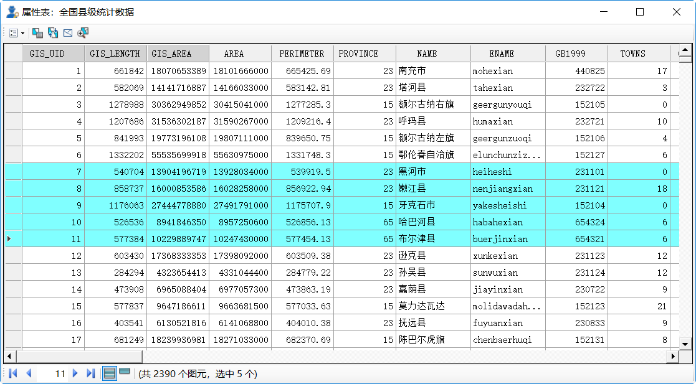

.. GIS

空间界面操作
===============================
空间分析是地学工作者常见的需求之一，本节将对空间分析的界面操作作简要的描述。空间分析模块旨在提供空间数据的选取、展示、分析等功能，以增强Datist的空间数据处理能力。该模板功能围绕主界面、属性表两大主题展开。主界面上工具栏，收纳了文件操作、图形浏览、图元选取、图元编辑、空间分析等工具；图层目录中右键菜单，收纳了图层属性编辑、图层操作、数据导出等系列操作；属性表中的系列功能，支持属性字段编辑、图元记录与图元交互、数据汇总分析等功能。

 
标准工具箱
-----------------------------------
空间分析标准工具组，提供一组基于图件的基本操作功能，如新建图件、打开图件、添加图层等。

**1)新建图件**
创建一个空白图件。

**2)打开图件**
从本地文件夹中，打开一个图件，支持格式包括ArcView Shape File、MapInfo WorkFile、OpenStreetMap等近百种GIS通用数据格式。

**3)添加图层**
以追加的方式，向当前打开的图件中添加一个或多个空间文件。在追加过程中，系统将根据追加图层类型，进行图件的加载顺序优化，并指定图层的默认样式。

**4)新建图层**
根据指定的投影系统、图元类型及字段列表，创建一个新的地图图层。

**5)导入地震目录**
将地震目录文件加载到当前地图中，支持时间、震级、深度等范围的限定。其中数据微调功能，在原始的震中坐标的基础进行了数据优化处理，从而优化震中的空间显示效果。

.. figure:: GISImages/ImportEarthQuake.png
    :align: center
    :figwidth: 90% 
    :name: plate
	
**6)保存**
保存当前地图文件；当图件做了修改后才可用。

**7)导出**
将当前视域保存为图片文件。

**8)坐标系统与网格**
提供丰富的坐标系统，用户可在多种不同的坐标系统之间切换；坐标网格自动绘制机制使得图件显示，更具专业效果。

.. figure:: GISImages/Projection.png
    :align: center
    :figwidth: 90% 
    :name: plate
	
.. figure:: GISImages/Projection2.png
    :align: center
    :figwidth: 90% 
    :name: plate

常用工具箱
-----------------------------------

最常用的地图操作功能，如缩放、平移、放大一倍、缩小一倍等。

**1)Default**
空操作模式，用于模式切换。

**2)缩放**
切换至缩放模式，从左向右拉框为放大地图；而从右向左拉框则为缩小地图。

**3)平移**
切换至平移模式，通过鼠标拖拽，移动地图的中心位置。

**4)放大一倍**
以当前显示的中心为原点，将地图放大倍。

**5)缩小一倍**
以当前显示的中心为原点，将地图缩小倍。	

**6)查看全图**
将地图缩放到，能否足够显示地图所有内容的比例尺。	
 
**7)查找图元**
提供根据图元的属性信息查询图元功能，用户可以指定查询关键字、查询方式等查询条件；在查询结果中双击图元记录，地图显示区的图元会高亮闪烁。

.. figure:: GISImages/Search.png
    :align: center
    :figwidth: 90% 
    :name: plate
 
**8)测量长度**
切换至测量长度模式；提供一个测量尺用于测量长度。  
 
**9)量面积**
切换至测量长度模式；提供一个测量尺用于测量面积。 
 
.. figure:: GISImages/MeatureArea.png
    :align: center
    :figwidth: 90% 
    :name: plate
 
选中工具箱
-----------------------------------

提供矩形选中、多边形选中、折线选中等多个选中工具，状态栏中将显示选中图元的统计结果。

.. figure:: GISImages/Selection.png
    :align: center
    :figwidth: 90% 
    :name: plate

**1)矩形选中**
切换至矩形选中模式；绘制矩形选中与之相交的图元。 	
	
**2)多边形选中**
切换至多边形选中模式；您可以绘制一个多边形以便选中其中的图元。 
 
**3)手绘区域选中**
切换至手绘区域选中模式；提供绘制一个自由绘制多边形的工具，以圈选其中的图元。
 
**4)圆选中**
切换至圆选中模式；通过两点确认一个圆，以便选中图元。 
 
**5)折线选中**
切换至折线选中模式；您可以绘制一个折线以便选中与之相交的所有图元。 
 
**6)缓冲区选中**
切换至缓冲区选中模式；折线选中的增强版，可以根据设定的缓冲距离，选中折线周边一定距离内容的图元。
 

 
**7)选中设置**
设置选中图元的方式及缓冲选中的距离；同时为了方便选取操作，还提供了顶部图层、可见图元、可见图层等选中模式。

 
**8)清除选中状态**
清除地图上所有的图元的选中状态。

**9)创建空间数据源节点**
在数据专家流程区创建缓冲数据节点，其数据为选中的图元的属性数据；若图元涉及多个图层，将合并多个图层的属性字段列表。

图元编辑工具箱
-----------------------------------

提供一组点、线、面图元的编辑功能，同时支持三角形、正方形等常规图形的快速绘制。图元编辑是基于当前图层的（可在图层管理栏中选中一个矢量图层，作为当前图层），不同的图层的支持编辑的内容不同。

**1)开始编辑**
开启图层编辑状态。
 
**2)结束编辑**
编辑结束，退出编辑状态。	
	
**3)创建图元**
切换至图层编辑模式，可以用于创建点、线、面图元，或对选中的图层进行编辑。对于环形多边形，您可以使用鼠标右键菜单功能进行创建与修改。

.. figure:: GISImages/CreateShape.png
    :align: center
    :figwidth: 90% 
    :name: plate

**4)三角形**
切换至三角形创建模式。 

**5)正方形**
切换至正方形创建模式。	

**6)五边形**
切换至五边形创建模式。	

**7)五角星**
切换至五角星创建模式。	 

**8)六边形**
切换至六边形创建模式。	 

**9)圆形**
切换至圆形创建模式。	 

**10)撤消**
图元编辑过程中，撤消当前的操作。	

**11)重做**
图元编辑过程中，重做撤消的操作。	

**12)删除选中图元**
当处理于编辑状态下，您若选中一个或多个图元，即可以把他们删除。
 
**13)属性信息**
切换至图元信息窗口，提供可见图层、可选图层等多个图层同时探查模式。

.. figure:: GISImages/ShapeInfo.png
    :align: center
    :figwidth: 90% 
    :name: plate

	
图层管理栏工具箱
-----------------------------------

图层管理栏工具箱，提供一组关于图层的操作工具，如属性表、选中图元、图层属性等功能。

	
**1)属性表**
打开矢量图层的属性数据表，系统提供一组强大的关于属性数据表操作功能，在本文后的面部分将详细描述。	
	
**2)缩放至图层**
将图层显示区的图幅范围，缩放至能够容纳当前图层的范围。		

**3)可见范围组**
提供对图层的可见比例尺范围的进行设置的功能。
	
**设为放大上限**
将当前图层的比例尺范围的上限，即当图幅放大超过此比例尺时，图层不可见。

**设为缩小上限**
将当前图层的比例尺范围的下限，即当图幅缩小超过此比例尺时，图层不可见。

**清除可见范围限制**
清除当前图层的可见比例尺范围的限制。

**4)属性查询**
提供一种类SQL语言的查询图元的方法，您可以创建表达式查找图元，同时也可以指定查询结果的输出方式，如创建选中、添加选中、删除选中等。
 

 
**4)选中图元**
提供一组针对于当前图层中的已选中图元进行操作的功能。

**缩放到选中图元**
缩放图幅范围，以便以足够容纳当前图层中已选中的所有图元。

**平移到选中图元**
平移图幅范围，将当前图层中已选中的所有图元的中心点，位于显示区的中心。
 
**清除图元选中状态**
清除当前图层中已选中图元的选中状态。

**切换选中状态**
类似于反选的功能，将图层中的所有图元作为一个整体，在已选中图元与未选中图元之间进行切换。

**选中所有**
将图层中的所有图元置于选中状态。

**设置为唯一可选图层**
与【选中设置】功能类似，提供一个简捷的操作方法，把当前图层设置为，唯一可选的图层。

**新建选中图元图层**
将当前图层所有已选中的图元，复制成一个新的图层。

**输出选中图元数据**
将当前图层所有已选中图元的属性数据，输出为Excel文件。

**5)克隆结构**
复制当前的图层的结构，并新建一个图层。
 
**6)删除图层**
从地图图件中，删除当前图层。
 
**7)图层另存为**
导出当前图层中的所有图元，可以用于图层文件格式的转换。

**8)输出数据**
将当前图层所有图元的属性数据，输出为Excel文件。 
 
**9)图层属性**
打开图层编辑属性窗口，您可以进行图元线型、图元大小、标签样式等图层显示样式的创建与修改。

空间分析工具箱
-----------------------------------

**1)缓冲区分析**
切换至缓冲区分析模式；求选中图元的缓冲区，用户可以指定缓冲距离，或通过鼠标拖拽定义缓冲区范围。

 
**2)空间关系查询**
提供一组空间关系查询图元的功能，将空间关系进行可视化展示，您可以直观的了解各种空间关系。同时提供数据映射功能，将当前已选中图元（空间关系查询之前）的值赋值到目标图元上，大幅度减少了空间操作的步骤。

 
**3)地统计分析**
提供方便快捷的地统计分析功能，支持反距离权重、普通克里金插值、规则样条插值等多种等值线绘制算法；灵活多样的充填色编辑与应用机制，为用户提供优质用体验效果。

	

	
属性表工具箱
-----------------------------------

系统面向矢量图层的属性数据，提供了一套编辑、查询与分析功能。用户可以从图层管理栏右键菜单中开启属性数据表。属性表具有两模式：所有图元数据与仅选中图元，模式切换位于窗口的最下方。	

	
**1)主菜单**	

主菜单栏位于窗口上方，一组关于整个数据表操作功能集合，如文字查找与替换、新增列、重置等。

**查找与替换**
提供字符串的查找与替换的功能，支持仅在选中图元范围内查找与替换。

**根据属性选中**
该功能与图层管理栏中的【属性查询】功能一致。

**清除所有选中**
清除当前数据表中已选中记录的选中状态。

**反选记录**	
将数据表中的所有记录作为一个整体，在已选中记录与未选中记录之间进行切换。

**选中所有记录**
将数据表中的所有记录置于选中状态。

**新增列**
为数据表增加一列数据。
	
**显示所有列**
将所有数据列置可见状态。	

**重置列宽**
将所有数据列的宽度恢复至初始状态。	

**重置列序**
将所有数据列的顺序恢复至初始状态。	

**输出数据**
将当前数据表的内容导出为Excel文件。	
	
 
**2)字段头右键菜单**	

字段头右键菜单，一组关于数据列操作的功能集合，如排序、字段计算、汇总、统计等。
 
**正序**
以前列为关键字，对整个数据表进行正向排序。

**逆序**
以前列为关键字，对整个数据表进行降序排序。 
 
**高级排序**
提供多个关键字对数据表进行排序的功能。

 
**字段计算**
提供一个计算器，计算生成数据项的值。

**列隐藏**
将当前列隐藏。

**冻结/取消冻结**
将当前列固定左侧，以方便浏览查询数据。

**删除列**
永久删除当前列的所有数据。

**汇总**
针对于字符串型字段，提供的数据汇总功能，汇总结果可导出为Excel文件。

	
**统计**
针对于数值型字段，提供的数据直方图统计功能，以探查数据分布情况。

**3)记录头菜单**	

记录头右键菜单，一组关于单行、多行记录操作的功能集合，如闪烁图元、缩放至图元、属性窗口等。
	
 
RowMenu	SelectChange	选中/不选中
RowMenu	ZoomToSelected	缩放到所有选中
RowMenu	ClearSelected	清除所有选中
RowMenu	DeleteSelected	删除所有选中
RowMenu	ClearSelected	清除所有选中
RowMenu	SwitchSelection	反选记录
RowMenu	SelectAll	选中所有记录
RowMenu	SwitchSelection	反选记录
RowMenu	ClearSelected	清除所有选中
RowMenu	ZoomToSelected	缩放到所有选中

	