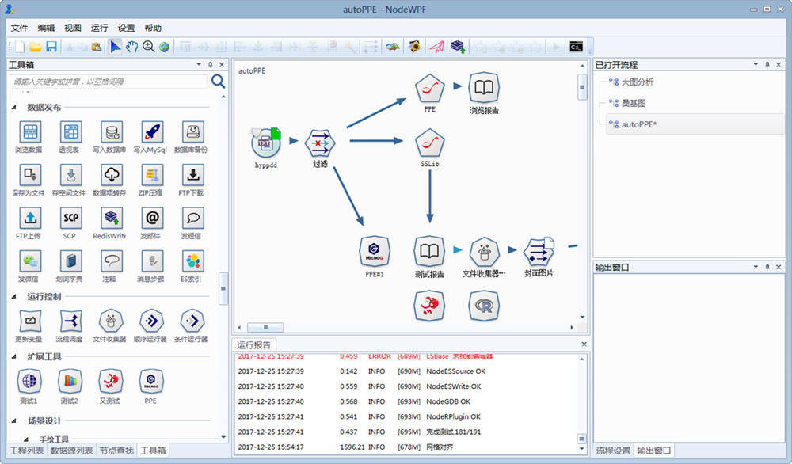
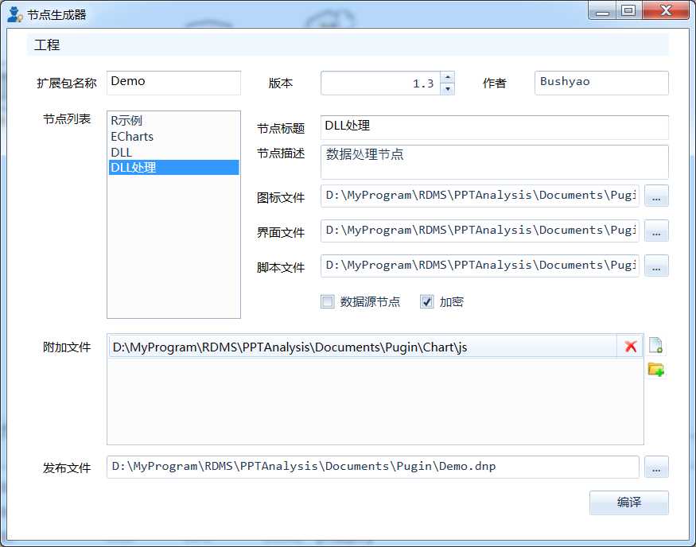
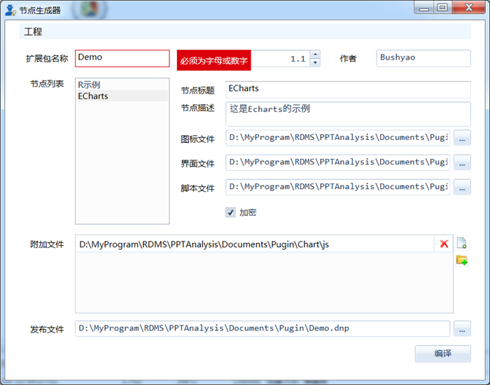
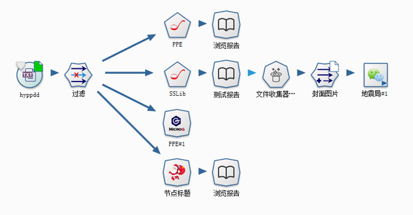

.. NodeExpend
 
扩展节点
====================================
Datist 给用户提供自定义的节点的功能，您可以在工具箱添加扩展自已的节点。本节点将详细说明扩展节点的工作原量与使用方法。

基本概念
-----------------------------------

**1、节点图标**
 
节点在流程编辑区的可视化展示；由节点类型边框、节点图标、节点标题三个部分构成；

.. figure:: images/NodeExpend01.png
    :align: center
    :figwidth: 90% 
    :name: plate

.. note::

   节点图标，图片为PNG格式，尺寸控制在200*200以内；
   
   节点标题将显示在工具栏中，字符串长度控制在5个之内；
 
**2、节点编辑器**

节点内部与用户进行交互的界面；由节点窗口、用户自定义的Html界面构成；

.. figure:: images/NodeExpend02.png
    :align: center
    :figwidth: 90% 
    :name: plate
	 	
**3、节点数据查看器**
	
数据专家自动收集节点运行的结果并进行展示；是用户定义的脚本运行结果查看器；需要用户提供R脚本；

.. figure:: images/NodeExpend03.png
    :align: center
    :figwidth: 90% 
    :name: plate
	 	
工作原理与方法
-----------------------------------

扩展节点运行包括两部分的工作，如下图所示；

  * 节点编辑器与节点实体之间的界面交互，这部分需要您定义HTML界面，并通过JSON数据格式进行通讯；
  * 自定义的算法；运行时，数据专家会给算法推送数据，并进行关键字替换；算法执行之后，收集并扭转算法的输出结果，如文字、表格、图片等；
 
.. figure:: images/NodeExpend04.png
    :align: center
    :figwidth: 90% 
    :name: plate

数据交换（JSON）
-----------------------------------

HTML界面与节点之间，采用JSON格式进行数据交换，JSON数据定义了参数传递与字段映射关系。

示例::

   {
       "pars": {
           "title": "点1",
           "desc": "测点"
       },
       "allfields": true,
       "names": {
           "q": "列0",
           "f": "列0"
       }
   }

pars键值组，定义界面与自定义代码之间的参数，一般而言，代码中以[$VarName$]的格式来定义参数，；运行时，系统将用值替换它。
本例，名为title的参数，代码中定义为[$title$]，运行时，将用“点1”来替换它。

字段映射由两部分构成

  * allfields，布尔型，定义是否对前节点数据推送的方式；false，将根据names键值组的定义，取二维表中的部分字段（列）进行数据映射，向自定义代码中推送；true，将忽略names键值组，推送所有数据。
  * name键值组，定义数据映射关系；本例中，定义了前节点中IsFile与StreamType两个字段的映射关系，运行时，系统以q、f名称推送两列数据。
 
用户自定义的Html界面
-----------------------------------

建议Html界面由样式设置、数据交换、界面显示三个部分构成；

  * 样式设置：定义的HTML的整体的样式，有助于界面风格的一致性，相关内容可参考CSS样式；
  * 数据交换：定义HTML界面与节点编辑器之间的通讯方式，由数据初始化SetData与数据保存 GetData 两个函数组成；
  * 界面显示：HTML脚本定义，界面参数与字段映射的具体内容。
  
样式设置部分，示例代码:: 

    

数据交换部分，由GetData、SetData两个函数组成；建议使用Jquery组件，方便界面对象的引用。

  * function GetData() 将界面数据组织成JSON数据字符串，存储于节点中；

  * function SetData(txt, fieldnames) 从节点中获取数据Json字符串和前节点的名称列表，初始化界面； txt为JSON字符串， fieldnames为前节点的字段名列表，以分号间隔的字符串。

数据交换部分，示例代码:: 

    

界面显示部分，示例代码:: 

	<body scroll="no" style="height: 100%; margin: 0; width: 100%">
		<table>
			<tr>
				<td style="width:70px">名称</td>
				<td><input id="title" type="text" value="点1"></td>
			</tr>
			<tr>
				<td>描述</td>
				<td><input id="desc" type="text" value="测点"></td>
			</tr>

			<tr>
				<td>字段Q</td>
				<td><select id="fieldQ"></select> </td>
			</tr>
			
			<tr>
				<td>字段F</td>
				<td><select id="fieldF"></select> </td>
			</tr>
		</table>
	</body>
	
核心脚本构成
-----------------------------------

用户自己构成脚本过程中，需要遵循数据接入与输出的规范。

**R版** 

  * 数据接入：界面参数格式为[$VarName$]，其中VarName对于界面参数JSON中的字段的名称，如title等; 
  * 前节点数据接入：为Inputtable变量，DataFrame类型；
  * 成果输出：支持多级标题、文本、加粗文本以及图片；具体参见代码规范。

代码规范，示例代码:: 

	#输出一级标题函数为 header1()
	#输出二级标题函数为 header2()
	#输出三级标题函数为 header3()
	#输出文本或内容函数为 output(object,"header")
	#输出加粗文本函数为 boldtext()
	#输出统计图
	#  开始 png(gettempfile(),width =300, height = 300)
	#  收尾 invisible(dev.off())

	#前节点数据源名称为inputtable；

算法代码，示例代码::

	header1("[$title$]")
	output("[$desc$]")
	 
	header1("具体内容")
	#============== set parameters ===================
	T0 =0                   #start time
	T1=5479                 #Learning period /julian day
	T2=13847                #Forcast period  /julian day

	xMin=95                   #output range Xmin
	xMax=109                #output range Xmax
	yMin=20                   #output range Ymin
	yMax=43                  #output range Ymax
	xd=0.05                    #space distance in X direction
	yd=0.05                    #space distance in Y direction
	calcmag=4.0              #triggering events 
	estimag=6.0              #triggered events

	mdx=(xMax-xMin)/xd+1
	ndy=(yMax-yMin)/yd+1

	#============== read datafile ===================
	cata.all <- inputtable
	cata <- cata.all[cata.all$V8 < xMax & cata.all$V8>=xMin & cata.all$V7 >=yMin & cata.all$V7<yMax   &cata.all[,9]>=calcmag,]  #filter region and mag
	cata$dates <- julian(as.Date(paste(cata[,1],cata[,2], cata[,3],sep="-")), orig=as.Date("1970-1-1"))+cata[,4]/24+cata[,5]/24/60+cata[,6]/24/60/60
	cata1 <-cata[cata$dates >T0 & cata $dates < T1,]  #learning period earthquake catalog
	cata2 <-cata[cata$dates >T1 & cata $dates < T2,]  #Forcast period earthquake catalog

	#output("PPE Model")
	png(gettempfile(),width = 1000, height = 1000)
	 par(mfrow=c(2,2))
	 hist(cata[,9],breaks=seq(3.95,8.0,0.1),xlab='magnitude',main='G-R of all catalog')  #figure G-R 1
	 plot(cata[,9],ylab='magnitude',main='M-T of all catalog')                           #figure M-T 2 
	 plot(cata[,c(8,7)],cex=(cata[,9]-3.5)/2,xlab='long',ylab='lati',main='seismicity of all catalog')  #figure Dist 3    
	 plot(cata1[,c(8,7)],cex=(cata[,9]-3.5)/2,xlab='long',ylab='lati',main='seismicity of learning period')   #figure Dist 4  
	invisible(dev.off())

**Echarts版** 

与R类似，具体使用方式，参考官方网站：http://echarts.baidu.com/examples.html

数据专家以pdata为变量的形式，向核心算法推送数据；

算法代码，示例代码::

	var markLineOpt = {
		animation: false,
		label: {
			normal: {
				formatter: 'y = 0.5 * x + 3',
				textStyle: {
					align: 'right'
				}
			}
		},
		lineStyle: {
			normal: {
				type: 'solid'
			}
		},
		tooltip: {
			formatter: 'y = 0.5 * x + 3'
		},
		data: [[{
			coord: [0, 3],
			symbol: 'none'
		}, {
			coord: [20, 13],
			symbol: 'none'
		}]]
	};

	option = {
		title: {
			text: 'Anscombe\'s quartet',
			x: 'center',
			y: 0
		},
		grid: [
			{x: '7%', y: '7%', width: '38%', height: '38%'},
			{x2: '7%', y: '7%', width: '38%', height: '38%'},
			{x: '7%', y2: '7%', width: '38%', height: '38%'},
			{x2: '7%', y2: '7%', width: '38%', height: '38%'}
		],
		tooltip: {
			formatter: 'Group {a}: ({c})'
		},
		xAxis: [
			{gridIndex: 0, min: 0, max: 20},
			{gridIndex: 1, min: 0, max: 20},
			{gridIndex: 2, min: 0, max: 20},
			{gridIndex: 3, min: 0, max: 20}
		],
		yAxis: [
			{gridIndex: 0, min: 0, max: 15},
			{gridIndex: 1, min: 0, max: 15},
			{gridIndex: 2, min: 0, max: 15},
			{gridIndex: 3, min: 0, max: 15}
		],
		series: [
			{
				name: 'I',
				type: 'scatter',
				xAxisIndex: 0,
				yAxisIndex: 0,
				data: dataAll[0],
				markLine: markLineOpt
			},
			{
				name: 'II',
				type: 'scatter',
				xAxisIndex: 1,
				yAxisIndex: 1,
				data: dataAll[1],
				markLine: markLineOpt
			},
			{
				name: 'III',
				type: 'scatter',
				xAxisIndex: 2,
				yAxisIndex: 2,
				data: dataAll[2],
				markLine: markLineOpt
			},
			{
				name: 'IV',
				type: 'scatter',
				xAxisIndex: 3,
				yAxisIndex: 3,
				data: dataAll[3],
				markLine: markLineOpt
			}
		]
	};	
	
扩展节点创建与添加
-----------------------------------

用户可以使用工具箱中的节点生成器，创建扩展节点；使用添加节点功能，将扩展节点添加到工具箱中；

	 	
**节点生成器**

用户输出扩展节点的相关信息，点击编译按钮，即可创建扩展节点（*.dnp）。

	 	
核心数据项验证机制

	
**添加扩展节点**
	
用户通过添加节点功能，对工具箱进行扩展；扩展节点的使用与原生节点的使用方式相同；

	
**案例：**

	

