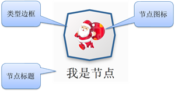
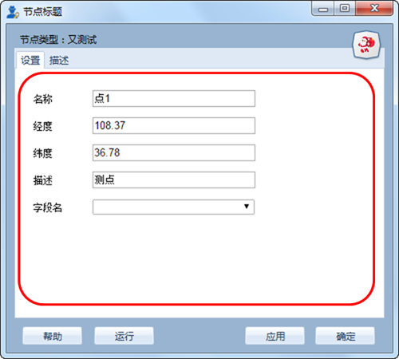
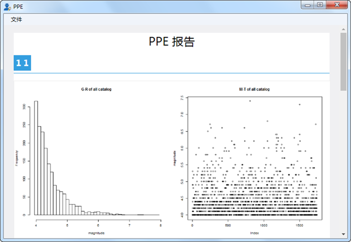
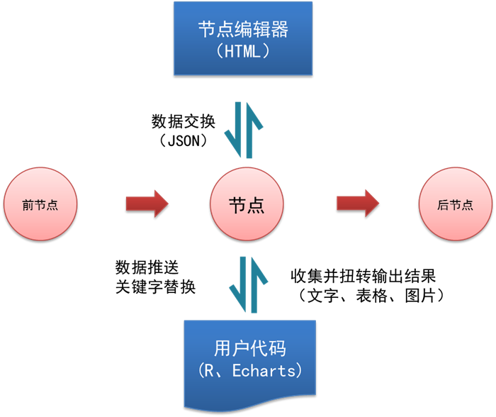

.. NodeExpend

节点扩展接口规范
====================================
Datist 给用户提供自定义的节点的功能，您可以在工具箱添加扩展自已的节点。本节点将详细说明扩展节点的工作原量与使用方法。

**一、基本概念**

**1、节点图标**
 
节点在流程编辑区的可视化展示；由节点类型边框、节点图标、节点标题三个部分构成；

.. note::

   节点图标，图片为PNG格式，尺寸控制在200*200以内；
   
   节点标题将显示在工具栏中，字符串长度控制在5个之内；
 
**2、节点编辑器**

节点内部与用户进行交互的界面；由节点窗口、用户自定义的Html界面构成；

	 	
**3、节点数据查看器**
	
数据专家自动收集节点运行的结果并进行展示；是用户定义的脚本运行结果查看器；需要用户提供R脚本；

	 	
**二、扩展节点工作原理**

扩展节点运行包括两部分的工作，如下图所示；

一是节点编辑器与节点实体之间的界面交互，这部分需要您定义HTML界面，并通过JSON数据格式进行通讯；

二是自定义的算法；运行时，数据专家会给算法推送数据，并进行关键字替换；算法执行之后，收集并扭转算法的输出结果，如文字、表格、图片等；
 

**1、数据交换（JSON）**

HTML界面与节点之间，采用JSON格式进行数据交换，JSON数据定义了参数传递与字段映射关系。

示例::
   {
       "pars": {
           "title": "点1",
           "desc": "测点"
       },
       "allfields": true,
       "names": {
           "q": "列0",
           "f": "列0"
       }
   }

pars键值组，定义界面与自定义代码之间的参数，一般而言，代码中以[$VarName$]的格式来定义参数，；运行时，系统将用值替换它。
本例，名为title的参数，代码中定义为[$title$]，运行时，将用“点1”来替换它。

字段映射由两部分构成

1）allfields，布尔型，定义是否对前节点数据推送的方式；false，将根据names键值组的定义，取二维表中的部分字段（列）进行数据映射，向自定义代码中推送；true，将忽略names键值组，推送所有数据。

2）name键值组，定义数据映射关系；本例中，定义了前节点中IsFile与StreamType两个字段的映射关系，运行时，系统以q、f名称推送两列数据。
 
**2、用户自定义的Html界面**

建议Html界面由样式设置、数据交换、界面显示三个部分构成；

  * 样式设置：定义的HTML的整体的样式，有助于界面风格的一致性，相关内容可参考CSS样式；
  * 数据交换：定义HTML界面与节点编辑器之间的通讯方式，由数据初始化SetData与数据保存 GetData 两个函数组成；
  * 界面显示：HTML脚本定义，界面参数与字段映射的具体内容。
示例::
	<!DOCTYPE html>
	<html style="height: 100%; margin: 0; width: 100%">
	<head>
		

		
		
	</head>
	<body scroll="no" style="height: 100%; margin: 0; width: 100%">
		<table>
			<tr>
				<td style="width:70px">名称</td>
				<td><input id="title" type="text" value="点1"></td>
			</tr>
			<tr>
				<td>描述</td>
				<td><input id="desc" type="text" value="测点"></td>
			</tr>

			<tr>
				<td>字段Q</td>
				<td><select id="fieldQ"></select> </td>
			</tr>
			
			<tr>
				<td>字段F</td>
				<td><select id="fieldF"></select> </td>
			</tr>
		</table>
	</body>
	</html>

