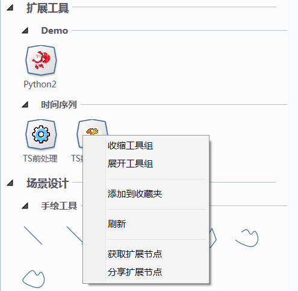

.. NodeExpend
 
制作扩展节点包
====================================
Datist 给用户提供自定义的节点的功能，您可以在工具箱添加扩展自已的节点。本节点将详细说明扩展节点的工作原量与使用方法。

自定义节点约定
-----------------------------------

以同名文件方式，组织扩展节点。常规节点定义文件组织如下：

  #).nde文件：NodeExpand简写，JSON格式的UTF8文本，定义节点的描述、数据需求和输出数据结构信息。
  
  #).png图片文件：定义节点的图标，建议图标尺寸小于200*200。
  
  #).html网页文件：定义运行参数界面。
  
  #)核心算法文件：自定义节点的运行文件，支持py、pyc、R、Rc和exe。
  
  #).dms流程文件，给出流程的示例流程。

.. figure:: images/NodeEx01.png
    :align: center
    :figwidth: 90% 
    :name: plate

.. note::

   节点图标，图片为PNG格式，尺寸控制在200*200以内；
   
   节点标题将显示在工具栏中，字符串长度控制在5个之内；
 
定制内容
-----------------------------------

扩展节点需定义节点描述、数据需求、运行参数及输出数据结构信息。

节点描述信息
^^^^^^^^^^^^^^^^^^^^^^^^^^^^^^^^^^^

节点描述信息，由.nde文件定义，定义节点的名称、版权、算法文件等信息。

示例代码::

    "Name": "Python2",
    "SystemToolTip": "python2测试",
    "Version":"2.0",
    "Author": "bushyao",
    "ScriptFile": "NodeTest.py" //算法文件，必需项，支持py、pyc、R、Rc和exe

节点数据需求
^^^^^^^^^^^^^^^^^^^^^^^^^^^^^^^^^^^

在.nde文件的InputTables对象数组中，定义节点的前节点的数据需求，包括数据表名称、字段结构等。

InputTables数组的长度，将决定节点的可连接前节点的数量：

  #)无InputTables属性或子元素，自定义节点为数据源类型；
  
  #)仅有一个子元素，自定义节点仅支持一个输入数据节点；
  
  #)多个两个子元素，自定义节点仅多个输入数据节点。 

示例代码::

    "InputTables": [
        {
            "Name": "magdata",            //数据表名，用于数据源转存
            "Title": "井位",              //数据表界面显示名称
            "Fields": [
                {
                    "Name": "Longitude",  //字段名，用于数据源转存
                    "Title": "经度(度)",  //用于字段显示
                    "Type": "string"      //用于控制下拉列表中的类型
                },
                {
                    "Name": "Latitude",
                    "Title": "经度(度)",
                    "Type": "string"
                }  
            ]
        },
		{
            "Name": "magdata2",
            "Title": "震中",
            "Fields": [
                {
                    "Name": "Longitude",
                    "Title": "经度(度)",
                    "Type": "string"
                },
                {
                    "Name": "Latitude",
                    "Title": "经度(度)",
                    "Type": "string"
                }   
            ]
        }
    ]
	
示例代码中定义了两个数据源的需求。

	
.. note::

   Type指定字段数据类型，即自定义节点对字段类型的要求，数据源窗口将根据指定的类型过滤字段下拉列表内容。
   Type支持int、real、string、bool、datetime等类型；
   若为空，支持任意类型的数据；多个类型以|间隔，如int|real,表示支持两种类型的数据。
 
	
节点运行参数
^^^^^^^^^^^^^^^^^^^^^^^^^^^^^^^^^^^

节点运行参数，由HTML界面定义，作用是编辑一个JSON文件，作为节点的运行参数。	

参数文件由HTML定义格式（用户自己定义）。运行时，数据专家追加数据源信息，以文件路径的方式推送给核心算法。

参数文件示例::

    {
      "pars": {
        "title": "点1",
        "desc": "测点"
      },
      "allfields": true,
      "names": {
        "q": "月份",
        "f": "月份"
      }
    }	
 
	

用户自定义的Html界面构成：

.. figure:: images/NodeEx04.png
    :align: center
    :figwidth: 90% 
    :name: plate
  	 

建议Html界面由样式设置、数据交换、界面显示三个部分构成；

  * 样式设置：定义的HTML的整体的样式，有助于界面风格的一致性，相关内容可参考CSS样式；
  * 数据交换：定义HTML界面与节点编辑器之间的通讯方式，由数据初始化SetData与数据保存 GetData 两个函数组成；
  * 界面显示：HTML脚本定义，界面参数与字段映射的具体内容。
  

数据交换部分由GetData、SetData两个函数组成；建议使用Jquery组件，方便界面对象的引用。

  * function GetData() 将界面数据组织成JSON数据字符串，存储于节点中；

  * function SetData(txt, fieldnames) 从节点中获取数据Json字符串和前节点的名称列表，初始化界面； txt为JSON字符串， fieldnames为前节点的字段名列表，以分号间隔的字符串。

示例代码:: 

    

界面显示部分，示例代码:: 

    <body scroll="no" style="height: 100%; margin: 0; width: 100%">
        <table>
            <tr>
                <td style="width:70px">名称</td>
                <td><input id="title" type="text" value="点1"></td>
            </tr>
            <tr>
                <td>描述</td>
                <td><input id="desc" type="text" value="测点"></td>
            </tr>

            <tr>
                <td>字段Q</td>
                <td><select id="fieldQ"></select> </td>
            </tr>
            
            <tr>
                <td>字段F</td>
                <td><select id="fieldF"></select> </td>
            </tr>
        </table>
    </body>		 
	
		 
输出数据结构
^^^^^^^^^^^^^^^^^^^^^^^^^^^^^^^^^^^

当自定义节点有二维表输出时，通过.nde文件中OutputFields属性定义输出二维表的结构。节点运行时，以输出列表中第一个CSV文件为输出数据表（以;或,分隔）。

示例代码:: 

      "OutputFields": [
        {
          "Name": "月份",
          "Type": "string"
        },
        {
          "Name": "蒸发量",
          "Type": "string"
        },
        {
          "Name": "降水量",
          "Type": "string"
        }
      ]

本案例中，完整nde文件代码如下:: 

    {
      "Name": "Python2",
      "SystemToolTip": "python2测试",
      "Version": "2.0",
      "Author": "bushyao",
      "ScriptFile": "NodeTest.R",
      "InputTables": [
        {
          "Name": "magdata",
          "Title": "井位",
          "Fields": [
            {
              "Name": "Longitude",
              "Title": "经度(度)",
              "Type": "string"
            },
            {
              "Name": "Latitude",
              "Title": "经度(度)",
              "Type": "string"
            }
          ]
        },
        {
          "Name": "magdata2",
          "Title": "震中",
          "Fields": [
            {
              "Name": "Longitude",
              "Title": "经度(度)",
              "Type": "string"
            },
            {
              "Name": "Latitude",
              "Title": "经度(度)",
              "Type": "string"
            }
          ]
        }
      ],
      "OutputFields": [
        {
          "Name": "月份",
          "Type": "string"
        },
        {
          "Name": "蒸发量",
          "Type": "string"
        },
        {
          "Name": "降水量",
          "Type": "string"
        }
      ]
    }

自定义节点运行
-----------------------------------

自定义节点运行过程中，系统转存界面参数及数据源数据，将参数文件传递给核心算法，运行算法后，数据专家自动从界面收集数据。

当前核心算法模块，支持py、pyc、R、Rc和exe。

脚本宿主程序
^^^^^^^^^^^^^^^^^^^^^^^^^^^^^^^^^^^

对于py、pyc、R、Rc等脚本文件，需要在系统中，定义宿主程序。注：R脚本指定Rscript.exe程序程序。
	

	
Python扩展节点
^^^^^^^^^^^^^^^^^^^^^^^^^^^^^^^^^^^
  
代码示例(NodeTest.py):: 

    # -*- coding: utf-8 -*-
    import sys
    import json
    import codecs
     
    argfile=sys.argv[1] #'par2.json'  
    data=json.loads(open(argfile).read().decode('utf-8-sig'))
    
    #前节点的输出文件名 
    print('--NodeTest.py by bushyao--')
    
    print('magdata:' + data['magdata'])
    print('magdata2:' + data['magdata2'])
    print('outputPath:' + data['outputPath'])
    
    print('中文永远是个坑'.decode('utf-8').encode('cp936'))
    print('title:' + data['pars']['title'].encode('cp936'))
    print('desc:' + data['pars']['desc'].encode('cp936'))
    
    #输出一个文件
    print("D:\\MyProgram\\binX\\Plugin\\test\\tmpData\\asia150dpi.png")
    
    #输出数据表格文件
    print("D:\\MyProgram\\binX\\Plugin\\test\\tmpData\\tmp5DAC.csv")
    
    #输出网页
    print("http://www.baidu.com")   #输出网络地址 
 
 
EXE扩展节点
^^^^^^^^^^^^^^^^^^^^^^^^^^^^^^^^^^^
  
代码示例(C#):: 

    using System;
    using System.IO;
    using System.Text;
    using Newtonsoft.Json.Linq;
    
    namespace NodePlugin
    {
        class Program
        {
            static void Main(string[] args)
            {
                if (args.Length < 1)
                {
                    Console.WriteLine("参数据文件不存在");
                    return;
                }
                var jsonFile = args[0];
    
                var txt = File.ReadAllText(jsonFile, Encoding.UTF8);
                var data = JObject.Parse(txt);
    
                Console.WriteLine("----NodeTest.exe by bushyao----");
    
                // 前节点的输出文件名
                Console.WriteLine("magdata:" + data["magdata"]);
                Console.WriteLine("magdata2:" + data["magdata2"]);
                Console.WriteLine("outputPath:" + data["outputPath"]);
    
                Console.WriteLine("title:" + data["pars"]["title"]);
                Console.WriteLine("desc:" + data["pars"]["desc"]);
    
                //输出一个文件
                Console.WriteLine("D:\\MyProgram\\binX\\Plugin\\test\\tmpData\\asia150dpi.png");
    
                //输出数据表格文件
                Console.WriteLine("D:\\MyProgram\\binX\\Plugin\\test\\tmpData\\tmp5DAC.csv");
    
                //输出网页
                Console.WriteLine("http://www.baidu.com");   //输出网络地址 
            }
        }
    }

 
 
运行结果收集
-----------------------------------

用户以Print方式（python），将需要收集的内容，输出界面上；数据专家自动收集数据，无须用户定义。现支持文本、文件和http、https网页。
		 
以报告形式浏览输出内容	 
^^^^^^^^^^^^^^^^^^^^^^^^^^^^^^^^^^^

	
查看网络地址	 
^^^^^^^^^^^^^^^^^^^^^^^^^^^^^^^^^^^

	
输出二维数据表
^^^^^^^^^^^^^^^^^^^^^^^^^^^^^^^^^^^

	
    
 
添加扩展包
-----------------------------------

用户通过添加节点功能，对工具箱进行扩展；扩展节点的使用与原生节点的使用方式相同；

    
**案例：**

    

