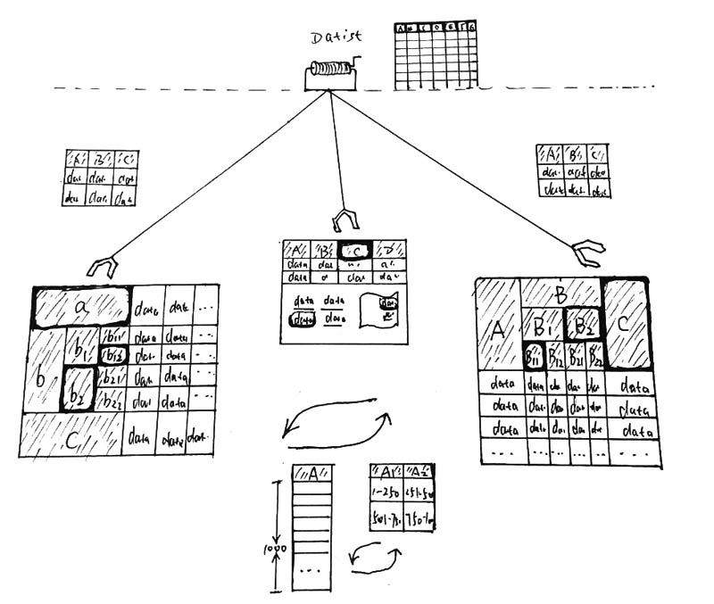
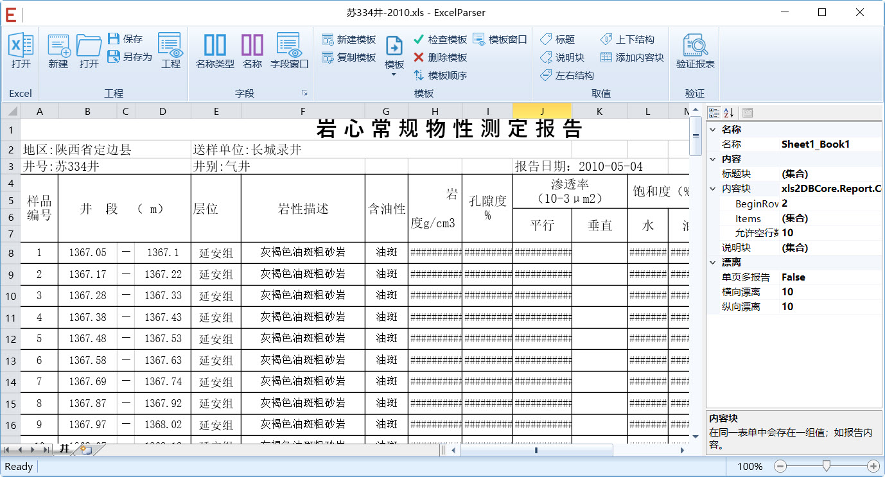
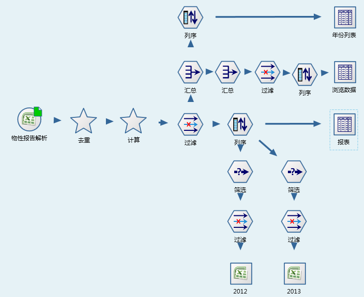
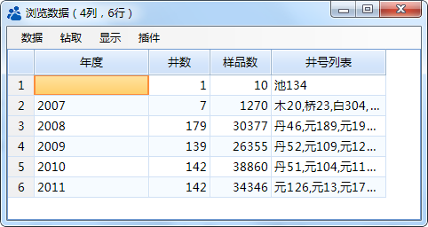

.. Semistructured

半结构化数据智能解析
====================================
维基百科：“直观的界面、出色的计算功能和图表工具，再加上成功的市场营销，使Excel成为最流行的个人计算机数据处理软件。在1993年，作为Microsoft Office的组件发布了5.0版之后，Excel就开始成为所适用操作平台上的电子制表软件的霸主。”这段话描述的非常到位，Excel在油田科研生产中无所不在，无论是从现场的数据采集、日常报表上报到科研人员的分析研究，都得到广泛的使用，因而多年来企业也就积累了大量的Excel数据。

Excel格式多源于用户习惯自行独立设计，缺乏统一的企业规范；与常见的二维表格数据相比，Excel数据种类多样、格式复杂，具有很强的自述性与动态可变性。

传统数据处理工具难以适应数据结构的复杂与变动，仅能处理格式相对简单的Excel表格；而编制数据解读程序工作量又非常大；就造成了Excel半结构化数据应用十分困难。

Datist提供独创的智能解析工具与技术，可快速地、批量地从任意复杂格式中，抽取所需的数据，并按照新需求将数据重新组织成标准规范的结构化数据格式，支撑上层应用。

智能解析原理：

智能解析采用多模板、单元格动态匹配、可选列等技术，让智能解析模板具有很强的伸缩性与兼容性，使得同一模板抽取多种格式的文件成为可能。

**步骤一 构造解析模板**

通过Excel智能解析插件，编写数据抽取模板：

  #. 定义待抽取的字段名及数据类型列表；
  #. 新建数据解析模板，指定标题块、说明块和内容块的取值方式；

Excel智能解析插件界面：

**步骤二 数据清洗**

使用数据专家中的智能解析节点，加载智能解析模板，读取Excel文档中数据。

.. note::

  如果说智能解析节点实现了Excel文档的读取，那么数据专家流程式数据清洗才是真正实现了Excel文档数据的智能解析与重组。

**案例：录井数据整理入库**

项目组需要将历年以光盘保存的单井资料，整理、加载到生产系统中。由于数据归档以单井为单位，钻、录、试数据又分别存在不同的Excel文档中，数据整理人员需从每口单井的文档中提取数据，通过复制、粘贴的方式，将原始的Excel数据，整理成目标数据格式，工程量浩大。又因为项目组人员少，日常事务烦忙，数据实录工作，进展缓慢，1个月才完成十几口的数据整理任务。

多年来积攒的报告：

.. figure:: images/Semistructured03.png
     :align: center
     :figwidth: 90% 
     :name: plate 	 
	  

报告样式多样是任务难以推进的主要原因，例如，岩心分析物性数据来源多个项目组，分析单位也来源不同的单位，各个单位的分析数据项目大同小异，但Excel的格式各异，这种差别有大有小。

下图中枚举了来源于不同企业的物性报告格式，虽然它们同是物性分析报告，也都包含井号、深度、层位、渗透率、饱和度等多个参数数据，然而这些参数的数据、位置及表征方式有很大差异，使得数据结构化工作异常困难。

勘探局的格式：

.. figure:: images/Semistructured04.png
     :align: center
     :figwidth: 90% 
     :name: plate 	 
	 
川庆钻探工程公司的格式：

.. figure:: images/Semistructured05.png
     :align: center
     :figwidth: 90% 
     :name: plate 	 	 

吐哈油田的格式：

.. figure:: images/Semistructured06.png
     :align: center
     :figwidth: 90% 
     :name: plate 	 	 

数据专家系统，采用智能数据解析技术，快速实现了分层数据提取、钻井分段钻井液性能数据、气测解释数据、取芯、套管数据、岩屑油气显示、钻头数据、最大井斜、油气显示分层统计和物性入库共10项数据自动提取入库，仅用10分钟，完成600余井的数据整理工作。
	 

   
666个文件解析耗时日志，解析总耗时10分22秒::
  
  [2014-10-31 09:24:24.729] 【流程开启】 D:\DatistDemo\DMS\Projects\录井.DMS
  [2014-10-31 09:24:24.732] 【名称】Stream
  [2014-10-31 09:24:24.733] 【版本】2014-06-19 22:47:51
  [2014-10-31 09:24:24.737] 【作者】bc-THINK
  [2014-10-31 09:24:24.739] 【运行模式】流程参数运行
  [2014-10-31 09:24:24.746] 【完成】 节点正确性检查
  [2014-10-31 09:25:49.290] 解析Excel: 50/666 7.51%
  [2014-10-31 09:26:35.629] 解析Excel: 100/666 15.02%
  [2014-10-31 09:27:05.417] 解析Excel: 150/666 22.52%
  [2014-10-31 09:27:36.907] 解析Excel: 200/666 30.03%
  [2014-10-31 09:28:14.572] 解析Excel: 250/666 37.54%
  [2014-10-31 09:28:59.638] 解析Excel: 300/666 45.05%
  [2014-10-31 09:29:29.340] 解析Excel: 350/666 52.55%
  [2014-10-31 09:30:17.498] 解析Excel: 400/666 60.06%
  [2014-10-31 09:31:09.807] 解析Excel: 450/666 67.57%
  [2014-10-31 09:31:57.783] 解析Excel: 500/666 75.08%
  [2014-10-31 09:32:47.935] 解析Excel: 550/666 82.58%
  [2014-10-31 09:33:39.062] 解析Excel: 600/666 90.09%
  [2014-10-31 09:34:30.589] 解析Excel: 650/666 97.60%
  [2014-10-31 09:34:46.305] 解析Excel: 666/666 100.00%
  [2014-10-31 09:34:46.854] 读取表单方式:	所有
  [2014-10-31 09:34:46.861] 日志文件:	C:\Users\bc\Desktop\录井\log1.log
  [2014-10-31 09:34:46.864] 共解析文件数661个，入库记录137878条。

 
解析结果数据表：
	  
.. figure:: images/Semistructured08.png
     :align: center
     :figwidth: 90% 
     :name: plate 	 
	 
将结构化的结果，按年度统计报告：

	 
 
**智能解析效果**

Datist数据提取解决方案具有高度智能化、自动化的特点，且整个过程无需编程，只需要对Datist数据专家的节点进行排列组合，便可以生成个性化的解决方案，因此在各方面均比人工方式和编程方式的解决方案高出几个等级，经过大量实际项目验证：

与人工方式相比：

  * 准确率提高数倍；
  * 工时缩短至小时级；
  * 成本缩短至1/10；
  * 可复用程度提高百倍。

与编程方式相比：

  * 开发用时缩短至1/50；
  * 成本缩短至1/4；
  * 灵活性提高10倍；
  * 开发难度降低至1/50。

