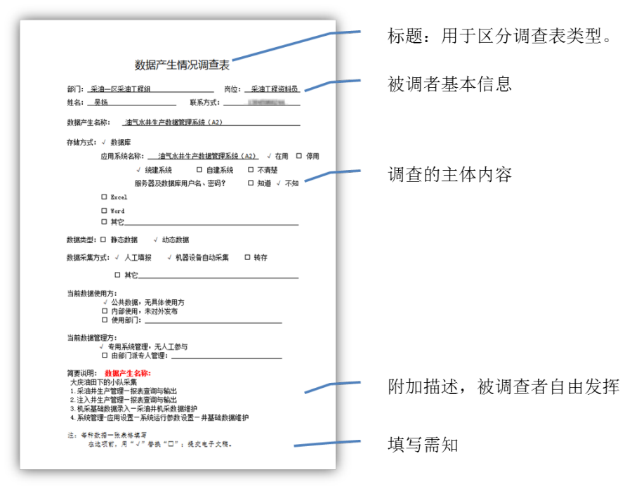
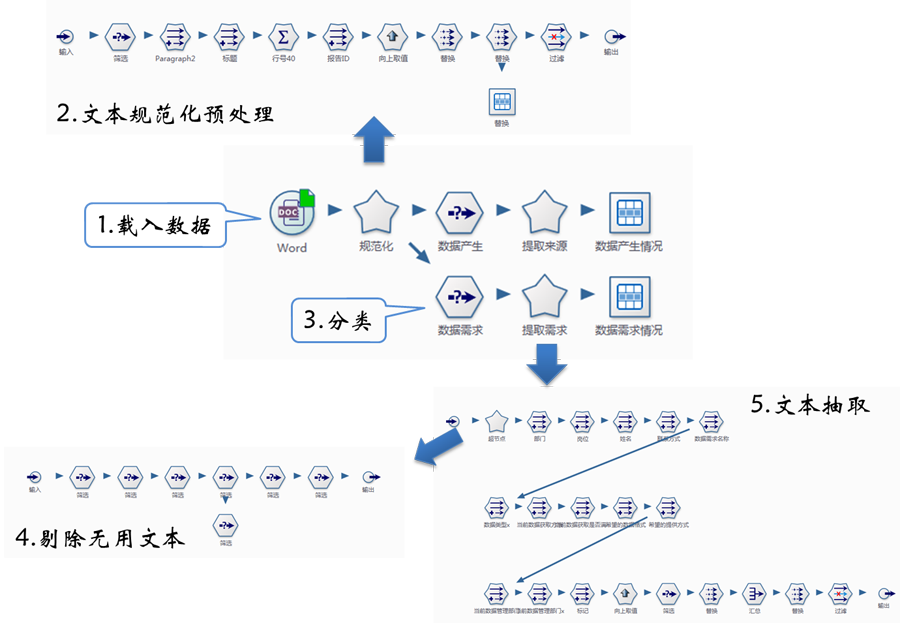
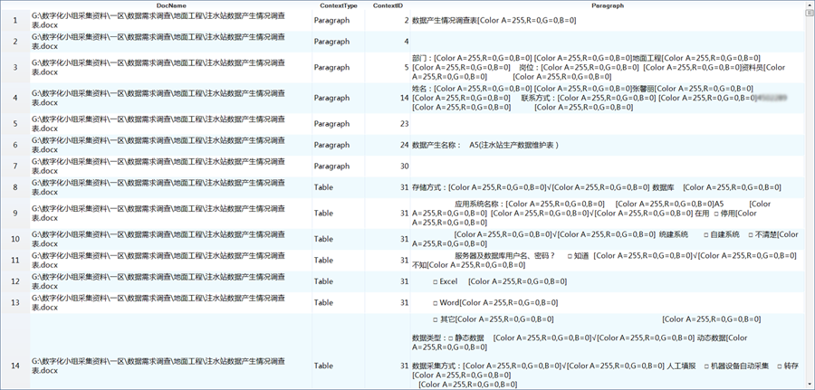
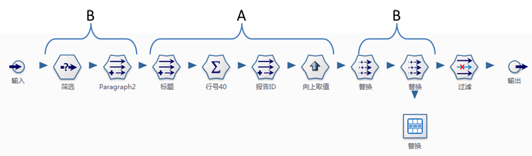
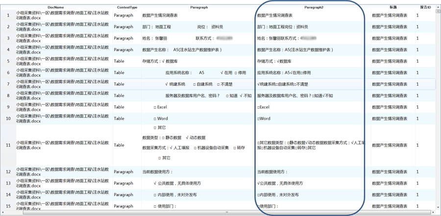
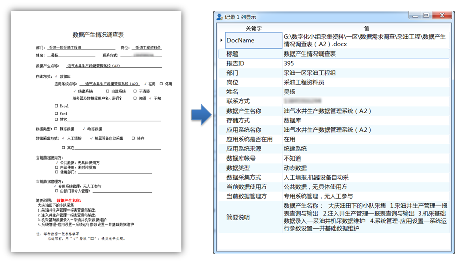
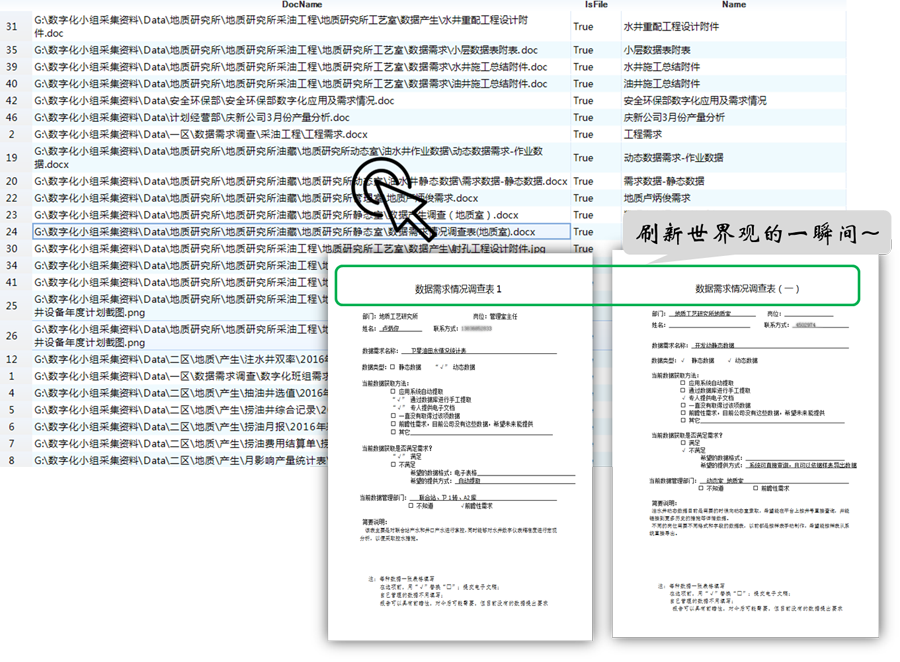

.. Unstructured

非结构化数据抽取
====================================
数据收集过程中，我们常遇到HTML、Word、PDF等文档资料，这些文档很难用关系型的二维逻辑表来表现。在数据提取过程烦琐、工作量巨大，长期的实践中，我们总结出了非结构化文档解析的“5+1”的方法（抽取数据五步+流程评估）。

**一、数据抽取**

  #) 载入数据；通过Word、PDF、Txt、数据引擎等数据源节点，将数据加载到数据专家中。
  #) 预处理；文本规范化处理，如删除不可见字符、名称表述规范化等，使多个来源的数据趋于一致。
  #) 分类；分而治之，不同类型文档的内容差异较大，区分文档类型分别进行数据抽取。
  #) 过滤噪声；剔除文档含有大量的无用数据，如填写需知、标题等文本噪音。
  #) 文本抽取；使用数据专家中的文本处理节点及函数，根据报告的特征字符抽取信息。
 

百度百科：调查表就是运用科学的方法系统地搜集、记录、整理和分析有关市场的信息资料，从而了解市场发展变化的现状和趋势，为企业经营决策、广告策划、广告写作提供科学的依据而制定的表格化文件。在大数据的时代背景下，人们可以通过手机信令数据、网络爬虫技术进行数据挖掘，以代替传统的市场调查；当前在传统行业中，进行主动式精准化的企业发展现状研究，调查表仍发挥着不可或缺的作用。

调查表是一种典型的非结构化文档。调查表通常以Word报告形式下发到岗位人员，然后汇集、整理、统计，编写调查报告。调查表的格式相对固定，部分内容具有需要被调查者主观发挥，这使得数据格式与内容的自由度很大，给整理与统计带来巨大的工作量。

下面我们就来揭示Word文档解析奥秘，破译非结构化文档解析的密码。

数字化小组调查表

数据解析流程：

	 
**1) 载入数据**

通过Word节点将所有调查表加载到数据专家中。

  * Word节点支持加载单个文件或者加载某个目录下的所有文件。
  * 被调查者通常使用颜色字体进行选择，因在读取过程中，需要输出单元格段落样式。
  
Word数据源节点，将所有文档全加载进来，输出项包括：文件名称、内容类型、内容编号及内容（Paragraph）。

	 
**2) 文本规范化预处理**

规范化预处理，主要目标是减少文本内容的自由度。

  A、标记调查表：由于上一步的载入数据后，形成了一个大数据表，因此需要对调查表进行编号，以区分不同的调查表。这里使用标题行对应的行号作为调查表的编号（报告ID）。
  
  B、规范化文本表达：通过删除空行、删除不可见字符、删除无效格式、替换不规范标记、替换特殊格式等方法，以减少文本内容的自由度。

	   
  
经过文本规范化预处理生成Paragraph2列，使得多个调查报告的内容趋于一致，为后续的解析工作打下坚实基础。

**3) 分类**

一次调研工作可能涉及很多方面的内容，涉及的调查内容、数据格式不尽相同，如数据来源、数据用途等。在汇集过程未作特别区分，在前面的数据加载过程中，并没有严格区分，给后期的数据提取带来很大的不便。

通过分类，区别不同类型的调查表，然后对每一种类型的调查表，分别进行数据提取工作，分类工作主要通过筛选节点完成。

**4) 剔除无用文本**

调查表为填写方便，设计了很多提示性信息，如填表需知等，这些信息仅为填表服务，而需要入库。通过一系列筛选节点，将这些无用的文本从流程中剔除。

**5) 文本抽取**

经过前面4步的准备，进入实质性数据提取阶段，抽取调查表的具体内容。抽取过程，主要是通过特征字符标记，来进行内容的定位与提取。

文本解析常用函数列表::

    1、SubStrBetweenS(STRING,SubString1,SubString2)
    抽取STRING中SubString1-SubString2之间的字符串。

    2、RemoveBetweenS(STRING,SubString1,SubString2)
    删除STRING中SubString1-SubString2之间的字符。

    3、RemoveString(STRING,STRING1,STRING2,…)
    从字符串STRING中，删除字符串STRING1,STRING2,…

    4、RemoveBreakAndSpace(STRING)
    删除字符串中的回车、中英文空格、制表符。

    5、ReplaceBetweenS(STRING,SubString1,SubString2,ReplaceString)
    用ReplaceString替换STRING中SubString1-SubString2之间的字符。

    6、HasSubString(STRING,SUBSTRING)
    如果STRING中包含SUBSTRING，返回真(1)，否则返回假(0)。

    7、IsNullOrWhiteSpace(Item)
    非空值和非空格判断，如果表达式Item的值为空、空格，返回真（1），否则返回假（0）。
  
  
**二、流程评估**

一个项目、一次研究总有些惊喜，总有一些奇葩事件来刷新我们的世界观。流程按照特定的规则运行，抽取符合规则的文档，剔除规则之外的部分，那么规则是否与实际情况吻合呢？这就需要对流程进行评估。

这里通过扫描目录节点，加载所有文档的目录信息，再与解析结果进行匹配，提取没有匹配的部分，再逐一进行文件判识、改进流程。

.. note::

  二维表浏览数据，支持双击或右键菜单打开本地文件。
 

.. note::

  * 通过“5+1法”解析Word文本文件，条理清楚，方法可行，易于操作；前4步不断缩小目标范围，第5步精准解析；
  * 文本解析工作主要借助于特征字符的定位与抽取；
