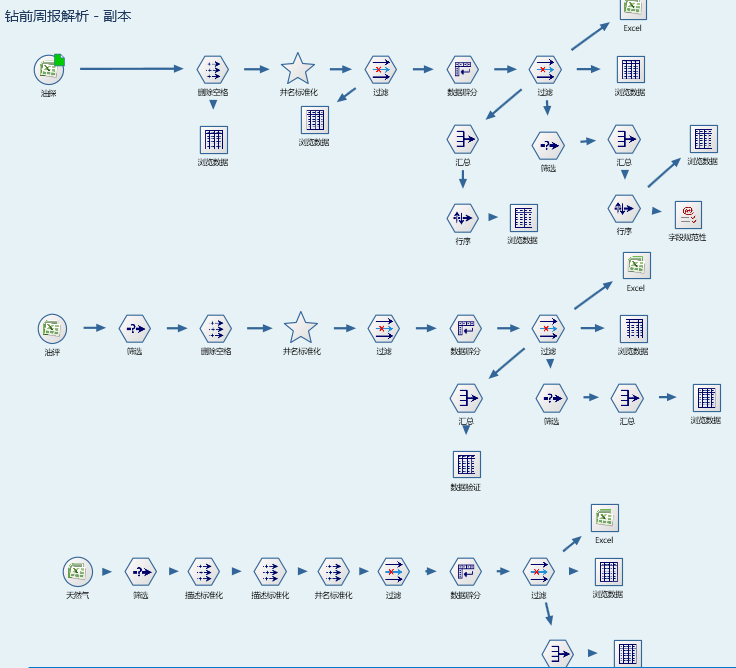
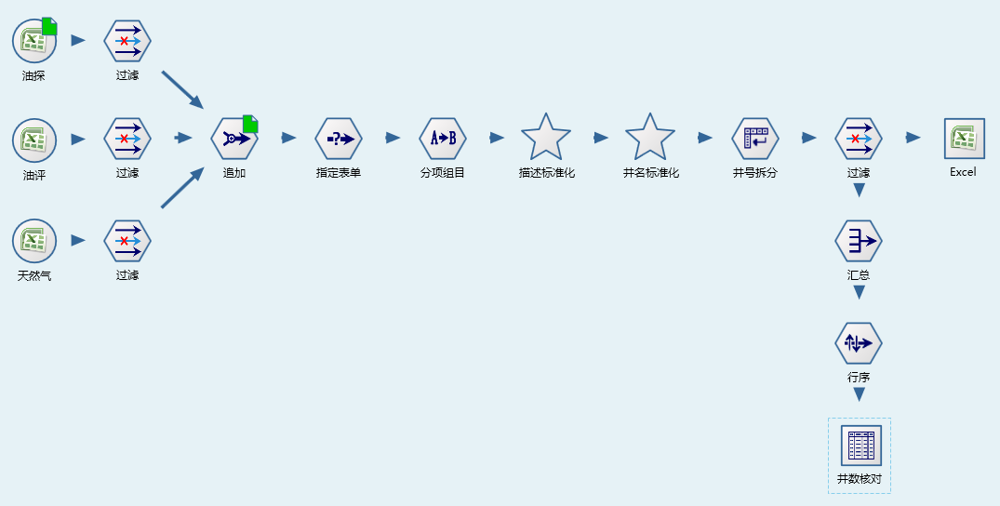

数据模型化的意义
====================================
关于数据解析，可随意指定字段的名称，从Excel中获取任意格式的数据，导致同类不同来源的数据的字段名称有差异，虽然后续的处理过程类似，但流程不可共同，需针对不同来源的数据，制作不同的流程；同时，在数据入库过程中，井的状态也不能标准化表达（钻前状态，即Excel解析的字段名称），需要进行同义词变换操作。

**基本原理：** 单个流程完成特定的任务，它处理的字段名称及数量是一定的，同时数据解析的目的是数据入库或格化报表，数据入库、格化报表所需要的字段也都是一定的。

**数据模型化（数据结构，字段名称、顺序）**

**定义：** 在流程制作过程中，引入数据模型的概念，将数据源映射成标准的数据模型，在后续工作针对标准数据模型进行。对不同来源的数据都进行数据模型化，从而实现流程数据处理部分的共用。主要工作是标准化字段的名称、先后顺序；处理过程中，对原有字段有取舍，也有新建字段，建立数据映射关系。

**使用：** 数据模型化，可以在Excel解析过程中进行，在创建数据读写模板时，指定标准的数据模型。也可以在流程处理中，通过过滤节点实现。数据模型可以是已有标准数据模型，或是流程中所需特定的数据模型。对于特定的数据模型，应使用多源数据的最大合集，涵盖所有涉及的字段，保证后续应用的兼容性。

**内容规范化（预处理）**

流程就是一系列的规则，根据这些规则将数据处理成特定格式。数据专家的意义在于动态给流程加规则，但在数据处理之前所有规则都是确定，也就是说某个时刻，流程能处理的数据内容是一定的。基于这样的原理，数据处理之前应当对数据进行规范化处理，进行必要的文本替换、同义词变换、全角半角变换、删除不相关字符等。

**自动化处理与人工相结合**

数据处理是将不规则数据处理成规则的数据，然而不规则的数据种类多种多样，要做到面面俱到，解决所有数据不规则问题，需要投入大量的时间和精力来给流程增加规则，流程编制需要花费大量的时间。在实际工作中，某个流程就是为了解决一个特定的数据处理问题，这就需要权衡流程制作与修改原始数据所需的时间，适当修改原始数据以快速完成任务。

	 

	 