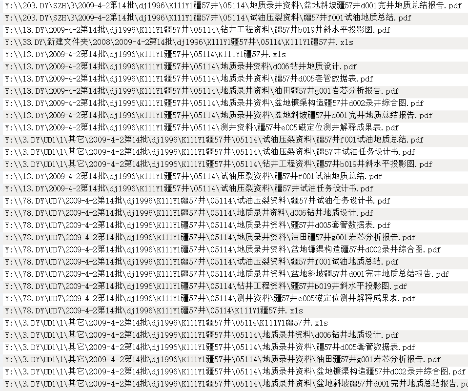
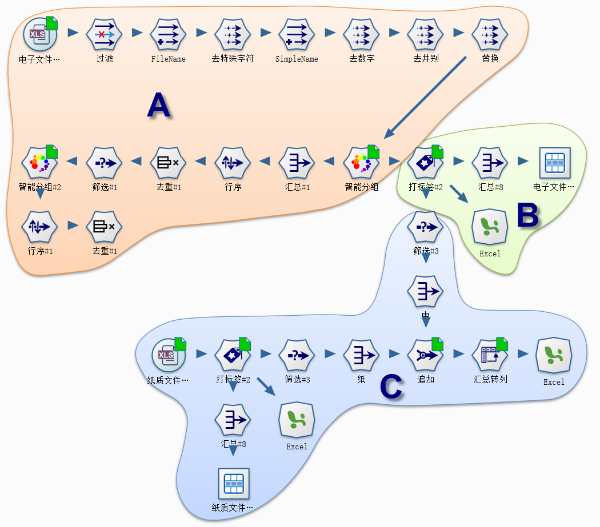
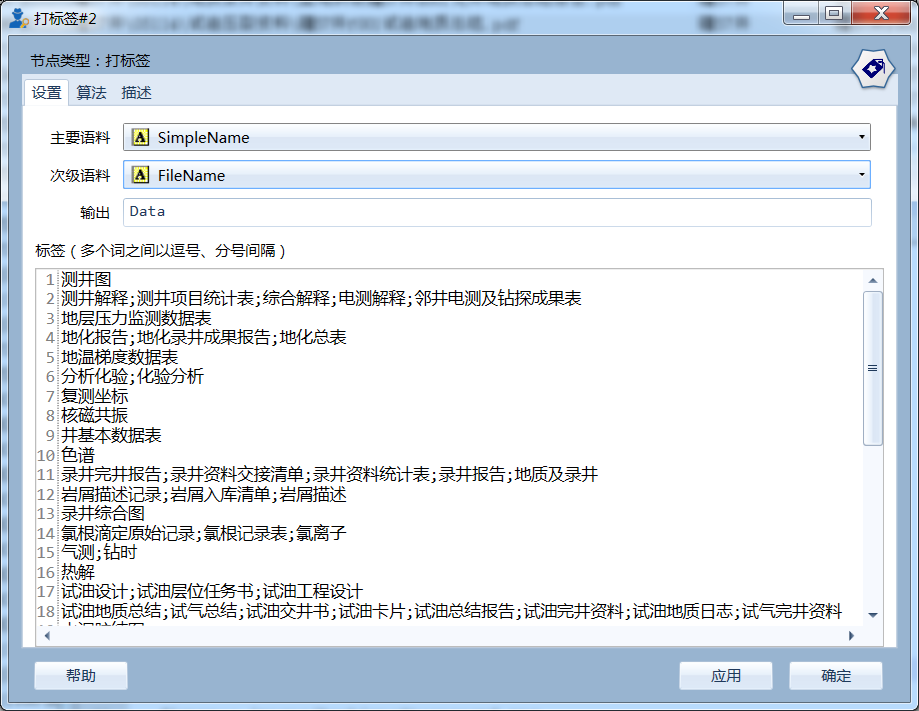
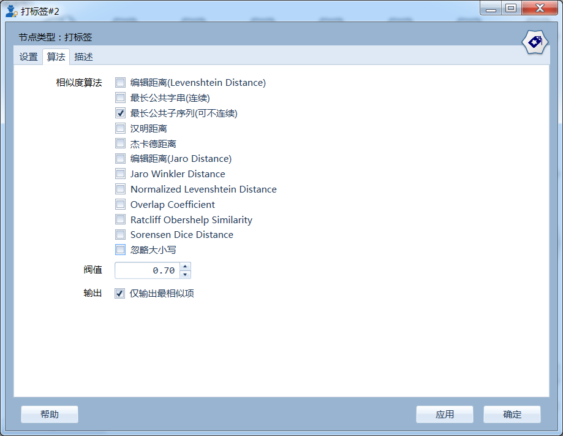
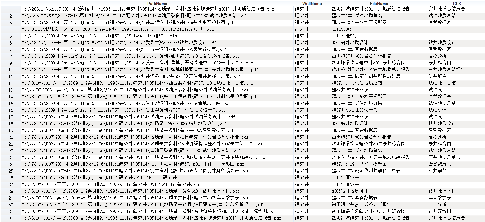
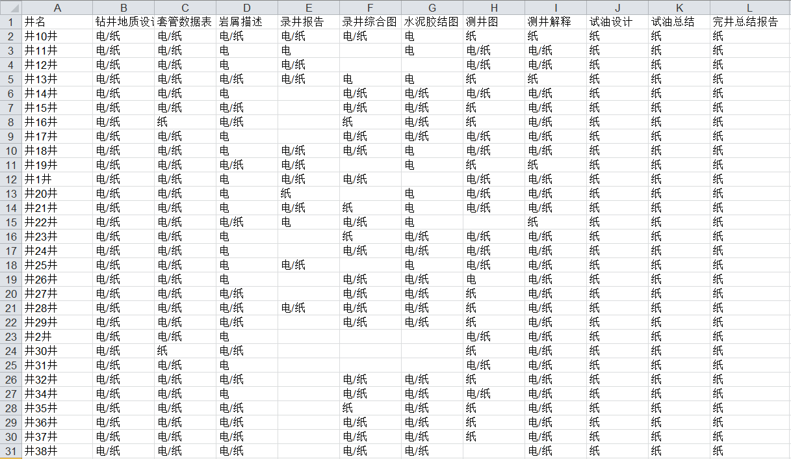

.. ArchivesStoreroom

如何对杂乱的文档进行归类？
====================================
档案馆，是大型企业的基本设施，存放着多年来的企业经营管理的基本数据。然而随着油田勘探开发的深入，对数据深度挖掘的需求越来越多，档案馆以单井施工打包归档的数据组织方式，与以专业数据库为主导的数据深化应用之间鸿沟日渐明显。如何在两种数据组织方式之间搭建起桥梁跨越鸿沟，是本案例的研究的主题。

油田档案馆的数据资产化管理，将单井钻井、录井、测井、试油气等施工数据打包上传到档案库中，即“一井一目录”的数据组织方式；这种数据组织方式极大地减轻数据归档的工作量。油田勘探与开发过程中，数据深度挖掘与应用以专业数据库为基础，即按学科按专业分别建库，如钻井库、录井库、测井等。两者的出发点不同，使得数据的组织方式也相距甚远。

本案例，以油田档案馆文件目录为数据源，阐述如何通过数据专家系统对杂乱的文档进行业务归类的方法。

**杂乱有章有数据源**

数据基础是从档案馆导出的130万条文件路径及井名信息；文件路径及名称标明了文档的所属学科大类、小类以及井名、盆地等信息。

对于分组问题，笔者第一感觉可以根据文件路径包含的子串进行分类；然而由于文件归档来源于成千上万的施工单位，使得文件路径中虽包含业务学科信息，但并非严格意义上的子串相等或包含关系，即它们之间关系中相似关系。这种信息的包含关系相对隐晦、杂乱且层次不清，传统意义上的子串匹配方法难以满足需求。本案例中笔者尝试采用字符串的相似度算法进行文件目录的归属分类。

 
**子串相似度流程设计**

文件路径分组流程设计核心点在于，根据文本串相似度的对每一个文件打标签，即根据文件目录与已知学科类型之间的文字相似度进行分类。打标签的先决条件是，建立业务学科语汇与短语的字典，这一点可以通过智能分组节点实现（智能分组根据字符串之间的相似度进行分类，而非业务意义上的学科相似度）。

流程可分为三个主要部分，A、建立学科语汇与短语字典，对以文件的名称进行数据清洗，再通过编辑距离、最长共公子串等算法，提取常见的学科短语集；B、采用最长共公子序列相似度算法，对文件目录进行专业归属标记；C、电子版与纸质版文件拥有量盘查与比对。 
	 

	 
     用于打标签节点的专业学科语汇与短语字典

	 
     采用相似度算法进行专业归属标记
	 
	 
**自动归类与比对结果**

文档自动化学科分类结果。通过数据专家系统耗时20钟，完成百万文档的自动化学科分类，结果符合率98%以上。

 
多个电子版文档与纸质版文档的比对结果。
 

	 