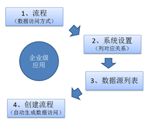
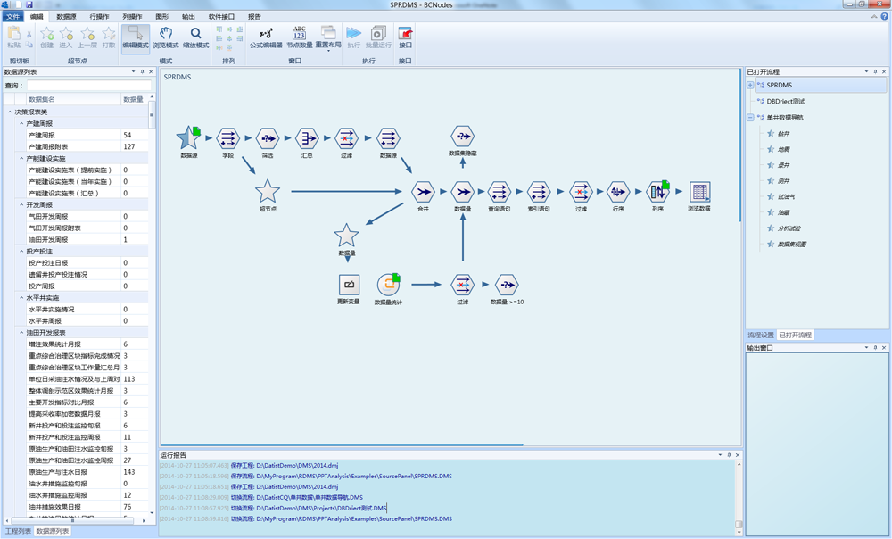
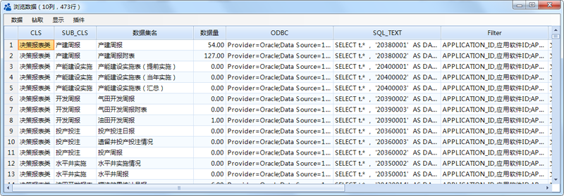
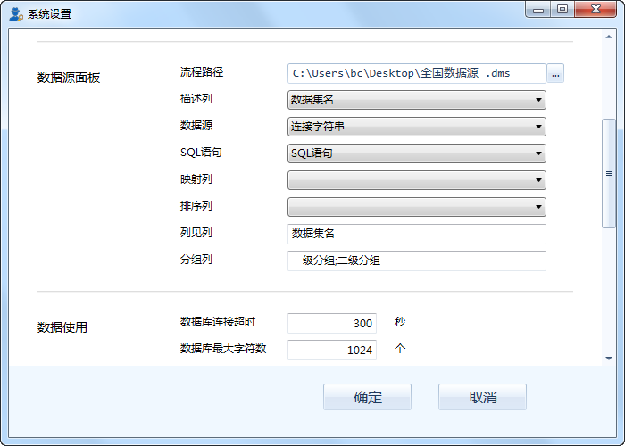
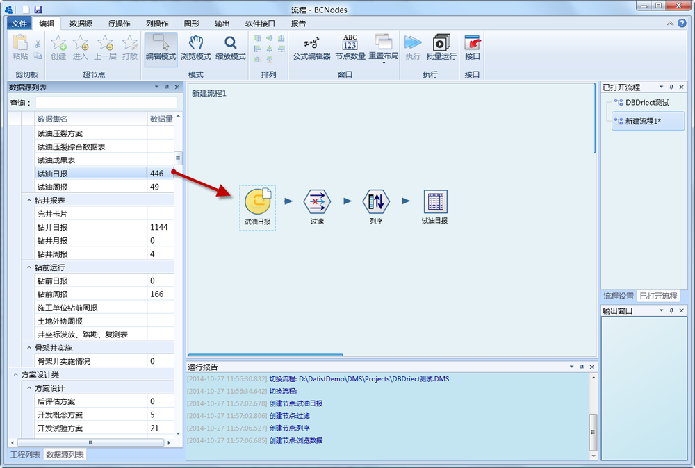

.. DataAccess

企业级数据接入
====================================
科研过程需要使用钻、录、测、试等多个专业数据，例如，在分析化420井的试油情况时，需要从钻井库查找钻时信息，从录井库获取砂样的记录，从测井库中查看蓝图资料；如何快速访问这些专业数据库呢？
使用 “数据源列表”面板功能，可将钻、录、测、试等多个数据库接入其中，可以快速查找相关的数据表，建立数据分析流程，从而形成企业级的数据管理与应用效果。

数据源列表应用包括：数据访问流程、系统设置、流程创建三个步骤：

**步骤一 编制数据访问流程**

这是一种殊定的数据流程，其默认输出节点的结果即数据源列表面板的数据内容，输出结果包括：数据源接入语句、数据表访问语句、数据量、数据集名称等多项内容。

数据访问流程图

	 
	 
值得注意的是，该流程输出结果顺序会作用于数据源列表面板中数据顺序，因此，对于企业级应用，需对输出结果进行排序，可使用自定义排序方式，实现专业角度的数据排序，而非字母顺序的排序。
同时，企业级的数据访问，需要扫描整个数据库的相关内容，访问效率相对较慢，建议对输出结果的前节点设定数据缓冲，从而提高数据源列表面板的加载速度。

试验表明，473个数据表的数据量统计，需要15分钟。如果不创建缓存，系统将需要15分钟的加载时间（数据源面板是与系统同时加载的）。

	 
	 
**步骤二 系统设置**	 

定义数据源面板的数据读取关系，在设置窗口中，指定数据源列表面板流程位置、描述列名、数据源等需要字段与流程输出结果的对应关系。

	 
数据源面板中的数据加载：

	 
.. note::	 

	SQL语句可以存在多个，可以是访问数据表的原始方式，也可以是汇总统计数据，这取决于SQL语句的写法，在应用过程，随用户指定的SQL语句列不同，创建的数据源访问方式也有所不同。

**步骤二 快速创建流程**

在此面板双击数据项或通过右键菜单，快速在数据流程区创建流程，实现数据的快速访问。
 

	 
	 