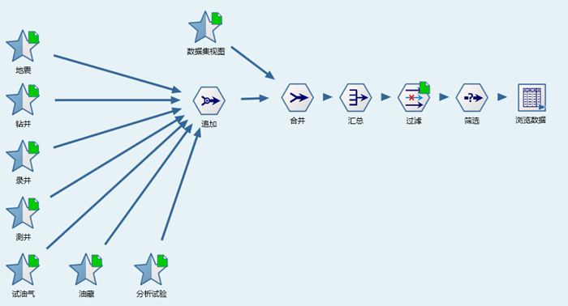
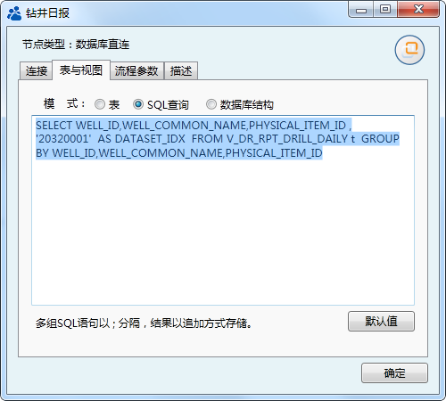
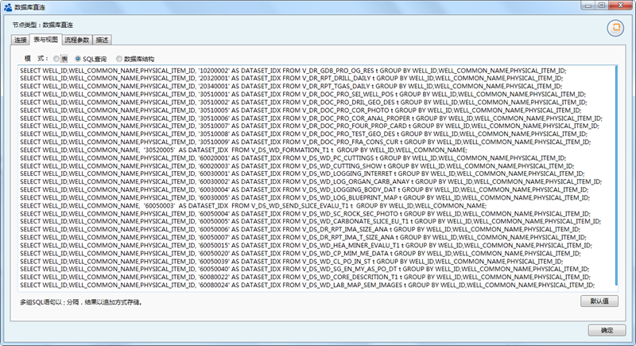

.. DataBaseIndex

单井索引数据库
====================================
随着油田企业信息化的深化，将油井全生命周期中各个生产阶段的信息都纳入到数字化的建设进程中，单井相关的数据表多达500余项。而在某个科研工作瞬间，我们通常想立即获取某口井的所有资料，以便于综合对比分析，这就需要从各个专业数据库中查询获取这口井的数据。

因为涉及的数据表众多，查询效率难以保障；我们考虑建立索引数据库，将涉及单井数据的元数据存储在一张物理表中，从而实现单井数据的快速访问。

.. note::

  索引数据库流程目的要明确，不用兼顾太多，数据量太大效率超慢。

数据专家系统提供多种索引数据库的建立方法：

**1、流程法**

针对每一个涉及的数据表，创建一个数据源访问节点，再通过追加节点，合并多个数据源的内容。此方法组织方式清晰明了，易于更新维护；不足之处，涉及的数据源比较多时，流程制作工作量较大。

流程设计：

数据源参数设置：

**2、多条语句法**

数据库节点，提供多条语句追加运行的功能，为建立索引数据库提供捷径。执行的语句可通过流程生成，从而提高查询语句的填写效率。

此方法建立索引数据库与流程法相比，运行速度更快，流程制作周期较短；但不易于维护。

流程设计：

数据库直连节点，支持多条语句追加运行： 

.. note::
  数据库节点中，多条语句之间以";"分隔。多条语句的输出结果，通过字段名匹配，输出结果数据结构为第一条语句的数据结构（字段名称、类型及数量）。
