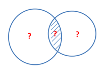
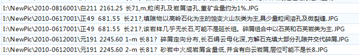
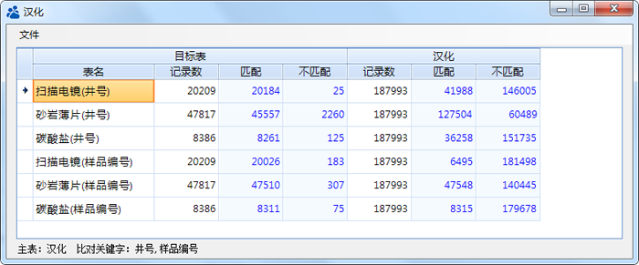

.. DataConsistency

数据一致性检查
====================================
井名称是生产井的唯一标识，通过它可以在不同的数据库中，找到科研中所需要的资料。然而钻井、录井、测井等专业库的建设与管理是独立的，这些库的井名能否完全匹配，匹配度如何呢？这需要对多个数据库进行一致分析。这也是常见的数据质量检查方法之一，即表A中的字段值，是否都在表B中。

Datist 提供数据匹配度分析节点，用于在多个数据表（节点）之间分析字段值的一致性。

 
**应用一 薄片照片归档**

使用 Datist 进行薄片照片文件进行整理、入库工作。薄片照片文件构造批处理命令自动进文件的归类，但复制之后却发现少了一些文件，问题出在哪里呢？哪些文件出问题呢？

将批处理命令与复制后的实现路径作对比，找出了其中缘由。

流程如下：
 

 
 
复制结束后，少几十个文件？目标路径与实际路径比对后，结果怪异：

目标文件中包含%和?字符，与比较通配符发生了冲突。

**应用二 试验项数据匹配**

分析化验数据库中，各个分析试验项的数据与分析化验主表比较。比较，井号、样品编号，各个数据表是否与主表一致？

参数设置：

比对结果：

数据钻取（双击分析结果中蓝色的数字，您可以创建临时数据源节点）：

.. figure:: images/DataConsistency08.png
     :align: center
     :figwidth: 90% 
     :name: plate 	 

什么叫不查不知道，一查吓一跳，数据库建设过程中，竟然有这么多的不一致，让数据库建设者情何以堪？
