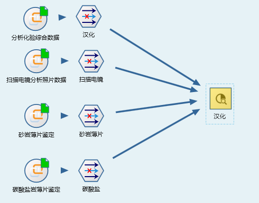
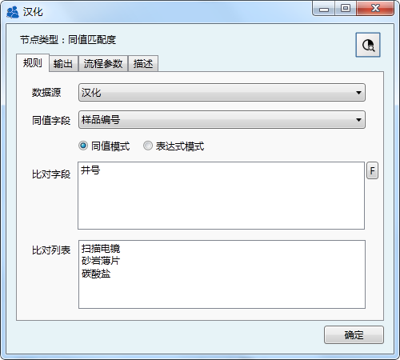
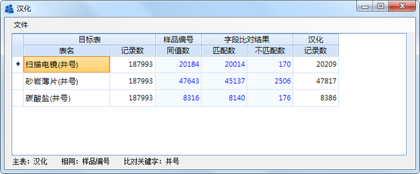
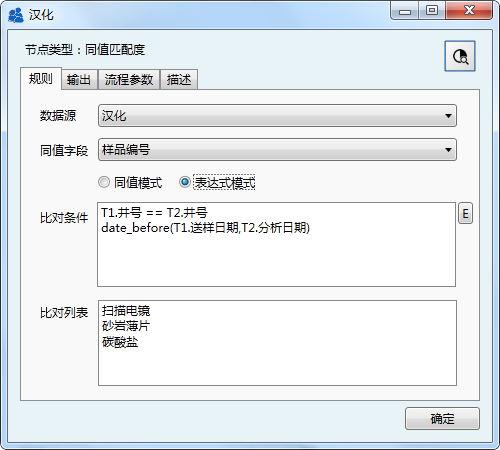
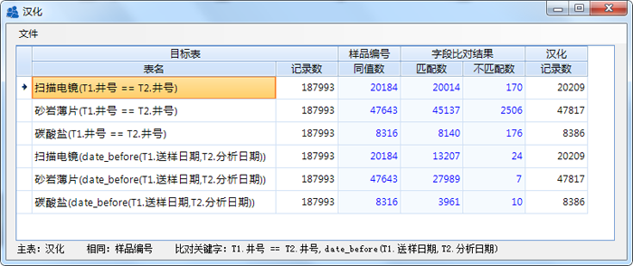
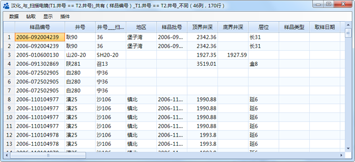

.. DataLogic

数据逻辑检查
====================================
常见同一实体的相关数据之间相互冲突，如同一编号的样品，在两个不同表中的井号不一致，同一口井的在两个数据库中井状态不一致。

Datist 提供【同值匹配度】分析节点，用于同一实体，多个不同之间的数据逻辑检查。具备有同值比较、条件比对两种模式，支持数据钻取、数据源实体、输出Excel等多项功能。

分析试验数据库数据逻辑检查流程：

	 
**1、同值模式**

相同样品编号下，井号是否一致？

同值匹配度节点参数设置

  
比对结果
 

	 
**2、表达式模式**

相同样品编号下，井号是否一致？逻辑上，送样日期是否早分析日期？（完钻深度、正钻深度？）

节点参数设置	 
	 

	 	 
比对结果
	 

 
数据钻取
 

	 
.. note..

   技术易产生崇拜，特别是跨学科的技术合作，会产生绝对信任，然而产品的研发往往受限于开发的当时当地的思维状态，思维的局限性是产品的BUG的发源地。
   
   同一件事，同一个目标，我们需要辩证地去看，在深究技术细节的同时，也要有包容的心态去看待过往的系统。