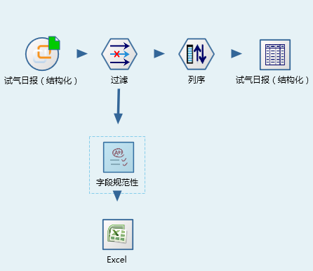
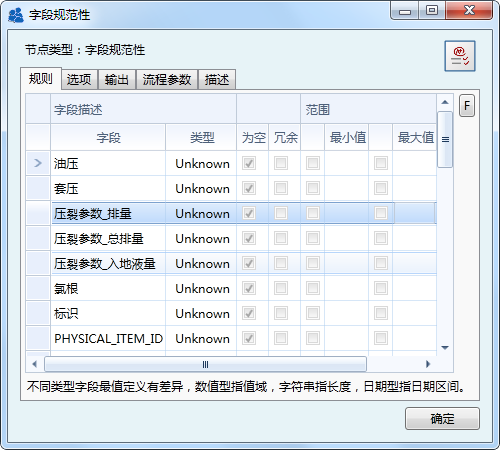
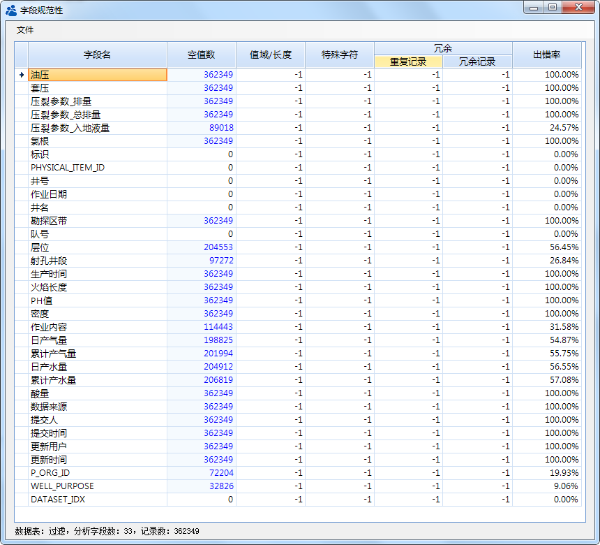
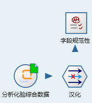
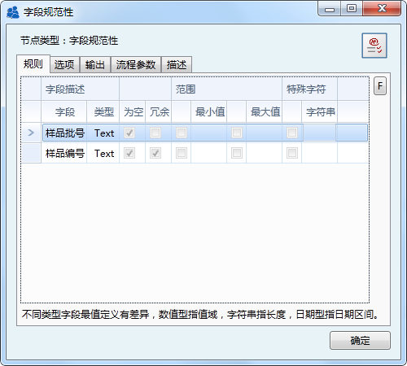
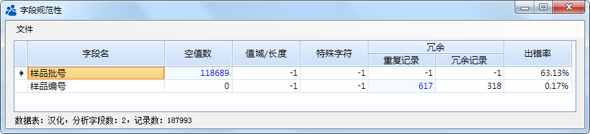

.. DataQuality

数据质量分析
====================================
多年来的专业数据库建设，实现了钻、录、测、试等数据的资产化管理，将成千上万的数据存储于数据库中。随着数据应用的深化，数据的缺失、异常与冗余给研究人员带来了苦恼。数据库的数据质量如何？如何量化？数据管理人员的通过编写SQL语句完成此类工作，然而工作量巨大，效率低下。
 
Datist 系统，提供的字段规范性功能，可对数据表进行数据质量分析，快速输出数据库的空值情况、冗余、最值、特殊字符等信息。

**应用一 试气日报数据表**

借助于字段规范性检查节点，编制的试气日报表数据质量分析流程，如下：

	 
字段规范性节点参数设置如下：

数据分析结果表明，对于试油日报相对关键的数据项：油压、套压、排量、氯根等字段值存在大量的空值。
	 

**应用二 分析试验数据库**

样品编号、样品批号是分析试验数据库中的关键信息，它是样品的唯一性的标识，然而数据检查的结果，却让人开始怀疑人生了。

分析流程如下：

字段规范性节点参数设置如下：	 
	

	 
分析结果表明，分析化验库中最核心的两项信息存在严重问题；代表试验样品的唯一性样品编号有重复，而代表样品批次信息的样品批号有大批量的缺失；这直接导致数据应用过程中，数据不能正确关联与使用。
	 

.. note::

   双击分析结果中以蓝色显示的数字，您可以创建临时数据源节点，查看数据构成情况哦。