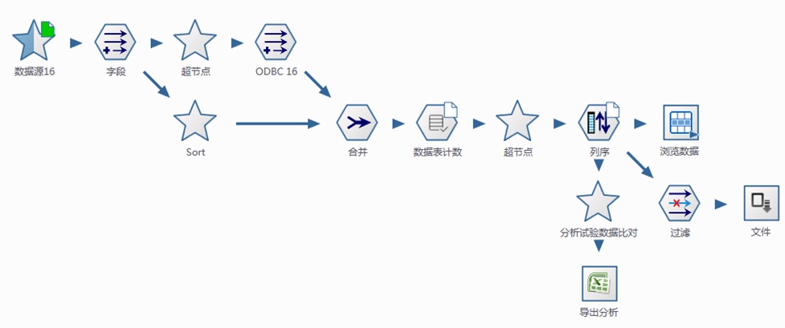
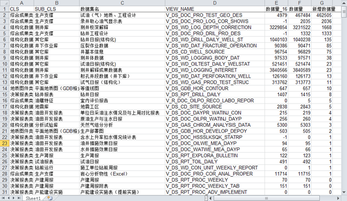
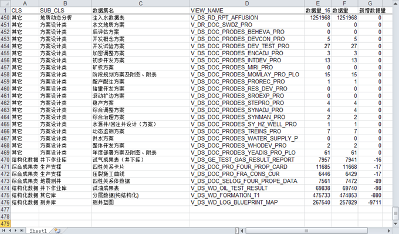

.. DataSourceChange

数据源变了，系统你还好嘛？
====================================
如果说数据是系统的血液，数据结构则是系统的骨架，数据结构变化会给系统造成灾难性的破坏。因此，在数字油田建设过程中，数据源切换是大忌，只在一些特殊的场景迫不得已才会发生，比如说硬件环境的更新、统建项目的要求等。

某部门为了提高数据查询的效率，切换了系统的底层数据库，切换之后数据使用人员发现有些数据查不到了；显然是切换过程中出了问题？

使用数据专家进行了快速分析，给出两个数据库的差异报告。

数据分析流程：

	 
**技术点：**

  #. 对两个数据源中所有的业务相关数据表、视图进行计数，并进行比较
 
数据量增加异常数据表：

	 
数据量减少异常数据表：

	 