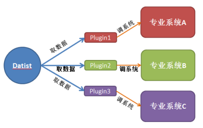
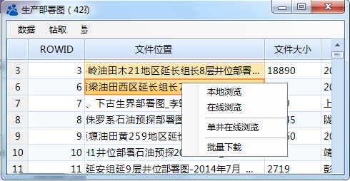
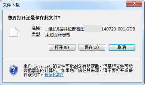

.. DocsOnline

文档在线浏览
====================================
企业级数据库，存储内容不光有的结构化数据，还有很多文档性研究成果，如何使用呢？

数据专家二维表数据浏览器，提供文档快速访问、查看的功能。该功能是通过插件实现，用户可自行开发数据浏览插件，实现专业文档在线浏览或是数据专家系统与其它其它专业系统的对接。

二维表数据浏览器的提供插件管理器，用户需定义菜单名、插件DLL名、类名、函数名、参数据字段列表等相关信息，从而实现系统功能的扩展。

基本原理

 
**1、插件管理**

如图所示，插件管理器
 
.. figure:: images/DocsOnline02.png
     :align: center
     :figwidth: 90% 
     :name: plate 	
	 
插件定义后，数据源访问菜单

	 
	 
**2、调专业系统**

用户登录（插件提供）

.. figure:: images/DocsOnline04.png
     :align: center
     :figwidth: 90% 
     :name: plate 		 

本地下载，下载某条记录的内容	 
 

批量下载，批量多个文件

.. figure:: images/DocsOnline06.png
     :align: center
     :figwidth: 90% 
     :name: plate 	
	 
单井在线浏览，同一口井的多个文档

