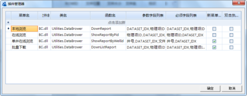

.. DocsOnline

信息系统集成
====================================

多年的信息化建设，企业里沉淀大量的信息化系统，研究人员在科研过程中，通常在多个信息系统中的查阅资料，如测井蓝图系统、单井文档库等。能否将它们集成在一平台上，以便于研究人员快速访问相关资料呢？ 

数据专家中二维表数据、地理图浏览器，提供扩展功能，可以用它来集成企业里的信息系统，也可用它来快速访问、查看各类文档功能。该功能是通过插件实现，您可以将基于信息系统的插件添加在其中，实现专业文档在线浏览，将数据专家与其它信息系统进行无缝集成。

浏览器扩展功能的基本原理如下：

.. figure:: images/DocsOnline01.png
     :align: center
     :figwidth: 90% 
     :name: plate 	 
 
**1、数据钻取管理器**

在主菜单的设置菜单下，数据钻取管理菜单可以开启数据钻取管理器。您需定义菜单名、插件DLL名、类名、函数名、参数据字段列表等相关信息，从而实现系统功能的扩展。如图所示：
 

	 
扩展功能后，在二维数据浏览器的右键菜单中，可以找到添加菜单项。下图中是数据专家与成果管理系统无缝集成的数据浏览器，我们在系统扩展了在线浏览、批量下载等功能。

.. figure:: images/DocsOnline03.png
     :align: center
     :figwidth: 90% 
     :name: plate 	
	 
	 
**2、在线调用信息系统**

在线调用信息系统之前，我们首先进行用户登录（插件提供）。

.. figure:: images/DocsOnline04.png
     :align: center
     :figwidth: 90% 
     :name: plate 		 

使用本地下载功能，下载某条记录的内容	 
 
.. figure:: images/DocsOnline05.png
     :align: center
     :figwidth: 90% 
     :name: plate 	

使用批量下载，批量多个文件。

	 
使用单井在线浏览，同一口井的多个文档

.. figure:: images/DocsOnline07.png
     :align: center
     :figwidth: 90% 
     :name: plate 		 