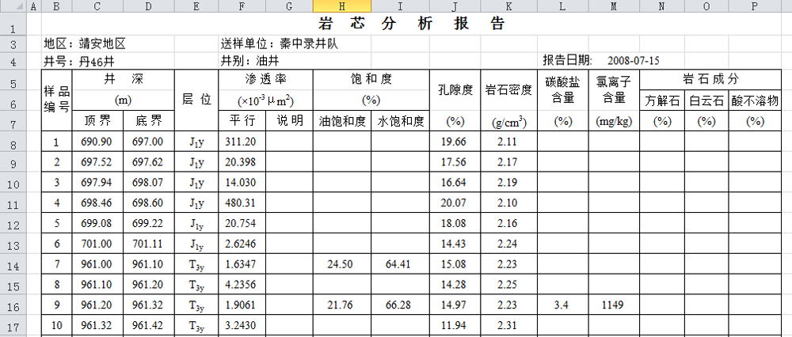
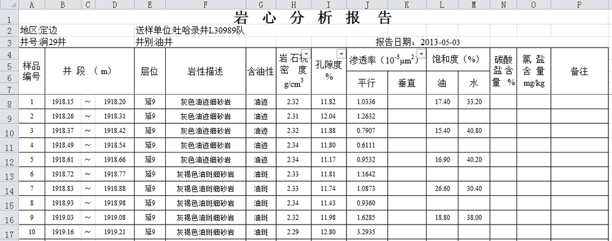
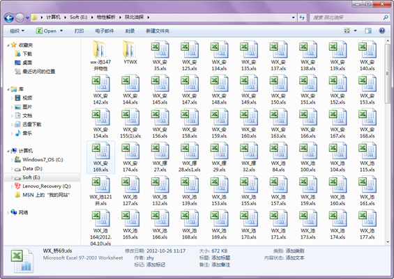

.. PhysicalPropertyReader

物性报告结构化
====================================
存在问题，岩心分析物性数据来源多个项目组，分析单位也来源不同的单位，各个单位的分析数据项目大同小异，但Excel的格式各异，这种差别有大有小。

勘探局的格式：

	 
川庆钻探工程公司的格式：

吐哈油田的格式：

解决方案：

.. figure:: images/PhysicalPropertyReader4.png
     :align: center
     :figwidth: 90% 
     :name: plate 	 	 
	 	 
**技术点：**

   1）智能解析，根据不同的数据格式编辑报告解析模板；
   
   2）数据汇总，将结构化的结果汇总成统计表；

岩心物性解析结果数据表：
	  

	 
解析结果按年度统计报告：

.. figure:: images/PhysicalPropertyReader6.png
     :align: center
     :figwidth: 90% 
     :name: plate 	 
	 
解析结果单井样品数据报告：

	 