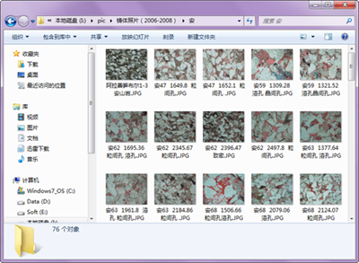
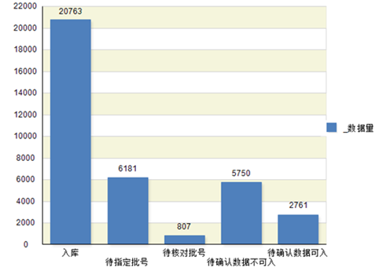

.. SliceImage

文件名称信息抽取与规范化整理
====================================
由于信息系统不稳定、入库规则复杂，分析试验部门有7万张试验图像，未能及时入库；给科研人员使用带来了不便。急需将这些图像数据整理入库，经过提取井名、深度、与数据库中样品批号配对、标准化图像名称、剔除重复图像、剔除现有数据库中已有图像、录入图像索引信息、上传图像文件等10余个步骤；整理一张薄片图像大约耗费3分钟，完成7万张图像大约需要400多个工作日，数据整理工作繁琐、工作量巨大。

使用数据专家进行文件目录扫描、中文划词、正则表达式、文件标准化组织等技术，构建数据分析处理的流程，仅花了4个小时完成了任务（这效率）。

**主要内容：**

  #. 剔除重复图像；
  #. 从文件名上，提取井号；
  #. 从文件名上，提取深度；
  #. 标准化文件名；
  #. 按照样品批号重新整理文件路径；

	 
**技术点：**
 
  #. 通过数据流程，制作划词字典
  #. 去重复规则
  #. 重复数据，自动编号
  #. 文件标准化整理

数据分析流程：

	 
索引信息入库：
	 

 
信息入库统计:

 