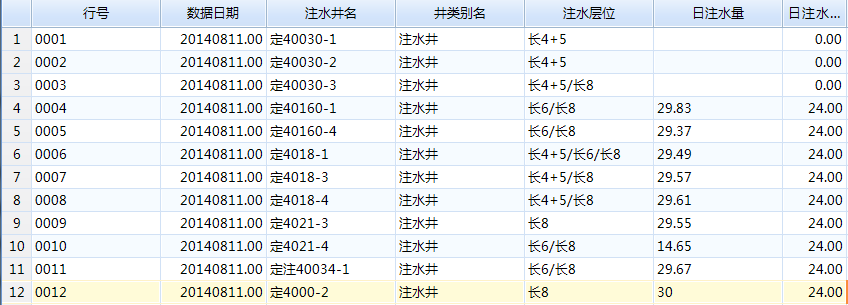
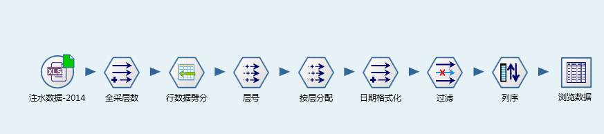
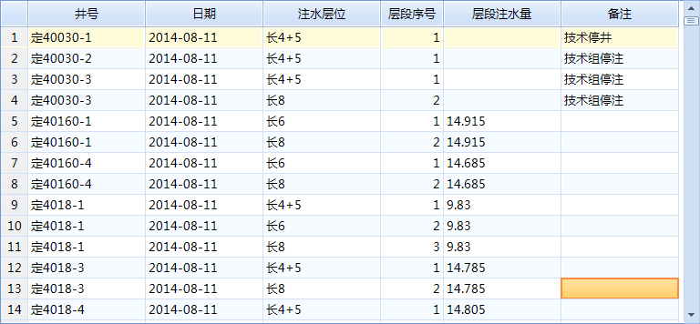


注水量按层劈分
====================================
油田开发过程中，采用多层合注开采技术，在实际数据应用过程中，需要知道单层的注水量。

合注层位以文本的形式存储于一个字段中，需根据注水层位数量，将日注水量劈分致各个注水层位中。

原始数据：

	 
解决方案：

**技术点：**

   1）合采层数计算
      
	  列表类型应用，将注水层位文本转换成列表类型，再计算注水层数【新列】

   2）注水层位拆分
      
	  通过拆分单元数据，将单行记录辟分成多行，并给出层段序号。【行数据劈分】

劈分结果：
	  

