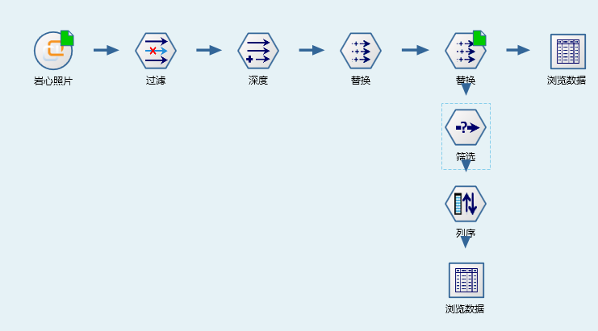
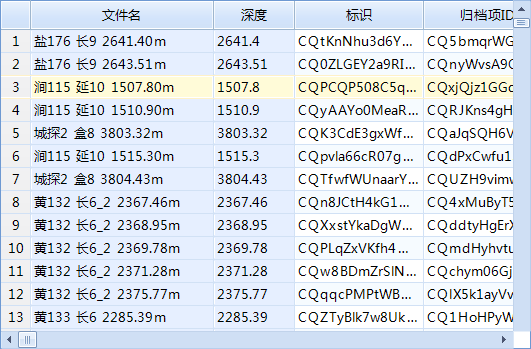


提取岩芯照片深度
====================================
研究人员的日常工作中，岩芯照片以文件管理，命名方式没有统一规范，有很大随意性，但大多包含井名、层位、深度信息。信息系统中建设过程，也只是建立了照片的索引信息，未对深度信息进行整理，没有深度数字化井筒的岩芯照片快速导航功能的很难规模应用。

数据专家系统，快速提取深度信息，对于部分未能提取的深度，通过手工参与方式，快速完成92920张岩芯照片的数据整理任务。

构建的提取岩芯照片深度流程如下：

**技术点：**

   1）正则表达式，提取深度信息

   2）提取信息规则的可靠性，有差异，应将可能性较高的先提取，较差的后提取，同时需配合人工抽查，从而提高信息提取的准确性。
   
提取结果如下：
 
