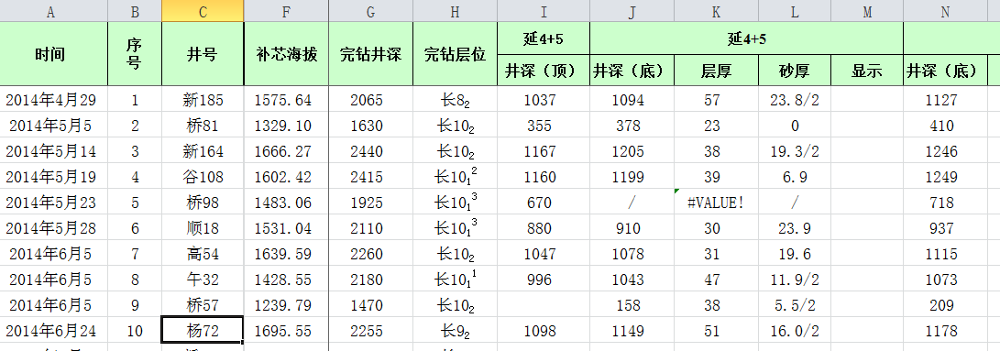
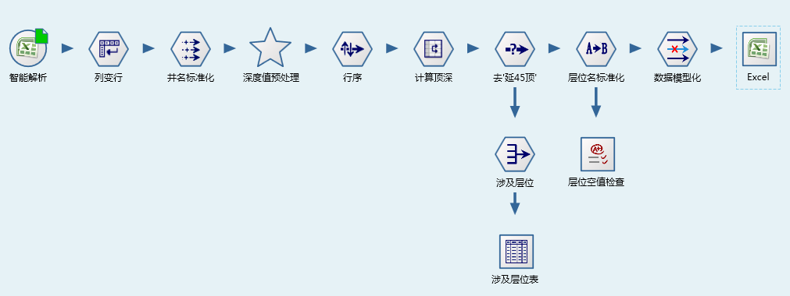
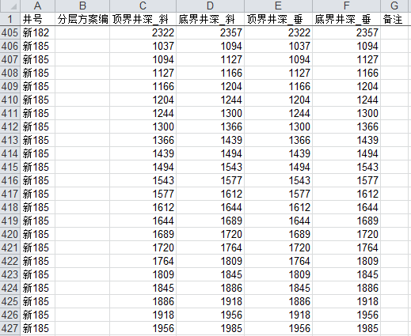


报表中数据组织方式变换
====================================
试油方案讨论是油田公司日常性的生产工作，会议召集现场生产、地质研究、工艺研究和决策等多个部门人员进行方案的讨论，在试油方案讨论中平台的数字化井筒功能很实用，在浏览测井蓝图的同时可查看研究科室分层信息及岩芯照片等。

在试油方案讨论前一天，要求科研人员将分层归档到平台中来，然而数据管理人员催一天，不见数据上传，追问原因，研究人员所使用分层数据格式与平台中上传格式有很大差异，研究人员没有时间整理并归档。

采用 Datist 系统，实现各层系数据的快速抽取，并生成数据上传所需要的数据格式。流程编制与数据处理共花费数十分钟。

研究人员常用的分层数据报表如下：

构建的分层数据结构化入库流程如下：
	 

	 
**技术点：**

   1）智能解析节点，提取数据

   2）列数据劈分节点，将字段转换为行值 

   3）分层数据中只有底深数据，顶深数据为上一层的底深数据，使用值偏离节点。只有同一口井的顶深数据才进行偏离计算。预处理：数据表将井号、深度排序

   4）层位名称标准化。解析过程中，层位名随意写，与数据库中的层位名，不符，使用同义词节点，如：长4_5_1 转化为 长4+5_1，富县 转化 富县组

   5）输出目标数据格式

Datist 解析结果如下：
   

	    