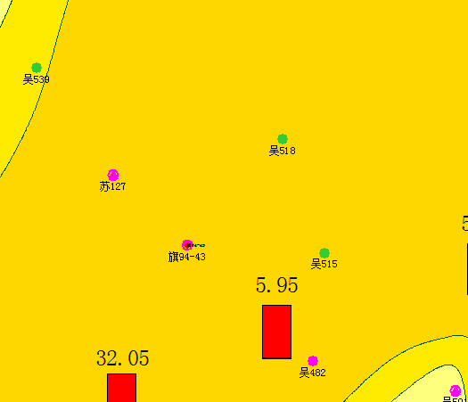
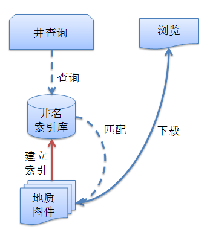
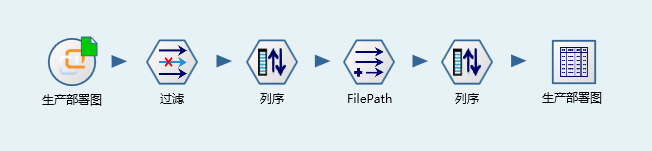
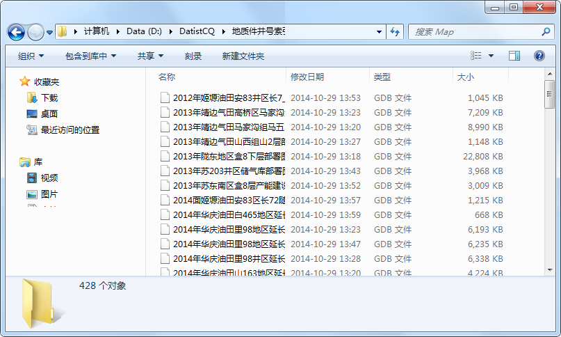
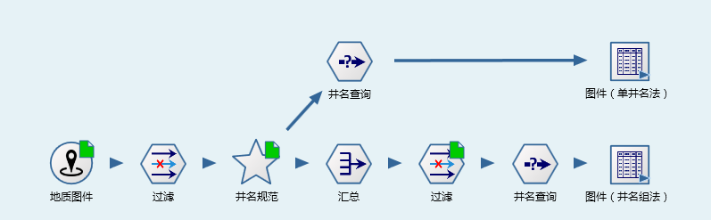
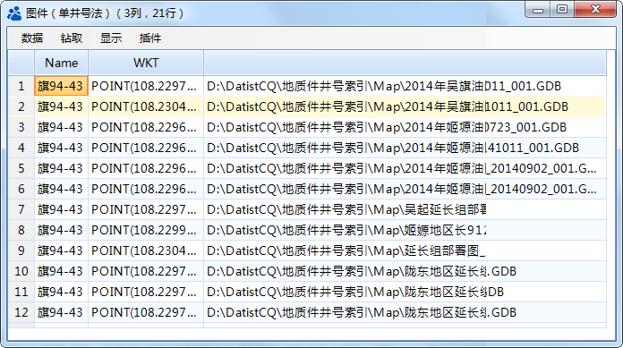
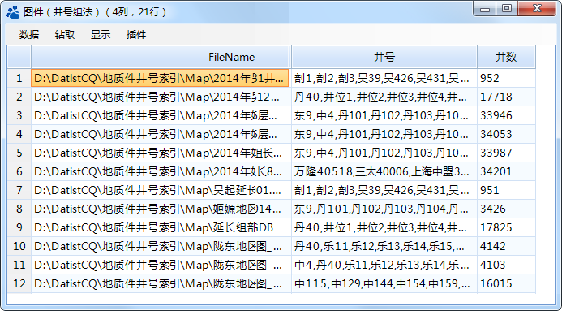


井在哪个图上？
====================================
油田多层系开发，勘探井位部署过程中，通常需要兼顾多个层系的油藏，同时老的区块新的勘探层位也有很大的勘探潜力。在试油方案讨论中，通常需要了解已发井网部署情况，从而避免地层水串通导致试油失败的问题。

井位讨论过程中，需要知道某个开发井所在层系的井网部署情况，即打开某张开发部署图件，然而油田的地质图以文件方式管理，不熟悉开发区的研究人员，很难找相关图件。信息系统中6000多张地质图件，且地质图打开较慢，通常人工打开查看，或是程序前台在线查询图件上的井名的方法，在效率上，很难满足在线论证的要求。

实现思路，如图所示，先针对所有入库的地质图件建立井名索引数据库；在单井查图过程中，通过查询井名索引库，再定位图件，从而实现开发井快速定位图，即哪些图件上有这口井？

数据专家系统，通过扫描地质图件建立井名索引信息库，并提供简明的界面，实现井所在图件的快速查询，完成了数字化平台中类似功能的原型设计及核心算法研究。

地质图件：
	 

	 
解决方案：

 

**技术点：**

   1）从地质图件导出井号【地质图件】

   2）UI快速查询，流程变量的应用，提高使用的便捷性。

   3）在应用成果之前，设置缓存以提高运行效率。

**步骤一 下载GDB文件**

从平台中，浏览相关数据集，下载所有地质图件

通过批量下载功能，下载了428个文件；

**步骤二 图件井号索引数据库**

对428个GDB文件建立井号索引数据库，共从GDB中抽提井号449.9万（414个合法GDB文件，此过程相当耗时，428个文件花费1小时26分钟），通过去空值、同一图件井名去重复、删除试油产量数字井等操作后，共生成合法井号228万条。井在哪个图上的功能实现，采用两种算法：单井号法、井名组法。	 

1）单井名法（75秒）

   单井名法，即把每一口井名，作为一条记录，228万口，在数据库即228万条记录；数据查询中从228万条数据库中找文件时，效率较慢，试验中查一口井需要75秒。

2）井名组法（8秒）

   井名组法，将同一文件的井名合并至一个字段中，合并后的数据库只有414条记录，应用中通过列表元素定位查找井名所在的文件，仅需要8秒。

