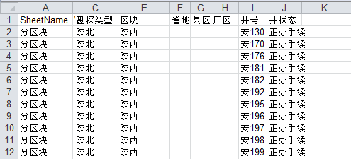

钻前报表解析
====================================
为了方便油田公司决策层了解钻井的实施进展情况，生产部门需定期汇总钻井实施进展表；现有工作模式下，由现场项目组提供数据，涉及油气探评多个项目组，需要分业务领域分别汇总，主要工作是将来源不同项目组的数据，合成到一个表中。然而由于项目组对数据使用的要求不统一，使得各个项目之间数据报表格式有差异，导致数据汇总工作量大，非常出一井多状态、数据不闭合等错误。
每次油田公司召开分析会之前，数据管理人员得花数十个小时整理相关数据，以保证平台的正常使用。

钻前报表：
	 

采用数据专家系统，实现井号自动拆分、井字头自动补全、井状态及所属信息的自动提取等功能，取代了数据管理人员的数据整理工作，在数分钟之内完成相关工作，效率提升近百倍。
	 
解决方案：

  
**技术点：**

   1）智能解析，从不同的格式的Excel报表中的抽取钻井状态信息；
   
   2）井名称标准化，将缩写的井名称，翻译成原始井名称；
   
**步骤一 报表解析**

通过Excel智能解析插件，编写钻前报表的智能解析模板：

  
**步骤二 数据模型化**

将来源于不同项目组的报表数据统一成相同的数据结构【过滤】

**步骤三 数据清洗**

Excel报表中手写录入的数据，数据表征方式多样；在井数统计之前，需要进行必要的数据清洗。

   1）通过正则表达式删除括号的内容。如：ReplaceReg( @Fields,"\((.*?)\)" , "" ) 预处理：replace( @Fields , "（" , "(") ，将全角的括号，转化为半角的坐标

   1）井名称标准化，先劈分井号，再追加井字头；如：AppendWellHeaders(SplitWellHeaders( replace( ReplaceLineBreak( @Fields , '.' ) , '..' , '.')))
   

**步骤四 数据验证**

方法：按条件汇总与原表的合计数对比
	 
排序，可指定原表中的值顺序，排序节点扩展【排序】

数据解析结果：

  
