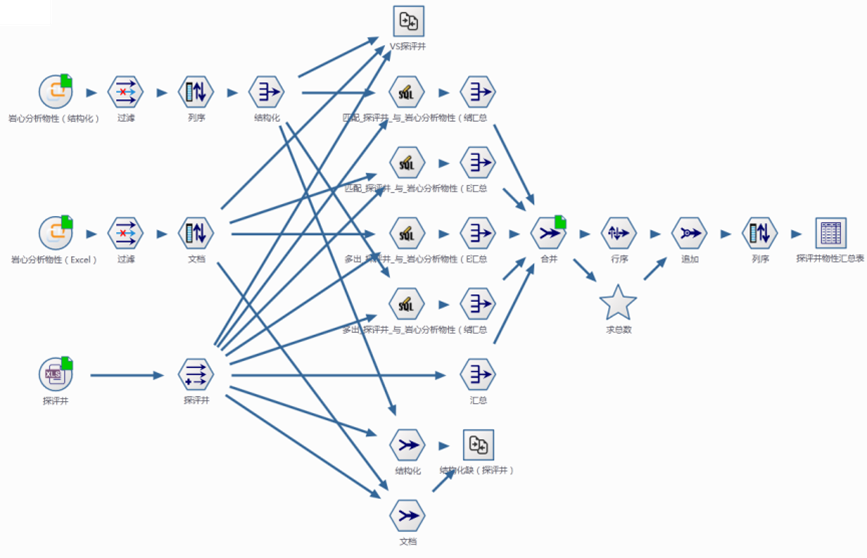
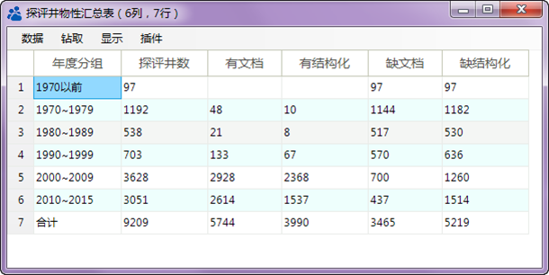

.. wuxinpancha

数据还缺多少？
====================================
数据库中有919674条物性样品分析记录，同时有11750个相关的Excel文件，物性样品分析记录源于Excel文件，两者不完全一致；油田共有9209口探评井，问历年探评井中，有哪些物性数据已结构化入库？还缺失哪些井？哪些有文档还未结构化？

数据分析流程：

	 
**技术点：**

  #. 多源数据集成，Oracle数据表与Excel数据表共同分析【数据库】【Excel报表】，结构化物性和Excel物性在Oracle数据库中，探评井号在Excel表中，需要统计将Oracle中的数据表和Excel中的数据进行综合分析。

  #. 匹配度分析，物性结构化数据、Excel文档、探评价井数据之间匹配度分析【字段匹配度】，结构化数据、文档数据中既包括探评井，又含有开发井，需从这两类数据表中，抽取探评井数据进行汇总。

  #. 情况表自动生成【SQl查询】，分年度段分别统计有文档、有结构化、无文档、无结构化的井数，并每项的总井数，最终合成一张综合数据表。

分年度文档与结构化工作量统计：

	 
探评井的结构化、文档数据量对比：

	 