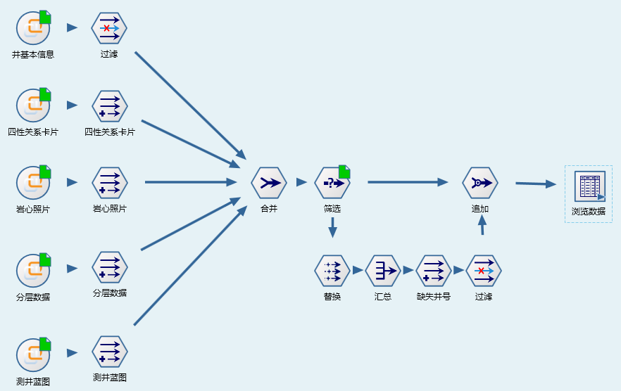
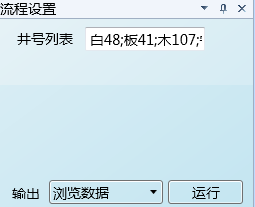
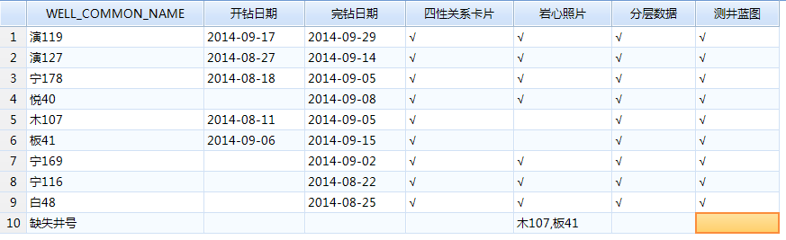

试油论证数据盘查
====================================
试油方案讨论过程中，需要使用单井的四性关系卡片、岩心照片、分层数据、测井蓝图等数据资料，这些资料的来源于多个单位，归档的时效性得不到保证；在试油方案讨论过程中，常出现单井资料缺失的问题。

虽然平台中虽有数据缺失情况统计的功能，但并非是针对试油方案所需数据进行，多个单井查漏工作量大。

数据专家系统，通过建立数据集的索引表，快速直观生成单井数据情况一览表，同时给出缺失数据集的井号，有力支撑数据管理员的日常监督工作。

**技术点：**

   1）建立各个数据集的索引信息表
   
   数据查询工作涉及数据集的数据量很大，在数据处理过程中，只关心数据存在与否，通过建立单井数据有无索引信息，提高数据分析的效率。（数据库中的表需要缓存致本地，缓存效率与数据量密切相关，通过建立有无索引数据，只下载单列数据，可大大提高数据处理效率）

   2）标记字段，标记数据来源
   
   在数据处理过程中，给流程增加标记字段，便于流程合并后，分析数据的出处。
 
   3）流程变量，UI界面方便于快速查询
   
   流程多个节点的呈列方式，显得杂乱，应用过程中，不简捷、明了；通过流程变量，将流程所需的部分参数以UI界面的形式展现，使用无需关底层细节，从而降低使用的门槛。

查询结果如下：

