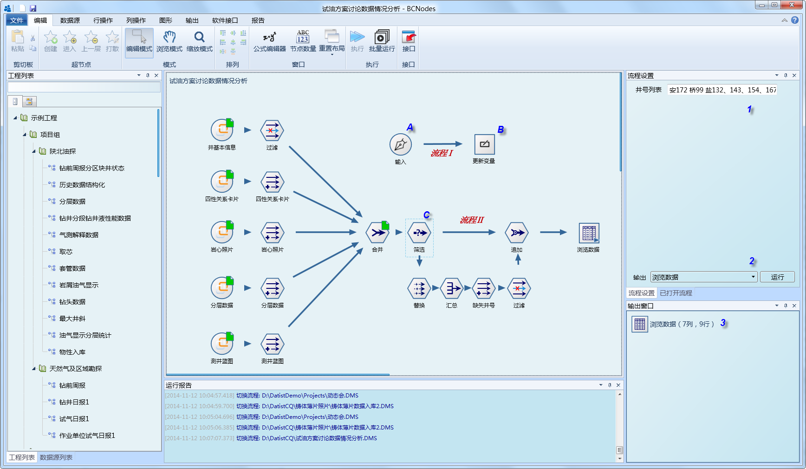
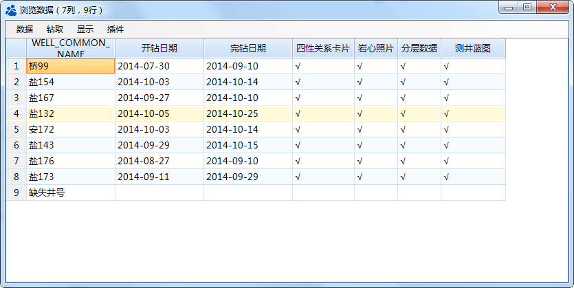
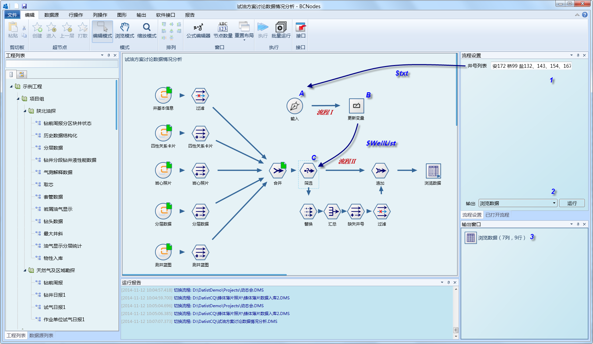
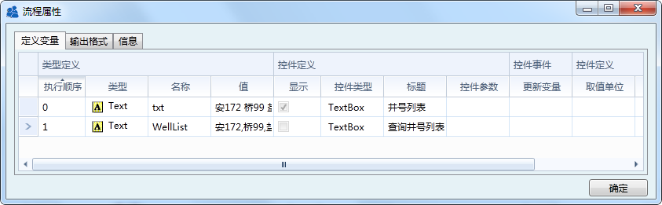
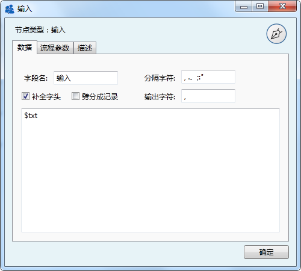
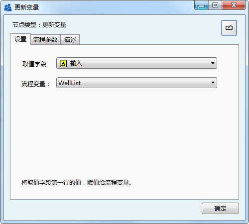
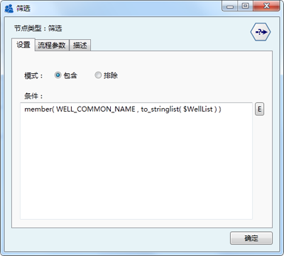


UI界面应用与多流程协作
====================================
1、经典应用场景，在1号位的文本框中输入井号列表，单击2号位的运行按键，立即获得3位的查询结果；

	 
数据浏览结果

2、实现原理
   * 第一步：输入井号列表，并传值给流程Ⅰ中节点A（通过流程变量txt实现）；
   * 第二步：规范化井号列表，运行流程Ⅰ，将井号列表进行标准化处理后（本例中输入数据，标准化工作由输入节点自带的功能实现），通过节点B赋值给流程变量（WellList）
   * 第三步：查询并返馈结果，流程Ⅱ中节点C使用流程变量WellList，进行数据查询，并输出查询结果。

.. note::
   以三步是自动运行的，系统运行时，会先自动扫描流程中的更新变量节点，自动运行相关流程。

	 
流程变量定义：
$txt，界面参数传送变量
$WellList，流程参数传送变量

输入节点A，参数设置

更新变量节点B，参数设置

筛选节点C，参数设置

