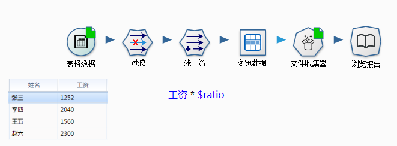
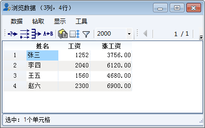
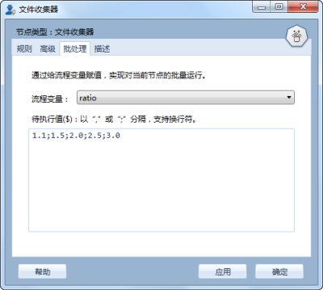
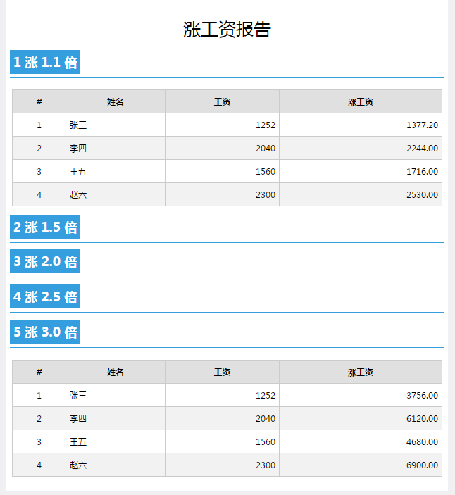


批处理工作原理
====================================
在数据分析过程中，会遇到很多同类的问题，它们之间仅在参数上有微小的差异，我们可以每个参数编制一个流程，当然这个方法过于繁琐。
Datist 提供了批处理功能，也可称之为循环运行、列遍运行等，就是让流程根据指定列表依次运行一遍。
如何去构造循环结构，需要用到流程变量，下面以一个流程来说明。

假设公司要给员工涨工资了，老板让在原有工资基础上，按1.1、1.5、2.0、2.5、3.0的倍率，分别造表过来瞅瞅（发就发呗，还对比着看，这是要累死人的节奏啊）；于是财务部分的小李就制作了以下的流程：

流程中，表格数据节点罗列了公司员工当前的工资水平；小李用了一个新列节点，构造了一个 "工资 * $ratio"公式，当前倍率 $ratio 为3.0时，浏览数据节点的运行结果如下：
	 

3倍工资算出来了（每天都是节假日加班的工资啊！），其它的怎么办呢？轮到批处理功能上场了，在文件收集器中有一个批处理页，小李将流程变量设置为 ratio，然后在待执行值中，输入了1.1;1.5;2.0;2.5;3.0；
	 

	 
小李运行了浏览报告节点，便获得了每种倍率下的员工增涨的报告。
	 

是不是很简单呢？您也可以试试着哦，老板给您涨工资哦（想得美）。	 

.. note::
   
   批处理功能，仅有文件收集器、顺序运行器、条件运行器才有哦。
   
.. note::   
   
   批处理页的待执行值标签带有“（$）”标记，意为这个输入框支持流程变量；也就是说您可以使用一个流程变量的值作为待执行值；
   
   在 Datist 中凡是带有“（$）”标记的输入框，均意谓着支持流程变量哦。
   