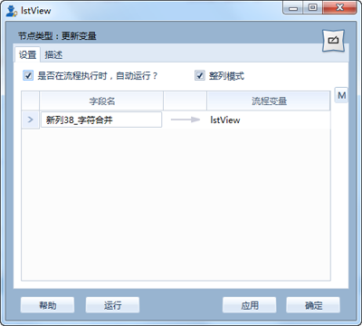

流程变量
====================================
在实际应用过程中，常遇到流程A的结果，作为流程B的运行参数的情况。系统中采用流程变量，实现同一文件中多个流程之间的流程协作。流程变量的使用，分为三大部分：定义变量，变量赋值，变量使用。本案例详细说明流程变量的使用过程。

**1、基本原理**

1) 运行流程变量节点

   * 流程运行之前，执行有变化的流程变量赋值节点；首先扫描前节点中涉及的流程变量，执行对应的流程变量赋值节点。	
   * 当流程变量变化时，清除其后节点的缓存，同时从使用列表中删除。	
   * 当流程变量没有变化时，其后节点的缓存起作用，提高运行效率。

2) 流程运行时，使用流程变量，将节点注册到使用列表中；（谁使用于流程变量？）

.. figure:: images/variable1.png
     :align: center
     :figwidth: 80% 
     :name: plate 	 

**2、定义变量：** 

在流程属性窗口中定义，设定流程变量的名称、类型、UI界面上控件显示等信息；如图所示，定义一个名为SQL的TEXT型流程变量。

**3、变量赋值：** 

	 
给定义的流程变量赋值，有两种方式，一是在UI界面上指定，二是“更新变量”节点指定，更新变量节点的功能是把流程运行的结果，赋值给流程变量；如图所示，给SQL流程变量赋值
	 

	 
**4、变量使用：** 

在节点使用过程，流程变量的使用方式是“$流程变量”，如图所示，使用SQL流程变量

	 
**案例：**

图中，流程B中的生成473个表的记录数汇总表，用于显示当前数据表的数据量；473表的统计数据量SQL有规律可循。

流程A分析数据库中的数据表，可以生成流程B所需的SQL语句，流程组中通过流程变量，实现流程A向流程B的值传递。
	 
