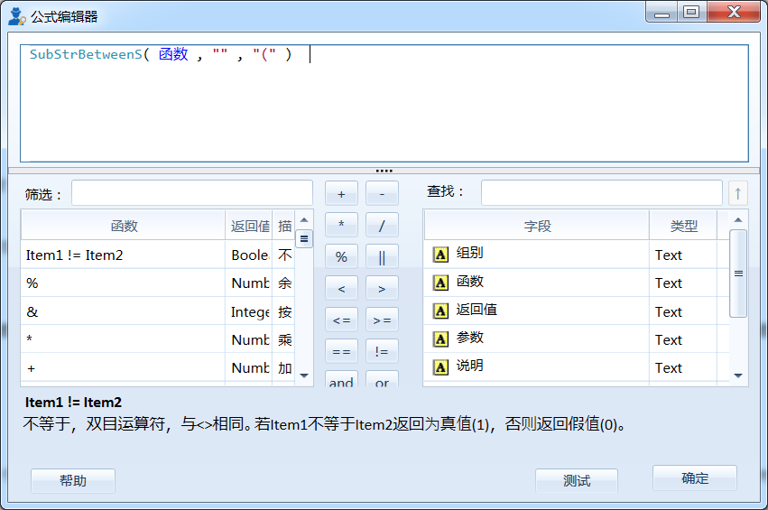
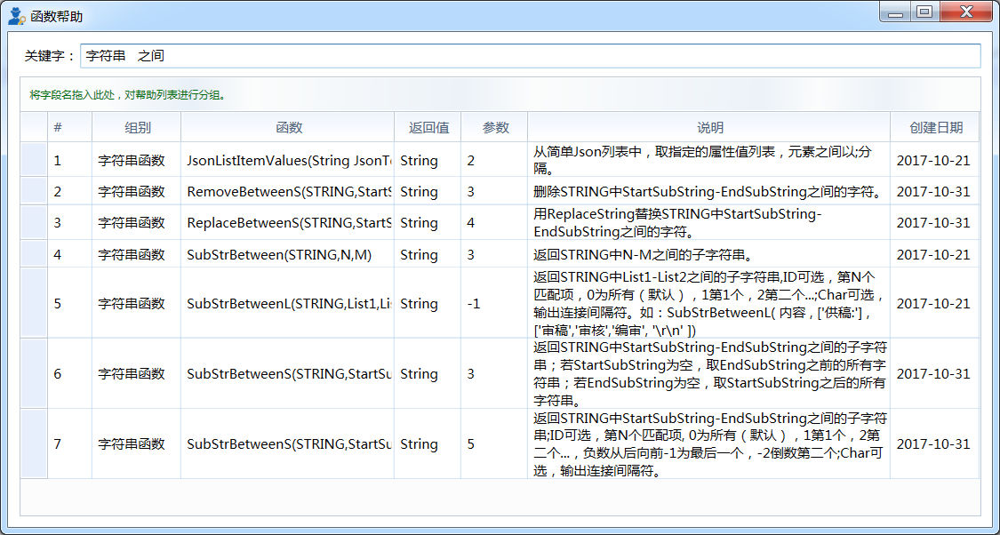

.. _QiTa:

函数概述
======================
函数作为 Datist 的重要组成部分，它以节点为载体；如果说节点是 Datist 的骨架，那么函数就是 Datist 的血液，它可以实现数值计算、数据分析、清洗等多项任务；因此，选取适合函数，可以达到事半功倍的作用。目前 Datist 提供数值计算、比较、字符串运算等25类近700个函数。

公式编辑器
----------------------
公式编辑器是最常用的功能（没有之一），系统为您提供了代码高亮、括号匹配、悬停提示、输入自动完成等大量功能；

通常，可以从节点编辑器公式输入框右上角的E按键，打开公式编辑器，如下图所示：

	 
您可以在左侧的筛选栏中，查找函数并双击将其插入到公式编辑区；也可以双击右侧字段列表中的字段名，将插入到公式编辑区。

公式编辑区中有很多辅助录入的功能，能帮助您快速构造表达式。比如，当您输入字母时系统将会自动枚举包含这些字母的函数、字段名称，供您选取。

一些特殊符号，可以帮助您快速录入：

.号可列举出所有字段名称供您选取；

$号枚举出所有的流程变量；

@号列举内置的正则表达式；

:号枚举在F函数中可用的字符串格式。

可参考流程商店中流程“版本新特性之2017.4版”。

.. note::
  数据类型“字符串”需要加英文单引号或双引号。
  
  在数据分析计算过程中，要特别注意数据类型及对应参数，确保正确使用函数。

.. note::
  您可以在主菜单的帮助菜单下找到公式编辑器，它与从节点中打开有所区别，您可以用它来进行简单的计算，或是进行数据处理试验。
  
  
函数帮助窗口
----------------------
为了方便开发者查找函数，系统中提供函数查询功能，您可以在公式编辑器的右键菜单中，找到函数帮助菜单项，或是主菜单帮助菜单下的函数帮助，打开函数窗口，如下图。
 

在关键字查询框中，输入一个或多个关键字，以便筛选出您想要函数；也可以将组别、函数、返回值等字段标题拖入到该栏，进行分类，以便查找函数。

.. note::
  从公式编辑器中打开 函数帮助窗口 时，若双击函数，可将函数体插入到公式编辑器中。