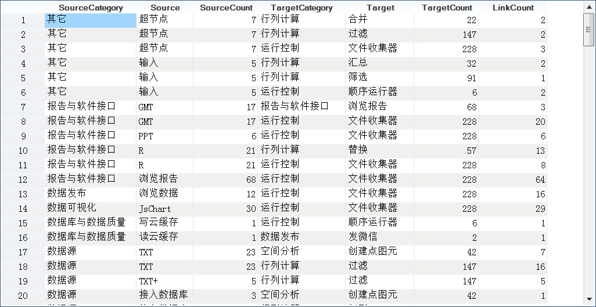
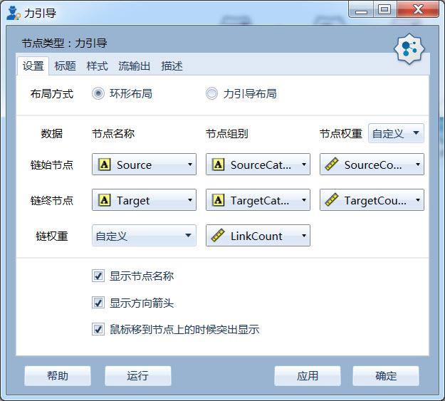
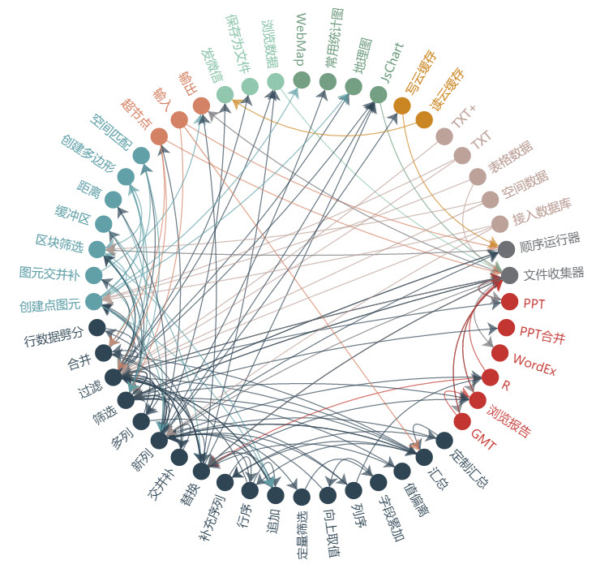
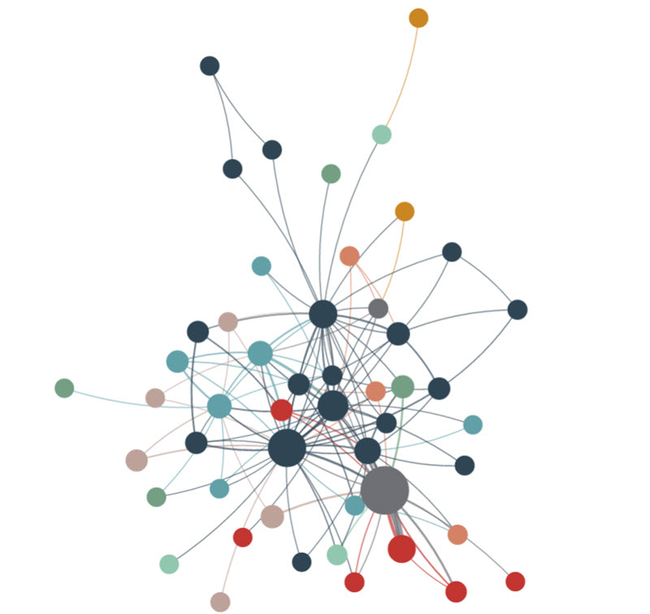

.. NodeEchartGraph
   
力引导图
====================================
用于展现节点以及节点之间的网络关系数据。

数据要求
------------------------------------

力引导图对数据有特殊的要求：
 
**必要项**

   * 链始节点的名称（字符型）；
   * 链终节点的名称（字符型）； 
   
**可选项**   

   * 链始节点的组别（字符型）、节点权重（数值型）；
   * 链终节点的组别（字符型）、节点权重（数值型）；
   * 链权重（数值型）
   
其中，组别表征节点颜色；权重用于表征节点尺寸；链权重用于表征链线宽度；由于节点在链中多次出现，因此组别与节点权重数据有很大的冗余。

示例数据：

其中：

    SourceCategory、Source、SourceCount分别为链始节点的组别、名称及权重；

    TargetCategory、Target、TargetCount分别为链终节点的组别、名称及权重；
    
    LinkCount为链“Source-Target”的权重；
   
编辑器
------------------------------------

**布局方式设置**
   
指定力引图绘制方式，支持两种布局方式：

   * 环形布局 
   * 力引导布局
   
环形布局：

力引导布局：

**数据设置**

指定用于绘图的数据列，界面从两个维度组织，横向表示节点与链，纵向表示名称、组别及节点权重；

节点组别用于映射节点显示的颜色，只有链始、链终节点均指定组别时，方可起作用；

对于节点权重三种计算方式:

  * **无** ，表示没有权重，所有节点显示尺寸相同；
  * **计数** ，系统自动统计节点在数据中出现的次数，作为节点显示尺寸的权重；
  * **自定义** ，指定一个数据列（数值型），作为节点显示尺寸的权重；只有链始、链终节点的权重同时给定时，才起作用；

链权重同样的三种计算方式：
  
  * **无** ，表示没有权重，所有节点的连线宽度相同；
  * **计数** ，系统自动统计“链始节点-链终节点”出现次数，作为该链显示宽度的权重；
  * **自定义** ，指定一个数据列（数值型），作为链显示宽度的权重；
 
**其它设置**

  * 是否显示节点名称；
  * 是否显示方向箭头；
  * 是否在鼠标移到节点上的时候突出显示节点以及节点的边和邻接节点。

