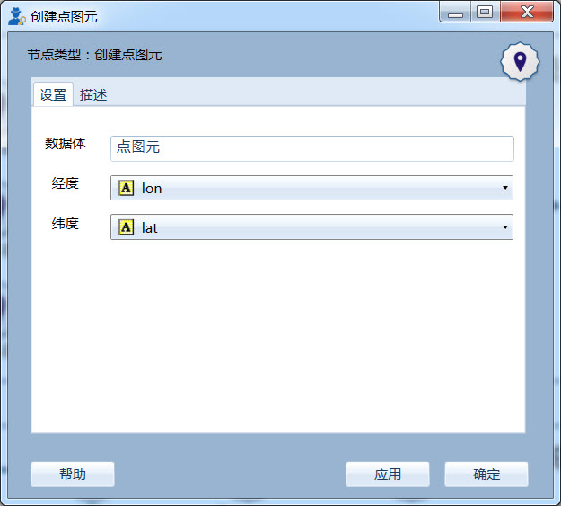

.. NodeCreatePoint 
   
创建点图元
====================================
将经纬度数据转换成空间点图元。在原有数据的基础上，追加一列数据，存放生成的点图元。

设置界面
------------------

  
     创建点图元设置界面
	 
其中：
   * **数据体：** 填写用于存放点图元的字段名称。
   * **经度：** 指定经度坐标所在的列（数值型）。
   * **纬度：** 指定纬度坐标所在的列（数值型）。   
   