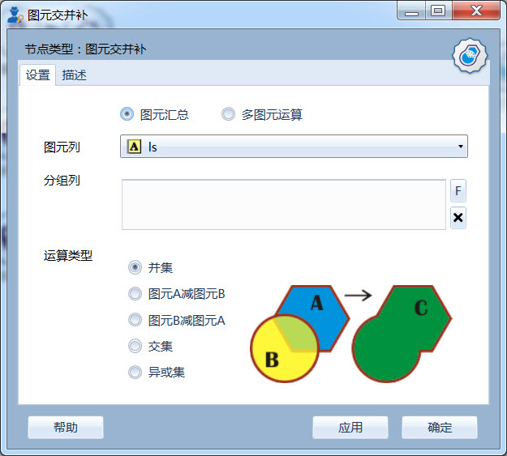
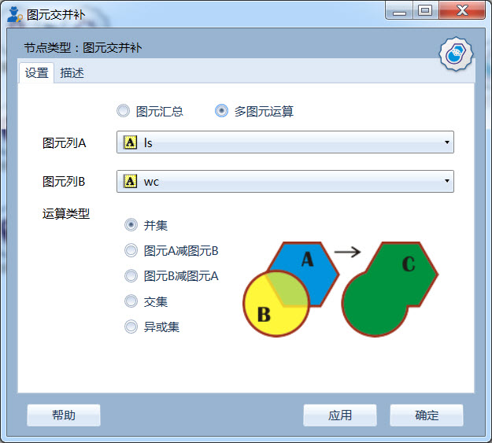
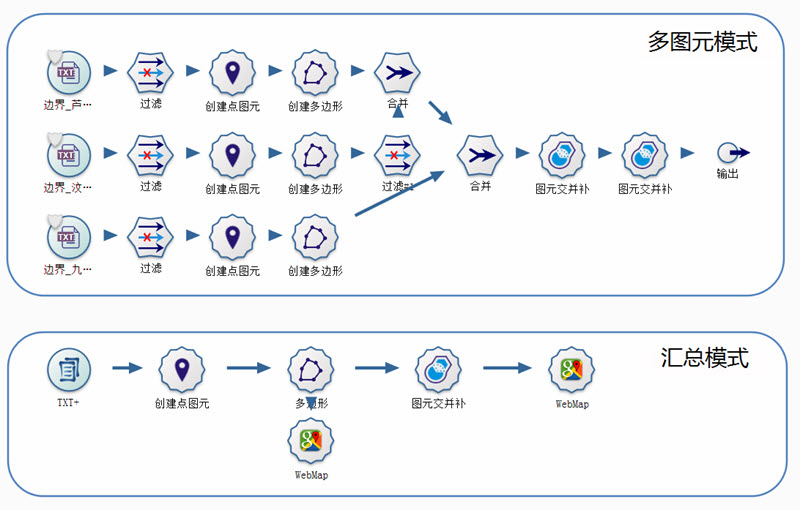
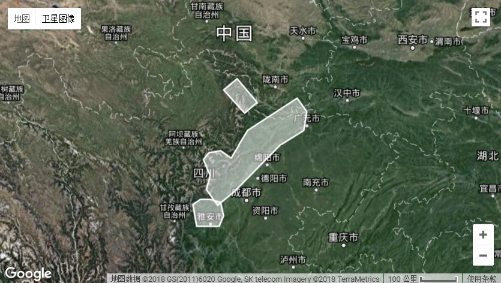
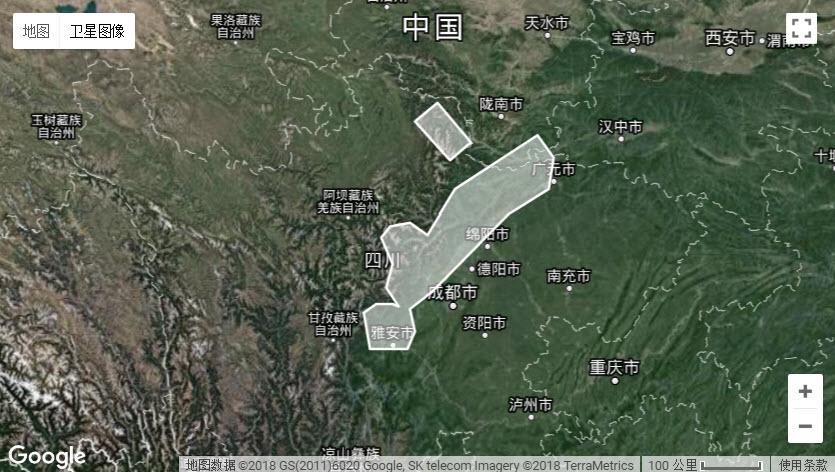

.. NodeSpatialProcess 
   
图元交并补
====================================
求多个图元之间的交集、并集、补集以及异或集。

图元运算类型
------------------------

支持五种运算类型：

.. list-table:: 

   * - 操作图示
     - 操作类型
     - 详细描述
	 
   * - .. image:: images/NodeSpatialProcess01.png
     - 并集
     - 返回多个图元之间合并的结果图元。
	
   * - .. image:: images/NodeSpatialProcess02.png
     - 图元A减图元B
     - 返回多个图元之间相差的结果图元。
	
   * - .. image:: images/NodeSpatialProcess03.png
     - 图元B减图元A
     - 返回多个图元之间相差的结果图元。	
	 
   * - .. image:: images/NodeSpatialProcess04.png
     - 交集
     - 返回多个图元之间公共部分的内容。	

   * - .. image:: images/NodeSpatialProcess05.png
     - 异或集
     - 返回多个图元之间非公共部分的内容。
	 

数据组织
------------------------

支持两种数据组织方式：

   * **图元汇总** ，对一列图元进行操作，类似于汇总节点，支持分组汇总功能；
   * **多图元运算** ，对于一条记录内的两个图元进行操作。
   
**图元汇总模式：**

  
     图元汇总模式界面

图元列，指定的待运算的图元数据列；

分组列，指定的分组字段，支持多个，可为空；

	 
**多图元运算模式：**	 
	 

  
     多图元运算模式界面	 
	 
图元列A，指定的第一个图元列；

图元列B，指定的第二个图元列。
	 
实例
------------------------	 

有一批地震带的边界数据，需求取所有区的合集，以便后续空间分析过程使用。我们分别采用多图元模式和汇总模式进行处理。其具体流程如下：

     
     多图模式和汇总模式流程对比

多图元模式，适用于对同一记录中的两个数据项进行操作，因此本例中需要进行大量的数据准备工作；

汇总模式，适用于对一列图元数据进行处理；本例中与Txt+相结合，批量读入多个边界数据文件，再分组创建多边形，最后使用汇总模式，求取所有区的合集图元。

虽然两个处理流程不同，但输出结果相同。此例中，使用汇总模式流程显得更为优雅。
	 

	 
     三个地震带原始形态
	 

	 
     三个地震带合并形态