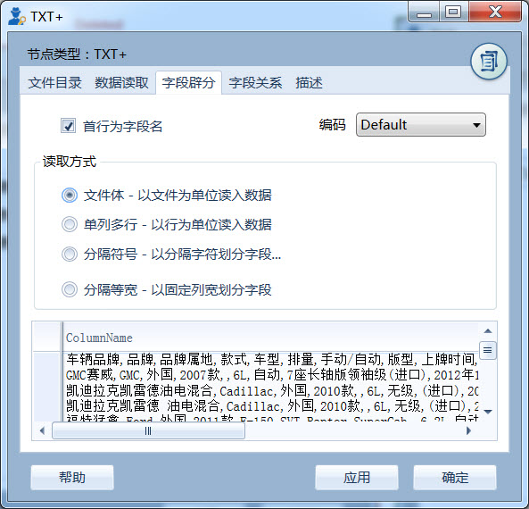
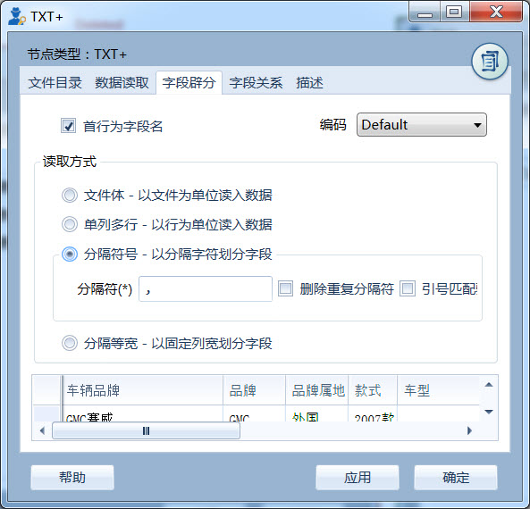
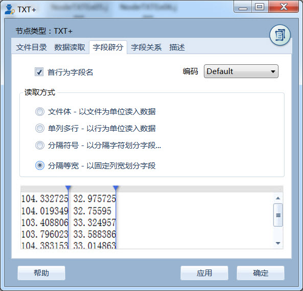
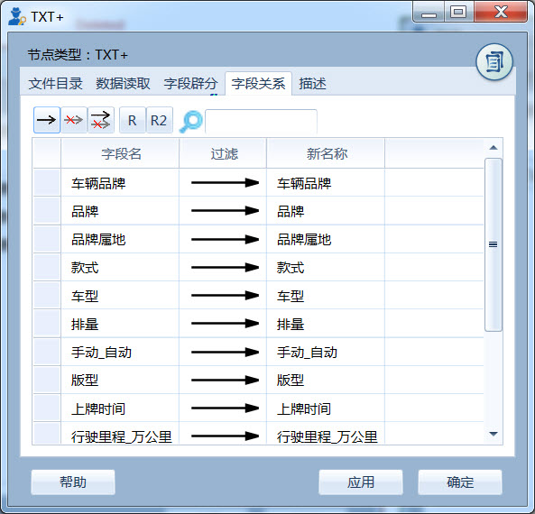

.. NodeTXTEx

TXT+
=====================
将文本文件读取数据专家，支持txt,csv,json,htm等多种数据格式。可用于将具有相近格式的文本数据加载到数据专家中。

文件目录设置
-----------------

指定的文件或文件夹，支持多个文件和文件夹。系统将自动扫描文件夹及子文件夹下的所有文件，读入数据专家中。

   文件目录设置页界面
   
   
文件读取设置
-----------------

指定文件的读取方式，如读取行数、文件类型、记录名称等。

.. figure:: images/NodeTXTEx02.jpg
   :align: center
   :figwidth: 90% 
   :name: plate        

   文件读取设置页界面

**1）仅读取顶部行数** 不勾选（默认），读取所有的行；勾选，仅读取文件中最开始部分行的文本；文本框填写指定读取的行数；

适用于使用大文件进行试验操作；如将1亿记录读入数据专家，大文件读取本身是非常耗时的，限定行读取，可提高试验时的效率。

**2）读取文件类型** 提供两种读入文件类型的指定方式：

   * **所有数据类型** 读取所有的文件；
   * **指定数据类型** 仅读取指定的扩展名的文件，如txt等，多个文件扩展名之间以分号间隔；
   
**3）输出文件名称** 勾选，在读入的数据中追加一列（FileName），以记录文件名称；不勾选，则不读入；

   * **完整文件路径** 记录文件的完整路径；
   * **仅文件名** 仅文件的名称，不包含扩展名；
   
   
数据内容设置
-----------------

指定字段的生成方式，如首行为字段名、文件编码以及字段辟分方式等。

   
   数据内容设置页界面
   

**1）首行为字段名** 

指定文件的第一行是否作为读入的字段名；

当指定字段名时，系统将根据名称进行字段名的匹配处理。举个例子，存在Demo1、Demo2两个文本文件。

文件Demo1.txt::
  
  lon,lat
  1,A
  2,B
  3,C
  4,D

文件Demo2.txt::

  lat,lon
  E,5
  F,6
  G,7
  H,8

其中两个文件的字段，位置不一致。

系统读取时将进行匹配::

  lon,lat
  1,A
  2,B
  3,C
  4,D
  5,E
  6,F
  7,G
  8,H

**2）编码**

定义文本文件的编码格式，支持Default、UTF8、ASCII、BigEndianUnicode、UTF32、UTF7、Unicode等多种文件编码。

**3）读取方式**

指定的文本文件的字段辟分方式，支持四种方式：

  * **文件体** 以文件为单位读入数据，每个文件只生成一个数据项；
  * **单列多行** 以行为单位读入数据，每个文件仅生一列多行数据；
  * **分隔符号** 以分隔字符划分字段；
     
     * 分隔符；指定辟分字段的分隔符号，支持多个分隔符；
	 
     * 删除重复分隔符；勾选，重复的分隔符作为一个分隔对待进行列的辟分；不勾选，则视之为多个分隔，生成多个空数据；
	
     * 引号匹配验证；勾选，用于csv文件的字符型字段的引号匹配验证；不勾选，则不进行验证；
  
  * **分隔等宽** 以固定列宽划分字段；指在预览区的顶部灰色区域，双击添加分隔线；或双击蓝色三角符号，删除已有分隔线。
  	   

   
   数据内容设置页界面（分隔符号）  

   
   数据内容设置页界面（分隔等宽）
   
字段关系设置
-----------------  

定义节点生成的字段名称，其它用法与过滤节点的相同。

   
   字段关系设置
 
   