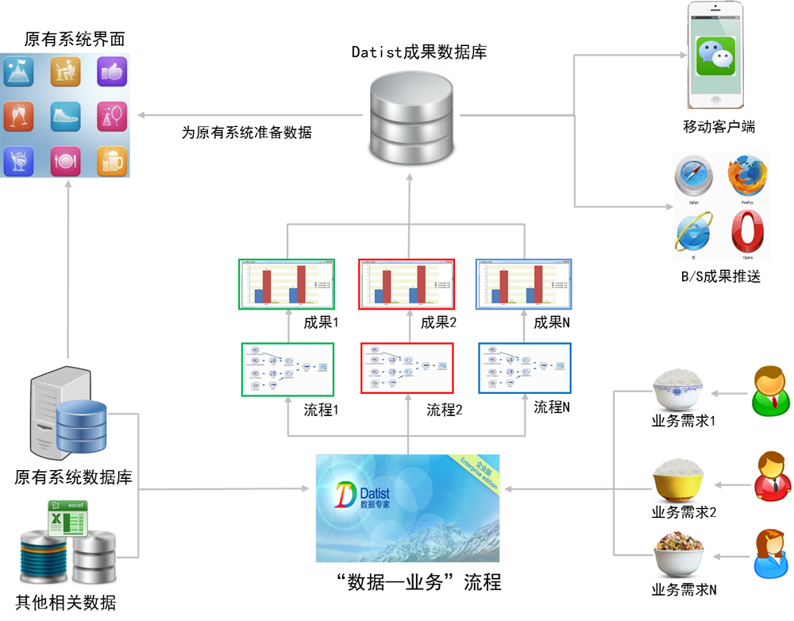

.. Datist documentation master file, created by
   sphinx-quickstart on Sun Jan 7 22:11:51 2018.
   You can adapt this file completely to your liking, but it should at least
   contain the root `toctree` directive.
   
解决方案
====================================

  * 单机版解决方案 
  
企业级解决方案 
-------------------  
  

  
微信端解决方案  
-------------------
  

	 
云部署解决方案 
---------------------
  

