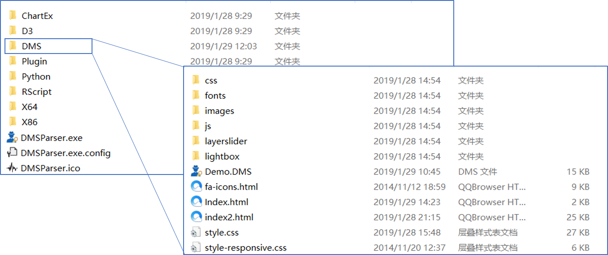
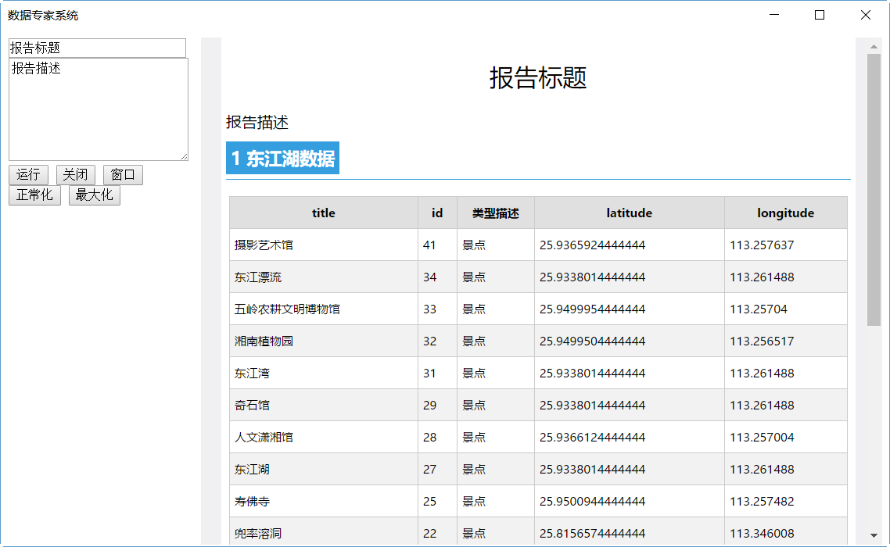
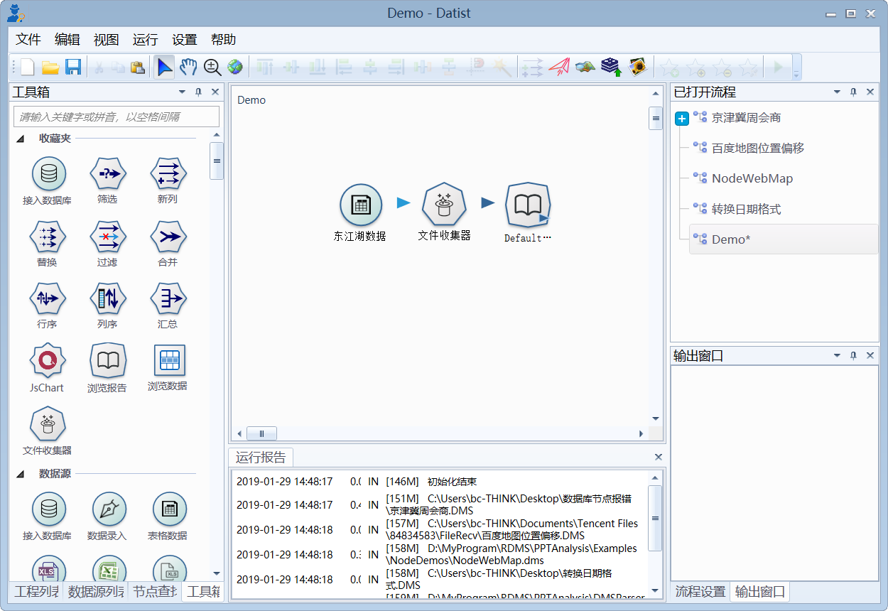
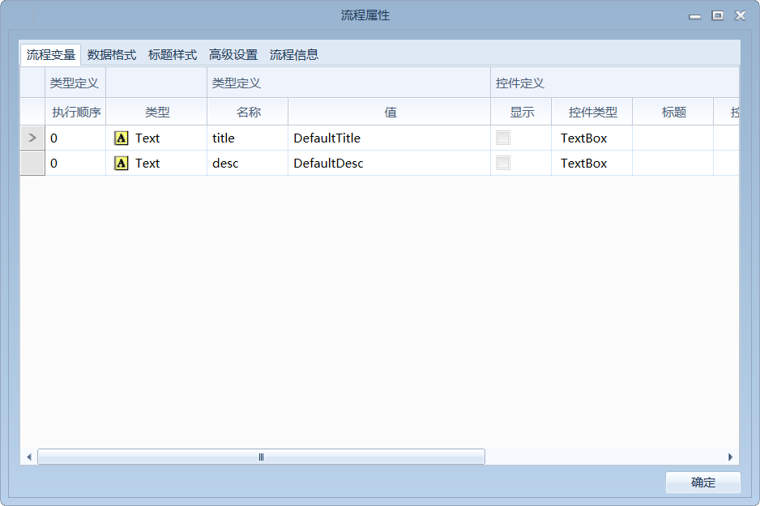
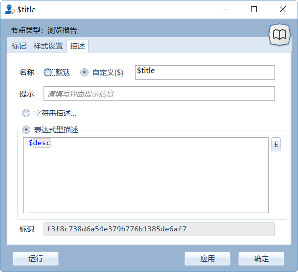

.. DMSParser

DMSParser部署
====================================   

流程的重心在于具体业务的实现，而业务的组织，特别是大型业务场景的组织，则需要多个流程共同来实现。为了便于用户组织业务场景，数据专家DMSParser部署方案。

DMSParser是一个数据专家执行容器，为用户提供一个开放的界面构造、流程执行与展现、软件发布工具；通过DMSParser用户可以发布自已的应用系统。其基本原理为，提供内存网站浏览器，用户通过编写HTML脚本构造界面、组织业务场景，该浏览器支持HTML解释与展示、HTML界面参数向流程参数传递、流程运行与运行反馈展现等功能。

DMSParser原理:

	
DMSParser使用，由HTML页面编写、DMS流程编制、窗口启动配置三个部分构成，其目录组织结构如下:
	

其中DMSParser.exe为主程序；DMSParser.exe.config为窗口启动配置参数；DMS为用户内容组织目录。

下面以一个简单的案例来说明实现原理。在报告标题、报告描述对话框中输入文字，单击运行，右侧的页面中显示相应的运行报告。

业务流程构造
-----------------------------------

本案例中，业务流程由三个节点构成，功能为用一个报告浏览节点展示缓存表格数据。流程中定义了title与desc两个流程变量，浏览节点使用它们使用为报告的标题与描述项。

业务流程：

流程变量：

流程变量使用：
	

HTML页面编写
-----------------------------------

面对具体的业务场景，用户的需求是多样的，HTML语言具有高灵活、门槛低的特征，因此系统选用了HTML作为DMSParser前端业务场景组织语言。

上述案例中，HTML代码如下::

    <!DOCTYPE html>
    <html>
    <head>
        
        
        
    </head>
    <body>
    
        <!--界面参数-->
        <form method="post" class="hpform">
            <input id="title" type="text" placeholder="报告标题" value="报告标题" style="width: 100%" /> 
            <textarea id="desc" placeholder="报告描述" style="height: 100px;width: 100%">报告描述</textarea> 
            <input type="button" onclick="javascript:Run();" value="运行" />
            
            <!--窗口控制命令-->
            <input type="button" value="关闭" onclick="Close();" />
            <input type="button" value="窗口" onclick="NoneBorder(false);" />
            <input type="button" value="正常化" onclick="WindowState('normal');" />
            <input type="button" value="最大化" onclick="WindowState('max');" />
             
        </form>
        
        <!--内容显示-->
        <iframe id="ifrm" Name="ifrm" frameborder="0"></iframe>
    
    </body>
    </html> 

炫酷版示例：
	
.. figure:: DMSParserImages/DMSParser7.gif
    :align: center
    :figwidth: 90% 
    :name: plate

