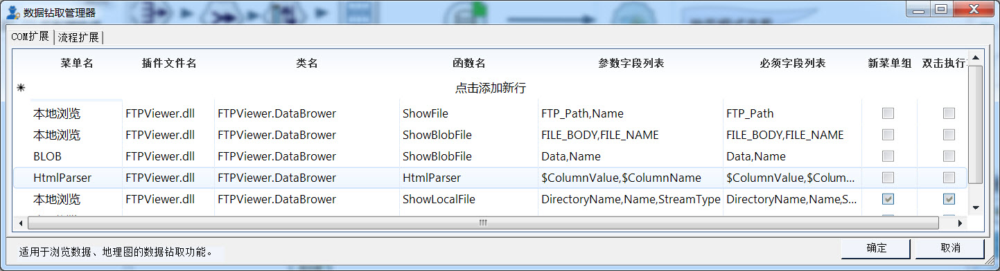
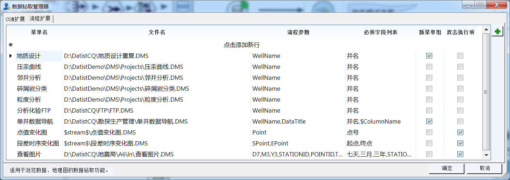
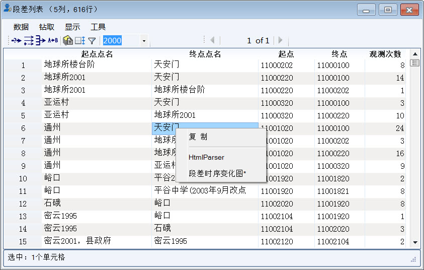
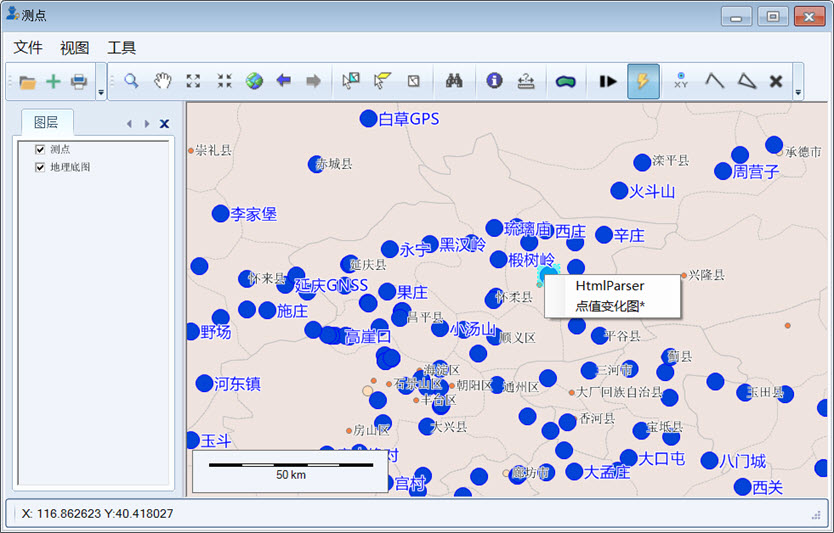
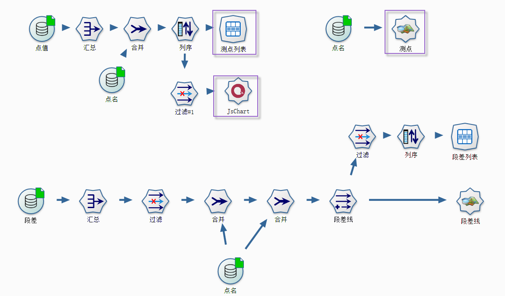

.. DocsOnline

数据钻取管理器
====================================

数据钻取，是通过定义数据钻取项对数据专家的部分浏览器功能进行扩展，即数据浏览器的右键菜单、地理图浏览器的信息钻取功能和报告浏览器的DrillDown命令。

数据钻取的基本原理是从浏览器中获取部分字段的信息，传递给数据钻取项并执行之。系统提供流程扩展与DLL扩展两种数据钻取项的定义方式。

*. 流程扩展项的执行目标是流程。执行时，从浏览器中获取数据，传递给目标流程变量，并执行流程中默认输出节点。
*. DLL扩展项的执行目标是DLL中的静态函数。执行时，从浏览器中获取数据，作为参数传递给DLL的函数并运行函数。可以用它来集成企业里的信息系统，也可用它来快速访问、查看各类文档功能。

 

浏览器扩展功能的基本原理如下：

.. figure:: images/DocsOnline01.png
     :align: center
     :figwidth: 90% 
     :name: plate 	 
 
数据钻取管理器
----------------------------------

在主菜单的设置菜单下，数据钻取管理菜单可以开启数据钻取管理器。系统支持两种类型的钻取功能：

  * **COM扩展：** 通过DLL对系统功能进行扩展，系统把当前记录的数据传给DLL，并执行指定的函数；
  * **流程扩展：** 通过流程扩展系统功能，系统调用指定的流程，并执行它。

**COM扩展**

您需定义菜单名、插件DLL名、类名、函数名、参数据字段列表等相关信息，从而实现系统功能的扩展，如图所示：
 

**流程扩展** 	

定义待执行的流程、流程参数、必须字段列表，如下图所示：
 

	 	 
	 
	 
扩展功能后，在二维数据浏览器的右键菜单中，可以找到添加菜单项。下图中是数据专家与成果管理系统无缝集成的数据浏览器，我们在系统扩展了在线浏览、批量下载等功能。

在地理图上，使用数据钻取功能，也会出现类似的右键菜单。

	 
数据钻取实例
----------------------------------

下面简单介绍一个数据钻取的实例，该实例为调用已建系统中的数据，在数据专家中实现系统登录、数据下载、批量下载以及单井在线流程功能。

在线调用信息系统之前，我们首先进行用户登录（插件提供）。

.. figure:: images/DocsOnline04.png
     :align: center
     :figwidth: 90% 
     :name: plate 		 

使用本地下载功能，下载某个地质图件。	 
 
.. figure:: images/DocsOnline05.png
     :align: center
     :figwidth: 90% 
     :name: plate 	

使用批量下载功能，批量多个地质图件。

.. figure:: images/DocsOnline06.png
     :align: center
     :figwidth: 90% 
     :name: plate 	
	 
使用单井在线浏览功能，单井的测井蓝图。

