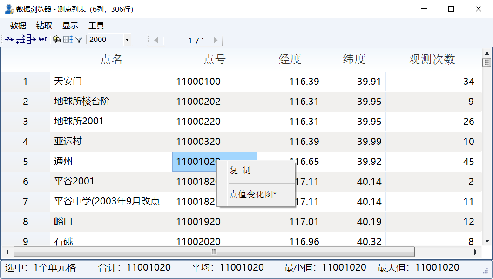
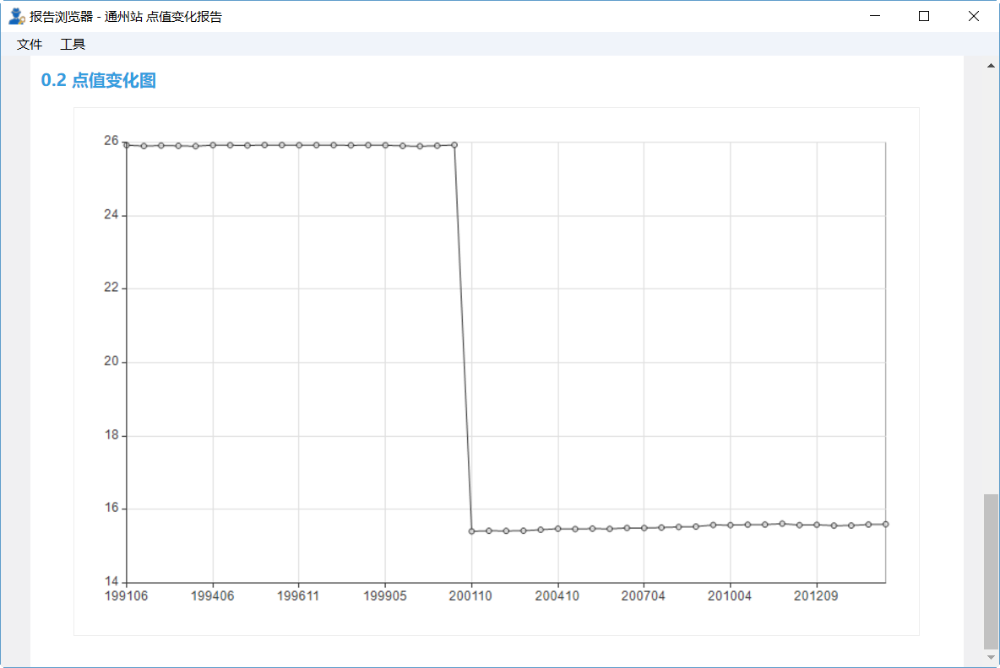
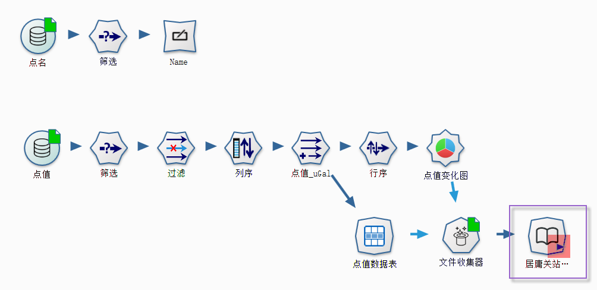
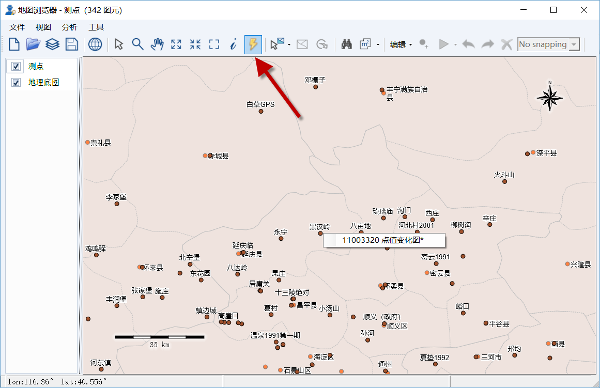
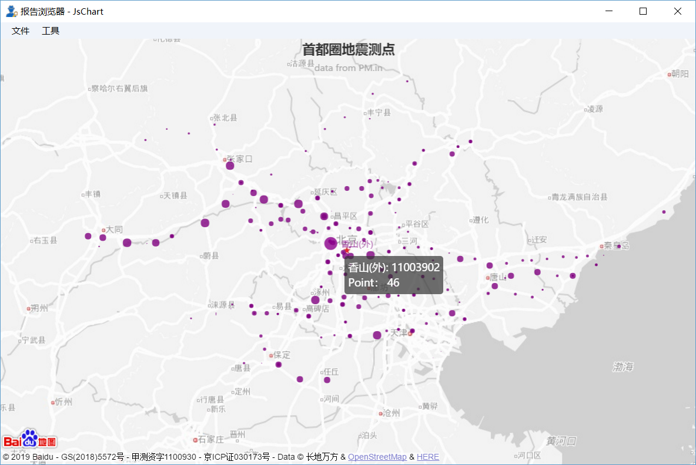
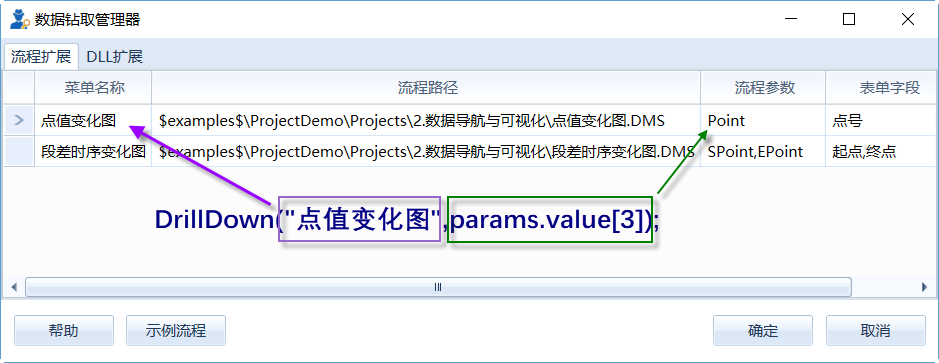

.. DocsOnline

数据钻取管理器
====================================

数据钻取是通过执行外部的流程、DLL对浏览器进行扩展的功能。目前支持扩展功能的浏览器有：数据浏览器的右键菜单、地理图浏览器的信息钻取功能和报告浏览器的DrillDown命令。

数据钻取的基本原理是从浏览器中获取部分字段的信息，作为参数传递给数据钻取项并执行之。数据钻取项的定义有流程扩展项和DLL扩展项两种:

1）流程扩展项的执行目标是流程。执行时，从浏览器中获取数据，传递给目标流程，并执行流程中默认输出节点。如下图所示：

.. figure:: images/DocsOnline01.png
     :align: center
     :figwidth: 90% 
     :name: plate 	 
 

2）DLL扩展项的执行目标是DLL中的静态函数。执行时，从浏览器中获取数据，作为参数传递给DLL的函数并运行。可以用它来集成企业里的信息系统，也可用它来快速访问、查看各类文档功能。

.. figure:: images/DocsOnline02.png
     :align: center
     :figwidth: 90% 
     :name: plate 	   

	 
数据钻取项定义
----------------------------------

在数据专家主窗口【设置】主菜单下，单击【数据钻取管理】菜单项可以开启数据钻取管理器（数据浏览器、地图浏览器、报告浏览器均提供此入口）。

1）流程扩展：定义流程扩展项；增加流程扩展项操作步骤如下：
 
步骤一：右键菜单，单击【添加流程】菜单页，在弹出的打开文件对话框中，选取流程； 

.. figure:: images/DocsOnline05.png
     :align: center
     :figwidth: 60% 
     :name: plate 

步骤二：在新增的记录行中，补充菜单名称和表单字段；  
 
.. figure:: images/DocsOnline03.png
     :align: center
     :figwidth: 90% 
     :name: plate 	   

右键菜单说明： 
	
  #. 添加流程：新增流程钻取项；    
  #. 查看流程：在流程编辑区打开流程；
  #. 更新流程参数：从目标流程中读取流程参数列表，并更新流程参数数据项的内容；	
  #. 删除流程：删除选中的流程钻取项；
 
2）DLL扩展：定义DLL扩展项；
 
步骤一：右键菜单，单击【添加DLL】菜单页，在弹出的“设置DLL数据钻取器”对话框中，选取DLL文件、命名空间、及函数名称，系统自动反射出函数的参数列表；
  
.. figure:: images/DocsOnline06.png
     :align: center
     :figwidth: 60% 
     :name: plate 	
	 
步骤二：在新增的记录行中，补充菜单名称和表单字段；    
  
.. figure:: images/DocsOnline04.png
     :align: center
     :figwidth: 90% 
     :name: plate 	 
	 
右键菜单说明： 
	
  #. 添加DLL：新增DLL数据钻取项；    
  #. 在文件夹中显示：在文件浏览器查看DLL文件；
  #. 编辑DLL：更新DLL路径、类名、函数名及函数参数等内容；	
  #. 删除DLL：删除选中的DLL钻取项；
  
数据钻取应用
----------------------------------  

单击数据钻取管理器下方的【示例流程】按键，打开示例流程如下：

.. figure:: images/DocsOnline07.png
     :align: center
     :figwidth: 90% 
     :name: plate 	 
	 

1）“数据浏览器”数据钻取案例

运行“测点列表”节点，打开数据浏览器，如下图所示。在关注的行上点击右键菜单，就可以看到“点值变化图*”菜单项。“点值变化图”菜单项，源于数据钻取管理器中流程扩展的设置，其中“*”表示是流程扩展（相对于DLL扩展）。

	 
单击“点值变化图*”菜单，系统弹出如下报告：

	 
单击菜单时，运行的如下流程（在数据钻取器中，右键菜单【查看流程】可查看对应的流程）。请注意，默认输出项的设置，运行时，仅运行具有默认输出项标记的节点。
	 

	
.. note::
   您可能已经注意到数据钻取中，定义了很多钻取项而仅显示了一条；钻取菜单显示与否，是依据“表单字段”中定义来判断的，当数据浏览器中包含“表单字段”中定义的字段时，才可以显示。此外在DLL数据钻取函数参数的定义时，建议使用字符型。
	
2）“地图浏览器”数据钻取案例

运行“测点”节点，打开地图浏览器，如下图所示。单击“信息钻取”按钮，将地图浏览器切换至数据钻取模式；在测点图元上，单击右键菜单，可以看到“11003320 点值变化图*”菜单项。其中11003320为点号的值，也就是“表单字段”中定义的第一个字段的值，该值用于区分图元单元。

地图浏览器中，数据钻取菜单项的执行结果与“数据浏览器”中的类似，这里不再敖述。

3）“报告浏览器”数据钻取案例
 
运行“JSChart”节点，打开报告浏览器，在图元上，单击左键，执行数据钻取功能（运行结果与数据浏览器数据钻取相同），如下图所示。
  

  
报告浏览器中，数据钻取功能实现与其它两种方式不同，它通过用户代码来实现；案例中，JSChart节点是使用百度Echart组件创建统计图的功能。

示例流程中的数据钻取代码::
 
   myChart.on('click', function (params) {
       print(params.componentType);
	
	   if (params.componentType === 'series') {
	      //对应于 菜单名,参数1,参数2……
	      DrillDown("点值变化图",params.value[3]);
      };
   });

其中，DrillDown函数为浏览器内置，第一个数据对应于“数据钻取管理器”中的菜单名称，运行时依据该名称调用相应数据钻取项；其后的参数则对应于流程参数或DLL函数参数。

.. note::

   DLL数据钻取的使用方式与流程钻取相似，这里再重复论述。	 