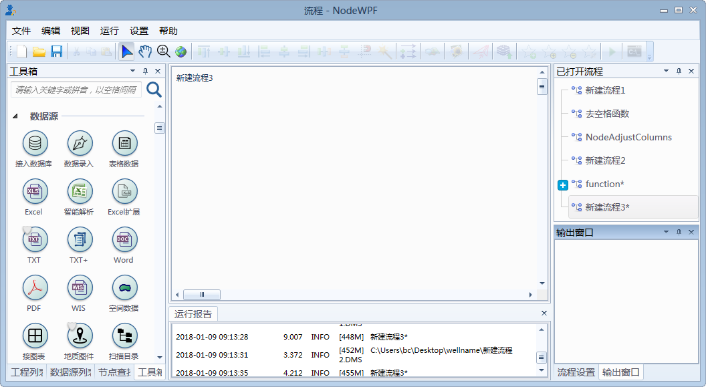
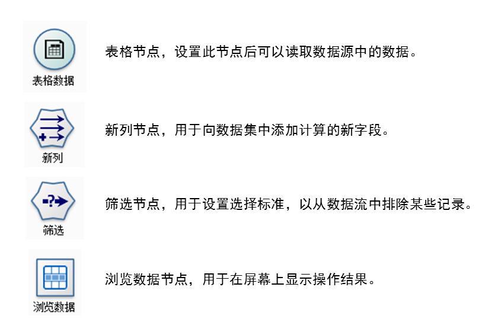
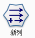
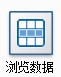

.. the frist doc for datist

初次上手
=====================
 典型的 Datist 界面如下：

接下来将详细介绍其基本概念及操作。

**基本概念：节点**

节点代表要对数据执行的操作。

例如，假定您需要打开某个数据源、添加新字段、根据新字段中的值选择记录，然后在表中显示结果。在这种情况下，您的数据流应由以下四个节点组成：

表格节点，设置此节点后可以读取数据源中的数据。

新列节点，用于向数据集中添加计算的新字段。 

筛选节点，用于设置选择标准，以从数据流中排除某些记录。 

浏览数据节点，用于在屏幕上显示操作结果。 

 